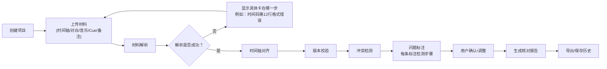

## 1. 产品概述

电影配乐Cue点核对工具，解决影视后期制作中导演剪辑版、对白轨、音乐版本频繁变更导致的Cue点核对难题。确保时间轴、对白、音乐、Cue清单、导演备注和核对报告的数据一致性，避免同一批数据在不同场景出现两套数字。

- 核心价值：将人工核对转为自动化校验，准确定位问题卡在哪一步而非笼统报错
- 目标用户：配乐师、剪辑师、声音编辑、后期制片
- 市场价值：减少反复核对时间，降低版本错误导致的重录风险

## 2. 核心功能

### 2.1 用户角色

| 角色 | 注册方式 | 核心权限 |
|------|----------|----------|
| 后期制作人员 | 本地使用无需注册 | 项目创建、材料上传、核对处理、报告导出、历史回看 |

### 2.2 功能模块

1. **项目入口页**：项目列表、新建项目、导入历史项目
2. **材料上传页**：剪辑时间轴、对白轨、音乐文件、Cue清单、导演备注的上传与解析
3. **核对处理页**：时间轴对齐、版本校验、冲突检测、结果可视化
4. **历史回看页**：修改历史、版本对比、操作回溯
5. **报告导出页**：核对报告生成、多种格式导出

### 2.3 页面详情

| 页面名称 | 模块名称 | 功能描述 |
|----------|----------|----------|
| 项目入口页 | 项目卡片列表 | 展示项目名称、最后修改时间、状态标签，支持搜索筛选 |
| 项目入口页 | 新建项目入口 | 项目名称输入、项目描述、初始材料拖拽上传 |
| 材料上传页 | 文件上传区 | 分类型拖拽上传，支持XML/CSV/TXT/JSON等多种格式，实时显示解析进度 |
| 材料上传页 | 解析结果预览 | 显示解析出的字段数量、缺失字段警告、疑似格式问题提示 |
| 核对处理页 | 时间轴对齐视图 | 可视化时间轴，多轨道叠加显示，错位处高亮标注 |
| 核对处理页 | 版本校验面板 | 音乐版本指纹比对，旧版混入自动识别并标记来源 |
| 核对处理页 | 冲突检测结果 | 对白盖音乐、Cue点漂移、时间码断裂等问题逐条列出，标注检测步骤 |
| 核对处理页 | 导演备注关联 | 备注与对应时间点绑定，悬停查看详情 |
| 历史回看页 | 版本时间线 | 每次核对的快照列表，支持两点对比差异 |
| 历史回看页 | 操作日志 | 记录每一步操作人、时间、修改内容，异常操作标红 |
| 报告导出页 | 报告预览 | 完整核对报告在线预览，数据与处理页完全一致 |
| 报告导出页 | 导出选项 | PDF/Excel/JSON三种格式，可选择包含内容范围 |

## 3. 核心流程

用户创建项目 → 上传五类交接材料 → 系统逐类解析并反馈解析问题 → 自动执行时间轴对齐、版本校验、冲突检测 → 可视化展示核对结果，每条问题标注检测步骤 → 用户确认或调整 → 生成核对报告 → 导出或保存历史版本。

## 4. 用户界面设计

### 4.1 设计风格
- 主色调：深碳灰 `#1a1a1e` 作为背景，琥珀橙 `#f59e0b` 作为强调色（警告），翠绿 `#10b981` 作为通过色
- 辅助色：深蓝灰 `#3b4252` 面板背景，浅灰 `#e5e7eb` 正文文字
- 按钮风格：扁平化设计，圆角4px，悬停时有微妙的亮度变化
- 字体：显示字体用 **Space Mono**（等宽，适合时间码显示），正文字体用 **Inter**
- 布局风格：三栏式布局（左侧导航+中间主内容+右侧详情面板）
- 图标风格：线性简约图标，配合状态色点（绿/黄/红）

### 4.2 页面设计概述

| 页面名称 | 模块名称 | UI元素 |
|----------|----------|--------|
| 项目入口页 | 项目卡片列表 | 深色卡片、状态标签（绿/黄/红）、悬停上浮动画、时间码字体 |
| 材料上传页 | 文件上传区 | 拖拽区域虚线边框、文件类型图标、解析进度条、错误提示用人类语言 |
| 核对处理页 | 时间轴视图 | 横向可滚动时间轴、多轨道分层、色块区分材料类型、问题点脉冲动画 |
| 核对处理页 | 问题列表 | 每项问题带步骤指示器（1/2/3步）、展开查看检测详情、一键定位到时间轴 |
| 历史回看页 | 版本时间线 | 垂直时间线、节点可点击、两点对比用连接线高亮差异 |
| 报告导出页 | 报告预览 | 模拟打印布局、数据与处理页同源、无二次计算 |

### 4.3 响应式
- 桌面端优先设计，核心工作区最小宽度1280px
- 平板端折叠右侧详情面板为底部抽屉
- 移动端仅支持项目查看和报告浏览，不支持上传和核对操作

### 4.4 错误提示设计原则
- 不说「格式错误」，要说「第3行的时间码「01:02:61」秒数超过59，请检查」
- 不说「数据异常」，要说「音乐文件时长2:30，但Cue清单标注为2:45，差异在第5个Cue」
- 所有错误提示包含：具体位置、问题内容、可能原因、建议操作
