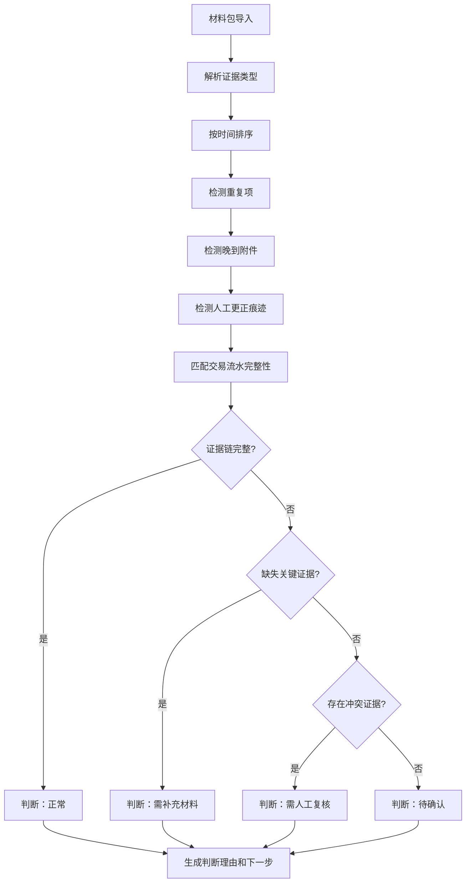

## 1. 产品概述
银企回单重挂工具是为风控运营团队设计的专业证据链管理工具，解决交易流水、审批截图、补充邮件等多源证据分散查看的痛点。工具以时间线形式整合所有证据，支持自动判断与人工复核，确保风控经理能够清晰、高效地处理回单重挂业务。

- 核心价值：将分散的证据材料串成完整证据链，避免核心证据流失
- 目标用户：风控运营人员、风控经理
- 解决问题：多源证据分散、判断理由不透明、处理流程不清晰、重复项难以识别

## 2. 核心功能

### 2.1 用户角色
| 角色 | 权限描述 |
|------|----------|
| 风控运营人员 | 导入材料包、查看证据链、标记人工更正 |
| 风控经理 | 审核判断结果、复核清单确认、最终审批 |

### 2.2 功能模块
1. **材料包导入页**：上传真实材料包，系统自动解析分类
2. **证据链时间线**：以时间轴形式展示交易流水、审批截图、补充邮件
3. **自动判断面板**：系统自动分析并展示判断理由与下一步建议
4. **复核清单管理**：人工确认与复核清单的全流程跟踪

### 2.3 页面详情
| 页面名称 | 模块名称 | 功能描述 |
|-----------|-------------|---------------------|
| 材料包导入页 | 上传区域 | 拖拽或点击上传材料包，支持zip压缩包和多文件上传 |
| 材料包导入页 | 解析预览 | 显示解析进度，预览识别出的证据类型和数量 |
| 证据链时间线 | 时间轴主视图 | 按时间顺序展示所有证据，支持筛选类型 |
| 证据链时间线 | 证据详情弹窗 | 点击查看证据详情，支持图片预览和邮件全文 |
| 自动判断面板 | 判断结果卡片 | 展示系统判断结论（正常/异常/需复核） |
| 自动判断面板 | 判断理由清单 | 逐条展示自动判断的规则触发原因 |
| 自动判断面板 | 下一步建议 | 明确告知风控经理需要执行的操作 |
| 复核清单管理 | 待复核列表 | 展示需要人工确认的项目 |
| 复核清单管理 | 复核记录 | 完整记录所有人工操作痕迹 |

## 3. 核心流程

### 3.1 主业务流程
1. 风控运营人员导入包含真实材料的数据包
2. 系统自动解析并分类：交易流水、审批截图、补充邮件
3. 系统按时间轴重组证据，识别重复项、晚到附件、人工更正
4. 系统执行自动判断，生成判断理由和下一步建议
5. 风控经理查看证据链和判断结果
6. 风控经理在复核清单中进行人工确认
7. 完成复核后生成完整复核记录存档

### 3.2 自动判断逻辑流程

## 4. 用户界面设计

### 4.1 设计风格
- **主色调**：深灰蓝 (#1e3a5f) - 专业、稳重、符合风控场景
- **辅助色**：
  - 正常状态：深绿 (#2d6a4f)
  - 异常状态：深红 (#9d0208)
  - 待复核：琥珀橙 (#e85d04)
  - 晚到附件：深紫 (#5a189a)
- **字体**：
  - 标题：Noto Serif SC - 正式、专业
  - 正文：Noto Sans SC - 清晰易读
- **布局风格**：
  - 三栏布局：左侧导航 + 中间时间线 + 右侧判断面板
  - 卡片式设计，层次分明
  - 极简设计，去除花哨装饰，聚焦内容本身
- **按钮风格**：直角矩形，细边框，点击有明显状态变化

### 4.2 页面设计概述
| 页面名称 | 模块名称 | UI元素 |
|-----------|-------------|-------------|
| 证据链主页面 | 时间线区域 | 垂直线条连接，时间戳标签，不同类型证据用不同颜色卡片标记，悬停效果 |
| 证据链主页面 | 判断面板 | 结果状态徽章醒目展示，理由列表有序编号，下一步建议用边框突出 |
| 复核清单页 | 列表区域 | 表格布局，状态列用颜色区分，操作按钮在行尾 |
| 复核清单页 | 操作记录 | 时间轴形式展示所有人工操作，包含操作人、时间、备注 |

### 4.3 响应式设计
- 桌面端优先设计，保证风控大屏查看体验
- 平板端：右侧判断面板移至底部，支持折叠
- 移动端：简化视图，核心信息优先展示

### 4.4 交互细节
- 证据卡片展开有平滑过渡动画
- 时间线滚动时当前位置有视觉锚点
- 判断理由逐条展开，支持折叠查看
- 复核操作有二次确认弹窗，防止误操作
