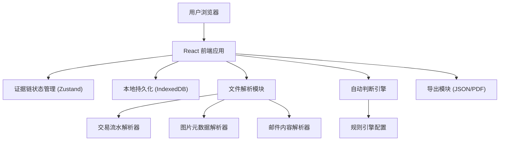
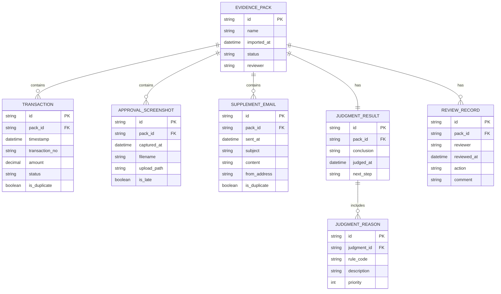

## 1. 架构设计



## 2. 技术描述

- **前端框架**：React@18 + TypeScript
- **构建工具**：Vite@5
- **样式方案**：TailwindCSS@3
- **状态管理**：Zustand (轻量级，适合风控工具场景)
- **本地数据持久化**：IndexedDB (通过 dexie.js) - 确保核心证据不丢失
- **UI组件**：Radix UI (无样式组件，配合Tailwind自定义)
- **图标**：Lucide React
- **日期处理**：date-fns
- **文件处理**：browser-image-meta, JSZip (处理压缩包)

## 3. 路由定义

| 路由 | 页面名称 | 用途 |
|-------|---------|------|
| / | 仪表盘 | 快速查看待处理任务和统计概览 |
| /import | 材料包导入 | 上传和解析材料包 |
| /evidence/:id | 证据链详情 | 时间线视图 + 自动判断面板 |
| /review | 复核清单 | 待复核项目列表和复核记录 |
| /archive | 已归档 | 历史记录查询 |

## 4. 数据模型

### 4.1 实体关系图



### 4.2 核心类型定义

```typescript
// 证据包状态
type EvidencePackStatus = 'pending' | 'parsing' | 'parsed' | 'judging' | 'judged' | 'reviewing' | 'completed' | 'archived';

// 判断结论
type JudgmentConclusion = 'normal' | 'need_supplement' | 'need_review' | 'pending' | 'abnormal';

// 证据类型
type EvidenceType = 'transaction' | 'screenshot' | 'email' | 'correction';

interface EvidenceItem {
  id: string;
  type: EvidenceType;
  timestamp: Date;
  title: string;
  description: string;
  isDuplicate?: boolean;
  isLate?: boolean;
  isCorrection?: boolean;
  source: string;
}

interface TransactionRecord extends EvidenceItem {
  type: 'transaction';
  transactionNo: string;
  amount: number;
  currency: string;
  counterparty: string;
}

interface ApprovalScreenshot extends EvidenceItem {
  type: 'screenshot';
  filename: string;
  imageUrl: string;
  approver?: string;
}

interface SupplementEmail extends EvidenceItem {
  type: 'email';
  subject: string;
  from: string;
  to: string[];
  content: string;
  attachments: string[];
}

interface JudgmentResult {
  id: string;
  packId: string;
  conclusion: JudgmentConclusion;
  reasons: JudgmentReason[];
  nextStep: string;
  nextStepDetails: string[];
  judgedAt: Date;
  confidence: number;
}

interface JudgmentReason {
  ruleCode: string;
  description: string;
  severity: 'info' | 'warning' | 'error';
  evidenceIds: string[];
}

interface ReviewRecord {
  id: string;
  packId: string;
  reviewer: string;
  reviewedAt: Date;
  action: 'confirm' | 'reject' | 'supplement' | 'correction';
  comment: string;
  evidenceItems?: string[];
}
```

## 5. 自动判断规则引擎

### 5.1 核心规则配置

```typescript
const JUDGMENT_RULES = [
  {
    code: 'R001',
    name: '交易流水完整性检查',
    description: '检查每笔交易是否有对应审批截图',
    severity: 'error',
    check: (evidence) => {
      // 逻辑：统计交易数与审批截图数是否匹配
    }
  },
  {
    code: 'R002',
    name: '重复项检测',
    description: '检测是否存在重复提交的证据',
    severity: 'warning',
    check: (evidence) => {
      // 逻辑：基于内容哈希或元数据检测重复
    }
  },
  {
    code: 'R003',
    name: '晚到附件识别',
    description: '识别超出正常时间窗口提交的附件',
    severity: 'warning',
    check: (evidence) => {
      // 逻辑：对比交易时间与附件上传时间
    }
  },
  {
    code: 'R004',
    name: '人工更正痕迹检测',
    description: '检测是否存在人工修改或更正记录',
    severity: 'info',
    check: (evidence) => {
      // 逻辑：识别更正标注或版本差异
    }
  },
  {
    code: 'R005',
    name: '时间线合理性校验',
    description: '校验证据链时间顺序是否合理',
    severity: 'error',
    check: (evidence) => {
      // 逻辑：审批必须在交易之前，补充邮件必须在之后
    }
  }
];
```

## 6. 数据持久化策略

### 6.1 IndexedDB 存储结构

| Store Name | 存储内容 | 索引 |
|------------|----------|------|
| packs | 证据包基本信息 | imported_at, status |
| transactions | 交易流水记录 | pack_id, timestamp, transaction_no |
| screenshots | 审批截图元数据 | pack_id, captured_at |
| emails | 补充邮件内容 | pack_id, sent_at |
| judgments | 判断结果 | pack_id, judged_at |
| reviews | 复核记录 | pack_id, reviewed_at |

### 6.2 导出功能

- 支持导出完整证据链为 JSON 格式（包含所有数据）
- 支持导出复核报告为 PDF 格式（风控存档使用）
- 所有导出文件包含时间戳和版本号，确保可追溯
