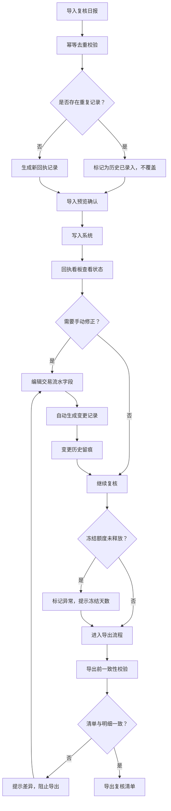

## 1. 产品概述

渠道返佣回执系统——供风控运营日常使用的返佣回执管理工具。核心解决三个问题：同一批复核材料重复导入不会覆盖历史、手动改交易流水时前后变化留痕可追溯、导出复核清单与明细数据一致不矛盾。目标用户是风控运营岗，不是管理层看板。

## 2. 核心功能

### 2.1 用户角色

| 角色 | 权限 |
|------|------|
| 风控运营 | 导入复核日报、查看回执状态、手动修正流水、导出复核清单、查看冻结额度 |
| 只读查看 | 查看回执状态和历史变更记录，不可修改 |

### 2.2 功能模块

1. **回执看板页**：全量回执列表，状态筛选，异常标记，冻结额度未释放提示
2. **回执详情页**：单笔回执全生命周期状态流、交易明细、手动修正入口、变更历史
3. **导入页**：粘贴/上传复核日报样例，幂等去重逻辑，重复导入预览
4. **导出页**：复核清单导出前预览，导出一致性校验，历史导出记录

### 2.3 页面详情

| 页面名称 | 模块名称 | 功能描述 |
|----------|----------|----------|
| 回执看板 | 回执列表 | 按渠道/状态/日期筛选回执，显示渠道名称、金额、状态、异常标记、冻结额度释放状态 |
| 回执看板 | 异常摘要栏 | 顶部统计异常笔数、冻结未释放笔数、待复核笔数，点击可跳转筛选 |
| 回执看板 | 冻结额度提示 | 对冻结超过T+1未释放的记录标红提示，显示冻结天数 |
| 回执详情 | 状态时间线 | 回执从「待复核→复核中→已通过/已驳回/异常」的状态流，每个状态带时间戳和操作人 |
| 回执详情 | 交易明细 | 该回执下的交易流水列表，显示原始字段和当前值，手动修正过的字段高亮 |
| 回执详情 | 手动修正面板 | 选中流水字段可编辑，保存时自动生成变更记录（字段名、旧值、新值、时间、操作人） |
| 回执详情 | 变更历史 | 按时间倒序展示所有手动修正记录，含完整前后值对比 |
| 导入 | 复核日报输入 | 支持粘贴文本或上传CSV，解析渠道、金额、交易流水号等字段 |
| 导入 | 幂等校验 | 根据交易流水号+渠道+日期去重，已存在的记录显示为「历史已录入」状态而非新记录 |
| 导入 | 导入预览 | 导入前展示解析结果和去重判断，运营确认后才写入 |
| 导出 | 清单预览 | 导出前展示复核清单完整内容，标注哪些字段被手动修正过 |
| 导出 | 一致性校验 | 导出前自动比对清单数据与明细数据，不一致时阻止导出并提示差异 |
| 导出 | 导出记录 | 记录每次导出的时间、操作人、导出范围，可回溯 |

## 3. 核心流程

风控运营每日工作流：导入复核日报 → 系统幂等去重 → 运营确认写入 → 逐笔复核回执状态 → 发现异常手动修正（自动留痕）→ 检查冻结额度释放 → 导出复核清单前校验一致性 → 导出

## 4. 用户界面设计

### 4.1 设计风格

- **工业实用主义**：无装饰，信息密度优先，表格和数字为主角
- 主色：深灰（zinc-800），辅色：琥珀色（amber-500）用于异常/警告，蓝灰色（slate-500）用于冻结状态
- 按钮：扁平圆角，操作按钮用实心，次要按钮用描边
- 字体：等宽数字用于金额和流水号，正文字体清晰易读
- 布局：顶栏+左侧导航+主内容区，表格为主，侧面板用于详情
- 图标：lucide-react 线性图标，不使用emoji

### 4.2 页面设计概述

| 页面名称 | 模块名称 | UI元素 |
|----------|----------|--------|
| 回执看板 | 异常摘要栏 | 顶部3个统计卡片（异常/冻结未释放/待复核），点击筛选列表 |
| 回执看板 | 回执列表 | 全宽表格，列：渠道、流水号、金额、状态标签、冻结天数、操作按钮，支持排序和筛选 |
| 回执看板 | 冻结额度提示 | 冻结超T+1行标红背景，冻结天数列显示红色数字 |
| 回执详情 | 状态时间线 | 左侧垂直时间线，节点显示状态+时间+操作人 |
| 回执详情 | 交易明细 | 表格显示字段，修正过的字段背景标黄，点击字段进入编辑 |
| 回执详情 | 变更历史 | 右侧面板或折叠区，每条记录显示字段名、删除线旧值→新值、时间 |
| 导入 | 输入区 | 左侧文本框/上传区，右侧预览表格，底部确认按钮 |
| 导入 | 去重标记 | 预览表格中重复行背景灰色，状态列显示「历史已录入」 |
| 导出 | 预览区 | 表格预览导出内容，修正字段标黄底，底部一致性校验状态+导出按钮 |

### 4.3 响应式

桌面端优先，最小支持1280px宽度。表格支持横向滚动，侧面板在窄屏下变为底部抽屉。

### 4.4 3D场景

不适用
