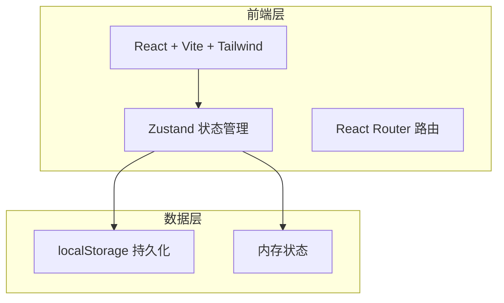
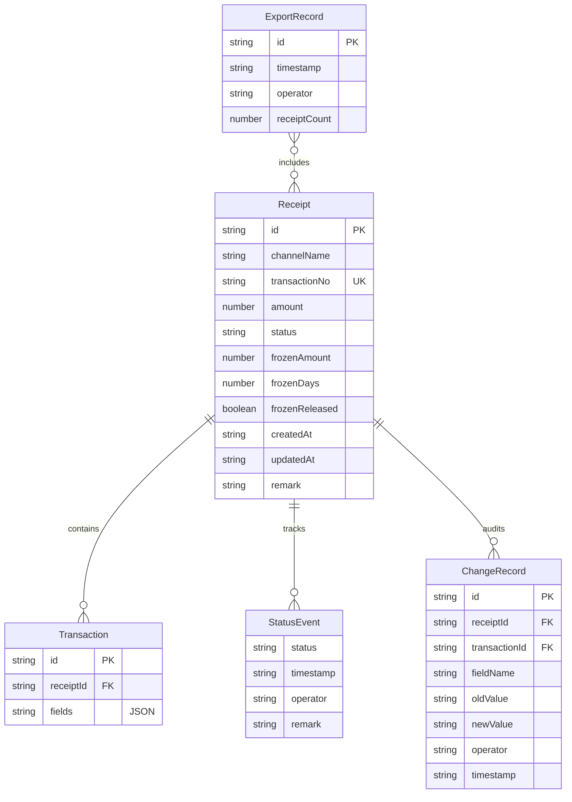

## 1. 架构设计



纯前端架构，数据持久化使用 localStorage，无需后端服务。所有业务逻辑（幂等去重、变更留痕、一致性校验）在前端完成。

## 2. 技术说明

- 前端：React@18 + TypeScript + Tailwind CSS@3 + Vite
- 初始化工具：vite-init
- 后端：无
- 数据库：localStorage + 内存（mock 数据）
- 状态管理：Zustand（含 persist 中间件持久化到 localStorage）
- 路由：React Router DOM v6
- 图标：lucide-react

## 3. 路由定义

| 路由 | 用途 |
|------|------|
| / | 回执看板页 - 全量回执列表、异常摘要、冻结额度提示 |
| /receipt/:id | 回执详情页 - 状态时间线、交易明细、手动修正、变更历史 |
| /import | 导入页 - 复核日报输入、幂等校验、导入预览 |
| /export | 导出页 - 清单预览、一致性校验、导出 |

## 4. API 定义

无后端 API。所有数据操作通过 Zustand store 方法完成。

### 4.1 Store 方法定义

```typescript
interface ReceiptStore {
  receipts: Receipt[]
  changeHistories: ChangeRecord[]
  exportRecords: ExportRecord[]

  importFromDailyReport: (data: DailyReportRow[]) => ImportPreview
  confirmImport: (preview: ImportPreview) => void
  updateTransactionField: (receiptId: string, txId: string, field: string, newValue: string) => void
  updateReceiptStatus: (receiptId: string, status: ReceiptStatus) => void
  getReceiptById: (id: string) => Receipt | undefined
  getChangeHistory: (receiptId: string) => ChangeRecord[]
  validateExportConsistency: (receiptIds: string[]) => ConsistencyResult
  exportChecklist: (receiptIds: string[]) => ExportRecord
  getFrozenReceipts: () => Receipt[]
}

interface Receipt {
  id: string
  channelName: string
  transactionNo: string
  amount: number
  status: ReceiptStatus
  frozenAmount: number
  frozenDays: number
  frozenReleased: boolean
  createdAt: string
  updatedAt: string
  transactions: Transaction[]
  statusTimeline: StatusEvent[]
  remark: string
}

type ReceiptStatus = "pending" | "reviewing" | "approved" | "rejected" | "exception"

interface Transaction {
  id: string
  receiptId: string
  fields: Record<string, TransactionField>
}

interface TransactionField {
  value: string
  originalValue: string
  modified: boolean
  modifiedAt?: string
}

interface StatusEvent {
  status: ReceiptStatus
  timestamp: string
  operator: string
  remark?: string
}

interface ChangeRecord {
  id: string
  receiptId: string
  transactionId: string
  fieldName: string
  oldValue: string
  newValue: string
  operator: string
  timestamp: string
}

interface DailyReportRow {
  channelName: string
  transactionNo: string
  amount: number
  remark?: string
  reportDate: string
}

interface ImportPreview {
  newRows: DailyReportRow[]
  duplicateRows: DailyReportRow[]
  errorRows: DailyReportRow[]
}

interface ConsistencyResult {
  consistent: boolean
  differences: ConsistencyDifference[]
}

interface ConsistencyDifference {
  receiptId: string
  field: string
  checklistValue: string
  detailValue: string
}

interface ExportRecord {
  id: string
  timestamp: string
  operator: string
  receiptCount: number
  receiptIds: string[]
}
```

## 5. 服务端架构图

不适用

## 6. 数据模型

### 6.1 数据模型定义



### 6.2 数据定义语言

使用 localStorage 存储，键名和结构如下：

- `commission-receipts`: Receipt[] —— 所有回执记录
- `commission-change-histories`: ChangeRecord[] —— 所有变更记录
- `commission-export-records`: ExportRecord[] —— 所有导出记录

初始化时注入 mock 数据，模拟3天运营数据，含正常、异常、冻结未释放、已手动修正等多种状态。
