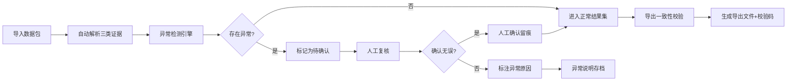

## 1. 产品概述

供应商扣款复核工具是面向财务结算人员的专业复核工作台，解决费率表、退款清单、结算附件证据分散、异常追溯难、导出不一致的核心痛点。工具以"时间线"为主轴，将三类证据串联展示，强化状态回看、异常解释和导出一致性三大能力。

- 目标用户：财务结算复核人员
- 核心价值：让核心证据可追溯、异常情况不遗漏、导出结果可校验
- 设计原则：少装饰、重状态、证据留痕、宁严勿松

## 2. 核心功能

### 2.1 用户角色

| 角色 | 登录方式 | 核心权限 |
|------|----------|----------|
| 财务复核员 | 本地账号登录 | 导入数据、查看证据链、标记异常、人工确认、导出结果 |

### 2.2 功能模块

1. **复核工作台**：时间线主视图，三线合一展示费率表、退款清单、结算附件
2. **异常检测中心**：自动识别重复入账、手续费跨期、退款挂账三类异常
3. **状态回看面板**：完整操作留痕，支持按时间节点回溯
4. **人工确认模块**：异常标记、更正说明、对账备注
5. **导出与校验**：Excel导出 + 一致性哈希校验

### 2.3 页面详情

| 页面名称 | 模块名称 | 功能描述 |
|-----------|-------------|---------------------|
| 复核工作台 | 时间线主视图 | 按时间轴串联费率表、退款记录、结算附件，支持缩放筛选 |
| 复核工作台 | 异常高亮面板 | 实时标注待确认项，点击查看异常解释和证据链 |
| 复核工作台 | 状态回看面板 | 操作日志时间轴，支持点击回溯任意节点状态 |
| 人工确认 | 异常处理表单 | 标记确认/驳回、填写更正说明、上传对账凭证 |
| 导出中心 | 导出预览 | 预览导出数据、生成校验码、支持多格式导出 |

## 3. 核心流程

**复核工作流说明**：
1. 导入包含正常记录、晚到附件、重复项、人工更正的数据包
2. 系统按时间线自动串联费率表、退款清单、结算附件
3. 异常检测引擎自动识别：同一流水重复入账、手续费跨期、退款挂账
4. 异常项强制标记为"待确认"，不混入正常结果
5. 人工复核时需填写确认意见，所有操作留痕
6. 导出前进行一致性校验，生成可验证的校验码

## 4. 用户界面设计

### 4.1 设计风格

- **美学方向**：工业极简主义（Industrial Minimalist），强调数据密度和可读性
- **主色调**：深灰蓝 `#1e293b` 为背景，石板灰 `#334155` 为卡片，翠绿 `#059669` 表示正常，琥珀 `#d97706` 表示待确认，红 `#dc2626` 表示异常
- **字体**：专业等宽字体 `JetBrains Mono` 用于数据展示，`Noto Sans SC` 用于中文说明
- **布局**：三栏固定式布局，左侧筛选过滤，中间时间线主视图，右侧详情面板
- **状态标记**：使用方括号标签 `[正常]` `[待确认]` `[异常]`，避免花哨图标

### 4.2 页面设计概览

| 页面名称 | 模块名称 | UI Elements |
|-----------|-------------|-------------|
| 复核工作台 | 时间线主视图 | 固定网格布局、垂直时间轴、三色状态标记、悬浮证据预览 |
| 复核工作台 | 异常面板 | 列表式异常项、点击展开证据链、操作按钮组 |
| 状态回看 | 操作日志 | 时间倒序排列、操作人/时间/内容三元组、点击回溯 |
| 导出中心 | 导出预览 | 数据表格预览、校验码生成区、下载按钮 |

### 4.3 响应式

- 桌面端优先（1440px+），三栏固定布局
- 平板端折叠右侧面板为抽屉
- 移动端仅保留核心时间线，操作为弹窗模式

## 5. 异常处理规则

### 5.1 同一流水重复入账
- 检测规则：相同流水号出现2次及以上
- 处理方式：全部标记为`[待确认]`，高亮显示重复组
- 人工操作：需确认哪条有效、哪条作废，填写说明

### 5.2 手续费跨期
- 检测规则：手续费归属期与实际入账期不在同一会计期间
- 处理方式：标记为`[待确认]`，提示跨期天数
- 人工操作：需确认是否需要调整、跨期原因说明

### 5.3 退款挂账
- 检测规则：退款记录产生后超过30天无对应核销记录
- 处理方式：标记为`[待确认]`，显示挂账天数
- 人工操作：需确认挂账原因、预计处理时间

### 5.4 晚到附件
- 检测规则：结算附件上传时间晚于复核截止日
- 处理方式：标记为`[待确认]`，注明"晚到附件"
- 人工操作：需确认附件有效性、是否影响前期结果
