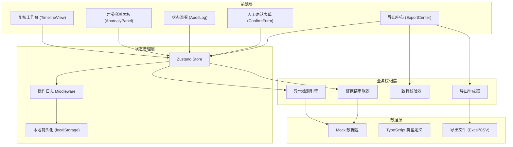
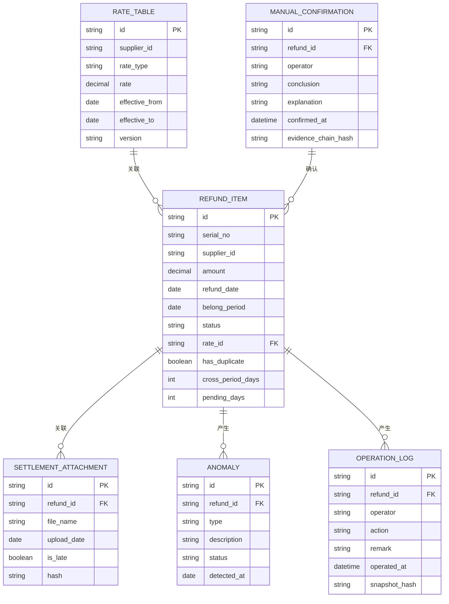

## 1. 架构设计



## 2. 技术描述

- **前端框架**: React@18 + TypeScript@5
- **构建工具**: Vite@5
- **样式方案**: TailwindCSS@3
- **状态管理**: Zustand@4 + Immer（支持时间旅行调试）
- **图标**: Lucide React（极简线性图标，仅用于功能按钮）
- **导出**: SheetJS (xlsx) + 自定义哈希校验
- **数据**: 内置Mock数据包，localStorage持久化操作记录
- **无后端依赖**，纯前端实现，所有数据和逻辑在浏览器端运行

## 3. 路由定义

| Route | 用途 |
|-------|------|
| / | 复核工作台（主界面，时间线视图） |
| /anomalies | 异常检测中心（全部待确认项列表） |
| /audit | 状态回看（完整操作日志） |
| /export | 导出中心（预览+导出+校验） |

## 4. 核心数据模型

### 4.1 数据实体关系



### 4.2 TypeScript 类型定义

```typescript
// 费率表
interface RateTable {
  id: string;
  supplierId: string;
  supplierName: string;
  rateType: 'service_fee' | 'commission' | 'penalty';
  rate: number;
  effectiveFrom: string;
  effectiveTo: string;
  version: string;
}

// 退款记录
interface RefundItem {
  id: string;
  serialNo: string;
  supplierId: string;
  supplierName: string;
  amount: number;
  feeAmount: number;
  refundDate: string;
  belongPeriod: string;
  entryDate: string;
  writeOffDate: string | null;
  status: 'normal' | 'pending' | 'anomaly';
  rateId: string;
  anomalies: Anomaly[];
  attachments: SettlementAttachment[];
  confirmations: ManualConfirmation[];
}

// 结算附件
interface SettlementAttachment {
  id: string;
  refundId: string;
  fileName: string;
  fileType: 'invoice' | 'settlement' | 'proof';
  uploadDate: string;
  reviewDeadline: string;
  isLate: boolean;
  hash: string;
  content: string;
}

// 异常记录
interface Anomaly {
  id: string;
  refundId: string;
  type: 'duplicate' | 'cross_period' | 'pending' | 'late_attachment';
  description: string;
  severity: 'high' | 'medium' | 'low';
  detectedAt: string;
  status: 'open' | 'confirmed' | 'rejected';
  relatedRefundIds: string[];
  crossPeriodDays?: number;
  pendingDays?: number;
}

// 人工确认
interface ManualConfirmation {
  id: string;
  refundId: string;
  operator: string;
  conclusion: 'valid' | 'invalid' | 'adjusted';
  explanation: string;
  reconciliationNote: string;
  confirmedAt: string;
  evidenceChainHash: string;
}

// 操作日志
interface OperationLog {
  id: string;
  refundId: string;
  operator: string;
  action: string;
  oldValue: any;
  newValue: any;
  remark: string;
  operatedAt: string;
  snapshotHash: string;
}

// 导出校验
interface ExportVerification {
  exportId: string;
  exportTime: string;
  operator: string;
  recordCount: number;
  totalAmount: number;
  dataHash: string;
  signature: string;
}
```

## 5. 异常检测引擎规则

### 5.1 重复入账检测
```typescript
function detectDuplicates(items: RefundItem[]): Anomaly[] {
  // 按流水号分组
  // 出现次数 >= 2 的标记为重复
  // 关联所有重复项的ID
}
```

### 5.2 手续费跨期检测
```typescript
function detectCrossPeriod(item: RefundItem): Anomaly | null {
  // 比较 belongPeriod 与 entryDate 的会计期间
  // 计算跨期天数
  // 跨期则标记
}
```

### 5.3 退款挂账检测
```typescript
function detectPending(item: RefundItem, today: string): Anomaly | null {
  // refundDate 距今超过30天且 writeOffDate 为空
  // 计算挂账天数
  // 挂账则标记
}
```

### 5.4 晚到附件检测
```typescript
function detectLateAttachment(attachment: SettlementAttachment): Anomaly | null {
  // uploadDate > reviewDeadline 则标记
}
```

## 6. 一致性校验机制

### 6.1 证据链哈希
每条记录的费率表+退款记录+附件+人工确认合并计算SHA-256哈希，确保证据链不可篡改。

### 6.2 导出校验
导出时计算：
1. 所有记录的金额合计校验
2. 状态分布统计校验
3. 整包数据哈希值
4. 生成校验文件 `.verification.json` 随导出文件一同下载

### 6.3 操作快照
每次人工操作前对整条记录做哈希快照，存入操作日志，支持状态回溯和篡改检测。
