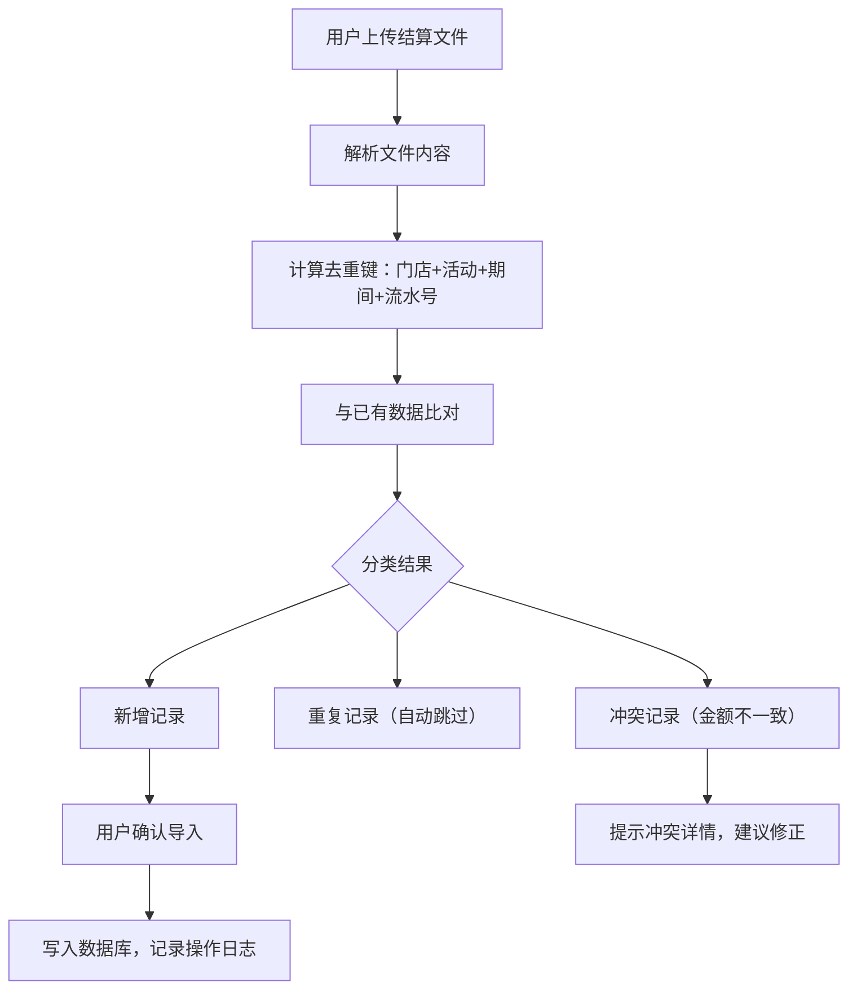
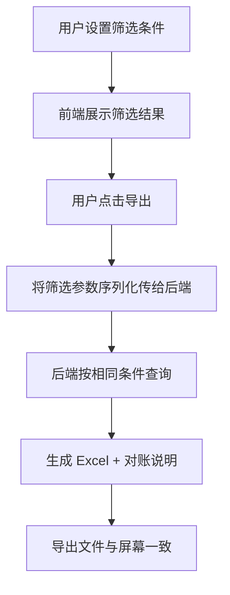
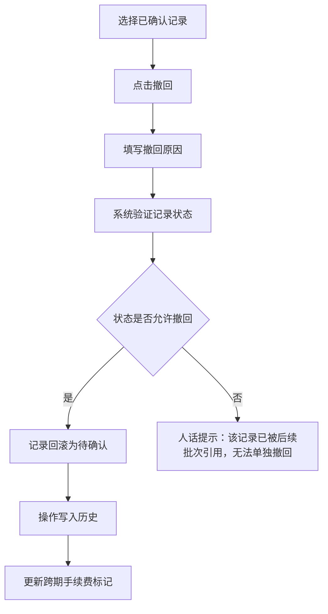
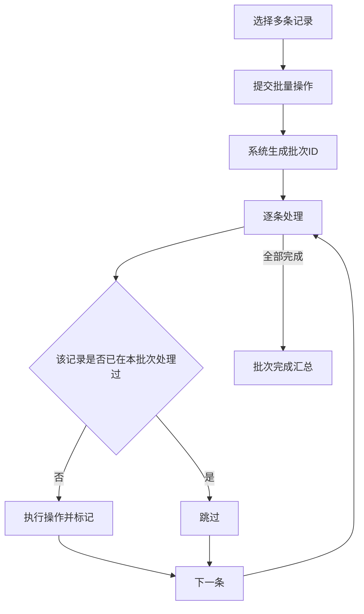

## 1. 产品概述

联名活动结算系统，面向门店财务与总部会计，解决手续费跨期确认难、重复导入、撤回修正口径不一致等痛点，让一线同事愿意跑、敢确认结果。
- 核心目标：结算数据一次导入即去重，筛选后导出与屏幕所见完全一致，撤回修正留痕可追溯，批量处理幂等不膨胀
- 目标用户：门店财务人员、总部会计、结算管理员

## 2. 核心功能

### 2.1 用户角色

| 角色 | 注册方式 | 核心权限 |
|------|----------|----------|
| 门店财务 | 管理员分配 | 导入结算数据、查看本门店结算、筛选导出 |
| 总部会计 | 管理员分配 | 查看全部门店结算、跨期对账、确认手续费、筛选导出 |
| 结算管理员 | 管理员分配 | 全部权限，含撤回修正、批量处理、数据管理 |

### 2.2 功能模块

1. **结算工作台**：结算概览统计、最近导入记录、待处理提醒、快捷操作入口
2. **结算明细页**：结算记录列表、多条件筛选、排序、分页浏览、批量选择
3. **导入中心**：文件上传、去重校验、导入结果反馈（人话提示）
4. **导出中心**：按当前筛选条件导出 Excel、导出对账说明自动生成、导出范围与屏幕一致保证
5. **撤回与修正**：撤回操作、修正记录、操作历史留痕
6. **批量处理**：批量确认、批量撤回、幂等执行保证

### 2.3 页面详情

| 页面名称 | 模块名称 | 功能描述 |
|----------|----------|----------|
| 结算工作台 | 概览统计卡片 | 显示待确认金额、跨期手续费、本月已结算等关键指标 |
| 结算工作台 | 最近导入记录 | 展示最近5次导入的时间、条数、状态 |
| 结算工作台 | 待处理提醒 | 手续费跨期待确认项、去重冲突项等 |
| 结算明细页 | 筛选栏 | 按门店、活动名称、结算期间、状态、金额范围筛选 |
| 结算明细页 | 明细表格 | 展示结算记录，支持排序、分页、行选择 |
| 结算明细页 | 批量操作栏 | 批量确认、批量撤回、导出选中/导出全部（按筛选） |
| 导入中心 | 上传区域 | 拖拽或点击上传 Excel/CSV 文件 |
| 导入中心 | 去重校验结果 | 展示新增/重复/冲突记录数及明细，用人话描述问题 |
| 导入中心 | 导入确认 | 确认导入新增数据，跳过重复数据，冲突数据提示修正 |
| 导出中心 | 导出配置 | 选择导出范围（当前筛选/选中记录）、是否含对账说明 |
| 导出中心 | 对账说明生成 | 自动根据筛选条件和数据生成对账说明文本 |
| 撤回与修正 | 撤回操作 | 对已确认的结算记录执行撤回，记录撤回原因 |
| 撤回与修正 | 修正记录 | 查看所有修正历史，含操作人、时间、前后值 |
| 批量处理 | 批量任务列表 | 展示批量任务状态（进行中/已完成/失败） |
| 批量处理 | 重复执行保护 | 同一批次重复提交自动跳过，不会产生重复数据 |

## 3. 核心流程

### 3.1 结算导入去重流程

用户上传结算文件 → 系统解析文件内容 → 按「门店+活动+结算期间+流水号」计算去重键 → 与已有数据比对 → 分类为「新增/重复/冲突」→ 人话提示导入结果 → 用户确认后仅导入新增数据

### 3.2 筛选导出一致性流程

用户设置筛选条件 → 屏幕展示筛选结果 → 用户点击导出 → 系统以相同筛选条件查询数据 → 生成 Excel + 对账说明 → 导出文件与屏幕所见一致

### 3.3 撤回修正流程

用户选择已确认记录 → 点击撤回 → 填写撤回原因 → 系统验证状态 → 记录回滚为「待确认」→ 操作写入历史 → 相关手续费跨期标记更新

### 3.4 批量处理幂等流程

用户选择多条记录 → 提交批量操作 → 系统生成批次ID → 逐条处理并检查是否已执行 → 已执行记录跳过 → 未执行记录执行 → 批次完成汇总

## 4. 用户界面设计

### 4.1 设计风格

- 主色调：深青色 (#0F766E) 搭配暖橙色 (#F59E0B) 作为强调色，传达专业可靠又不失温度
- 辅助色：石板灰 (#334155) 文字色、浅灰 (#F1F5F9) 背景色、白色卡片
- 按钮风格：圆角 (rounded-lg)，主要操作用实心深青色，危险操作用红色，次要操作用描边
- 字体：思源黑体 / Noto Sans SC 作为主字体，数字用 Tabular Nums 等宽对齐
- 布局：左侧导航 + 右侧内容区，卡片式模块，表格行间距宽松
- 图标：lucide-react 图标库，线条风格统一
- 状态标签：圆角药丸形标签，绿色=已确认、黄色=待确认、红色=异常、灰色=已撤回

### 4.2 页面设计概览

| 页面名称 | 模块名称 | UI 元素 |
|----------|----------|---------|
| 结算工作台 | 概览统计卡片 | 4张并排卡片，深青色渐变背景，大号数字+小号标签，悬浮阴影 |
| 结算工作台 | 最近导入 | 列表样式，每行显示文件名、时间、条数状态标签 |
| 结算工作台 | 待处理提醒 | 黄色/红色提示条，图标+文字+操作按钮 |
| 结算明细页 | 筛选栏 | 水平排列下拉框和输入框，深青色筛选按钮，灰色重置按钮 |
| 结算明细页 | 明细表格 | 斑马纹表格，行悬浮高亮，复选框列，状态标签列 |
| 结算明细页 | 批量操作栏 | 固定底部操作栏，选中数量提示+操作按钮组 |
| 导入中心 | 上传区域 | 虚线边框拖拽区，上传图标+提示文字 |
| 导入中心 | 去重结果 | 三列卡片（新增/重复/冲突），数字+颜色区分 |
| 导入中心 | 冲突详情 | 展开面板，并排显示原值和新值，红色高亮差异 |
| 导出中心 | 导出配置 | 表单布局，单选导出范围，开关是否含对账说明 |
| 导出中心 | 对账说明预览 | 只读文本区域，展示自动生成的对账说明 |
| 撤回与修正 | 操作历史 | 时间线样式，每条记录显示操作类型、操作人、时间、变更内容 |
| 批量处理 | 任务列表 | 卡片列表，进度条+状态标签+操作按钮 |

### 4.3 响应式

- 桌面优先设计，最小宽度 1280px
- 平板端（768-1279px）侧边导航折叠为图标模式
- 表格在窄屏时支持横向滚动
- 触屏设备：按钮最小 44px 触控区域，表格行高适当增加

### 4.4 3D 场景

不适用
