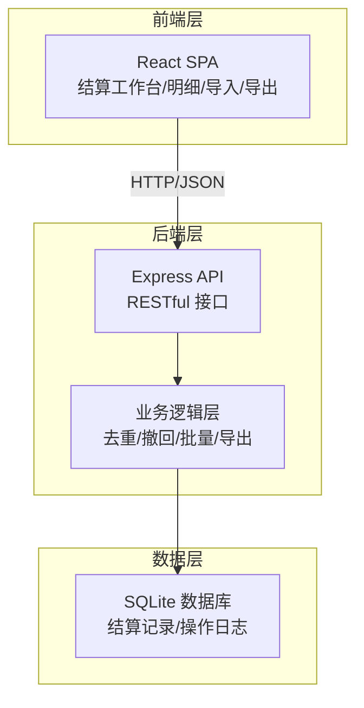
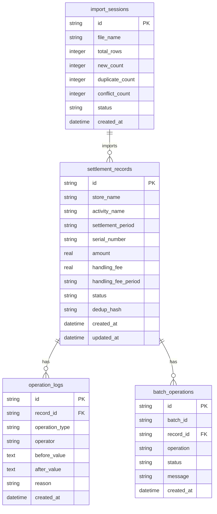

## 1. 架构设计



## 2. 技术说明

- 前端：React@18 + TypeScript + Tailwind CSS@3 + Vite
- 初始化工具：vite-init
- 状态管理：Zustand
- 后端：Express@4 + TypeScript（ESM）
- 数据库：SQLite（better-sqlite3），适合单机部署，无需额外数据库服务
- 图标：lucide-react
- 路由：react-router-dom
- 导出：前端生成 Excel（SheetJS/xlsx 库）

## 3. 路由定义

| 路由 | 用途 |
|------|------|
| / | 结算工作台，概览统计与快捷入口 |
| /settlements | 结算明细页，列表筛选与批量操作 |
| /import | 导入中心，上传去重与结果反馈 |
| /export | 导出中心，按筛选条件导出 |
| /history | 撤回与修正历史，操作追溯 |

## 4. API 定义

### 4.1 结算记录

```typescript
interface SettlementRecord {
  id: string;
  store_name: string;
  activity_name: string;
  settlement_period: string;
  serial_number: string;
  amount: number;
  handling_fee: number;
  handling_fee_period: string;
  status: "pending" | "confirmed" | "withdrawn" | "conflict";
  created_at: string;
  updated_at: string;
}

interface SettlementFilter {
  store_name?: string;
  activity_name?: string;
  settlement_period_start?: string;
  settlement_period_end?: string;
  status?: SettlementRecord["status"];
  amount_min?: number;
  amount_max?: number;
  page: number;
  page_size: number;
}

interface SettlementListResponse {
  records: SettlementRecord[];
  total: number;
  page: number;
  page_size: number;
  filter_summary: string;
}
```

### 4.2 导入

```typescript
interface ImportResult {
  total: number;
  new_count: number;
  duplicate_count: number;
  conflict_count: number;
  new_records: SettlementRecord[];
  duplicate_records: { record: SettlementRecord; reason: string }[];
  conflict_records: { existing: SettlementRecord; incoming: SettlementRecord; diff_fields: string[] }[];
}

interface ImportError {
  row: number;
  message: string;
  field: string;
  suggestion: string;
}
```

### 4.3 撤回与修正

```typescript
interface WithdrawRequest {
  record_ids: string[];
  reason: string;
}

interface OperationLog {
  id: string;
  record_id: string;
  operation_type: "import" | "confirm" | "withdraw" | "modify";
  operator: string;
  before_value: Partial<SettlementRecord>;
  after_value: Partial<SettlementRecord>;
  reason: string;
  created_at: string;
}
```

### 4.4 批量操作

```typescript
interface BatchRequest {
  record_ids: string[];
  operation: "confirm" | "withdraw";
  batch_id?: string;
}

interface BatchResult {
  batch_id: string;
  total: number;
  success_count: number;
  skipped_count: number;
  failed_count: number;
  details: { record_id: string; status: "success" | "skipped" | "failed"; message: string }[];
}
```

### 4.5 导出

```typescript
interface ExportRequest {
  filter: SettlementFilter;
  include_reconciliation_note: boolean;
  export_scope: "filtered" | "selected";
  selected_ids?: string[];
}
```

## 5. 服务器架构图


## 6. 数据模型

### 6.1 数据模型定义



### 6.2 数据定义语言

```sql
CREATE TABLE settlement_records (
  id TEXT PRIMARY KEY,
  store_name TEXT NOT NULL,
  activity_name TEXT NOT NULL,
  settlement_period TEXT NOT NULL,
  serial_number TEXT NOT NULL,
  amount REAL NOT NULL,
  handling_fee REAL NOT NULL DEFAULT 0,
  handling_fee_period TEXT NOT NULL DEFAULT '',
  status TEXT NOT NULL DEFAULT 'pending' CHECK(status IN ('pending','confirmed','withdrawn','conflict')),
  dedup_hash TEXT NOT NULL,
  created_at TEXT NOT NULL DEFAULT (datetime('now')),
  updated_at TEXT NOT NULL DEFAULT (datetime('now')),
  UNIQUE(dedup_hash)
);

CREATE INDEX idx_settlement_store ON settlement_records(store_name);
CREATE INDEX idx_settlement_period ON settlement_records(settlement_period);
CREATE INDEX idx_settlement_status ON settlement_records(status);
CREATE INDEX idx_settlement_activity ON settlement_records(activity_name);
CREATE INDEX idx_settlement_dedup ON settlement_records(dedup_hash);

CREATE TABLE operation_logs (
  id TEXT PRIMARY KEY,
  record_id TEXT NOT NULL REFERENCES settlement_records(id),
  operation_type TEXT NOT NULL CHECK(operation_type IN ('import','confirm','withdraw','modify')),
  operator TEXT NOT NULL DEFAULT 'system',
  before_value TEXT,
  after_value TEXT,
  reason TEXT,
  created_at TEXT NOT NULL DEFAULT (datetime('now'))
);

CREATE INDEX idx_oplog_record ON operation_logs(record_id);
CREATE INDEX idx_oplog_type ON operation_logs(operation_type);

CREATE TABLE batch_operations (
  id TEXT PRIMARY KEY,
  batch_id TEXT NOT NULL,
  record_id TEXT NOT NULL REFERENCES settlement_records(id),
  operation TEXT NOT NULL,
  status TEXT NOT NULL CHECK(status IN ('success','skipped','failed')),
  message TEXT,
  created_at TEXT NOT NULL DEFAULT (datetime('now'))
);

CREATE INDEX idx_batch_batchid ON batch_operations(batch_id);

CREATE TABLE import_sessions (
  id TEXT PRIMARY KEY,
  file_name TEXT NOT NULL,
  total_rows INTEGER NOT NULL DEFAULT 0,
  new_count INTEGER NOT NULL DEFAULT 0,
  duplicate_count INTEGER NOT NULL DEFAULT 0,
  conflict_count INTEGER NOT NULL DEFAULT 0,
  status TEXT NOT NULL DEFAULT 'processing' CHECK(status IN ('processing','completed','failed')),
  created_at TEXT NOT NULL DEFAULT (datetime('now'))
);
```
