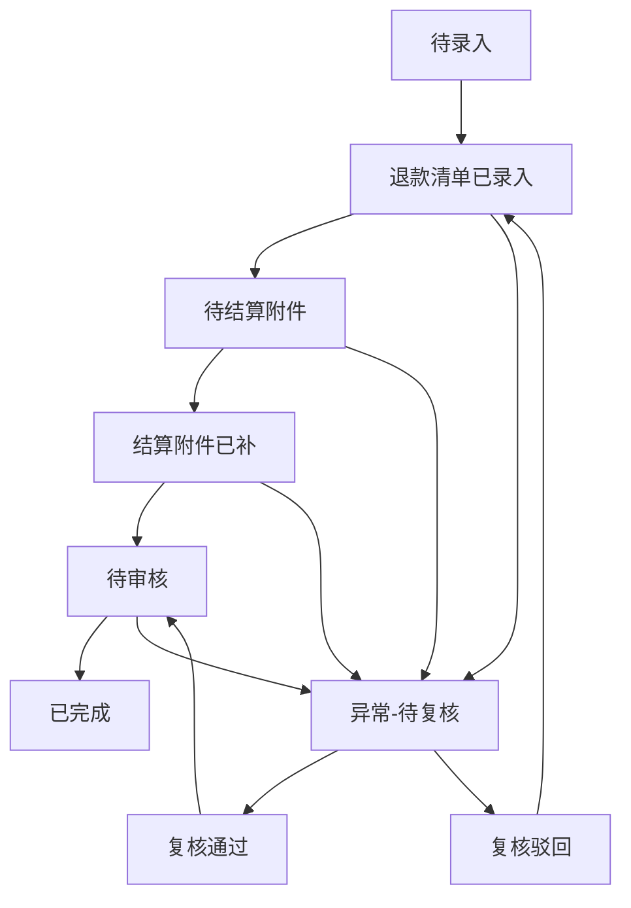

## 1. 产品概述
加盟商保证金记录追踪系统，解决保证金退款流程中材料不同步、状态不透明、审计追溯困难的问题。
- 核心用户：运营人员、财务人员、财务主管
- 核心价值：每条记录可追溯来源、状态流转清晰、改动有迹可循、待处理原因明确

## 2. 核心功能

### 2.1 用户角色
| 角色 | 注册方式 | 核心权限 |
|------|---------|----------|
| 运营人员 | 系统内置 | 录入退款清单、上传结算附件、修改对账单 |
| 财务人员 | 系统内置 | 审核记录、导出对账说明 |
| 财务主管 | 系统内置 | 查看完整审计历史、审批异常处理 |

### 2.2 功能模块
1. **记录列表页**：保证金记录总览、筛选搜索、状态统计
2. **记录详情页**：完整信息展示、状态时间线、操作历史、材料附件
3. **新建/编辑页**：录入退款信息、上传附件、标注改动原因
4. **导出功能**：生成对账说明文档

### 2.3 页面详情
| 页面名称 | 模块名称 | 功能描述 |
|---------|---------|----------|
| 记录列表页 | 顶部筛选 | 按加盟商、状态、日期范围、操作人筛选 |
| 记录列表页 | 统计卡片 | 待处理、已完成、异常状态数量统计 |
| 记录列表页 | 记录表格 | 展示核心信息、快速查看详情 |
| 记录详情页 | 基本信息 | 加盟商名称、金额、来源渠道 |
| 记录详情页 | 状态时间线 | 可视化展示状态流转、每个节点的操作人和时间 |
| 记录详情页 | 材料管理 | 退款清单、结算附件、对账单的上传和查看 |
| 记录详情页 | 改动历史 | 区分"补材料"和"改结论"的操作记录 |
| 记录详情页 | 待处理原因 | 展示为何进入待处理状态的说明 |
| 新建/编辑页 | 表单录入 | 录入保证金相关信息 |
| 新建/编辑页 | 改动标注 | 必须选择改动类型（补材料/改结论）并填写原因 |

## 3. 核心流程

### 3.1 正常退款流程
运营人员录入退款清单 → 系统自动标记"待结算附件" → 上传结算附件 → 系统自动标记"待审核" → 财务审核通过 → 标记"已完成"

### 3.2 异常处理流程
发现对账单有误 → 运营修改并标注"改结论"+原因 → 进入"待复核"状态 → 财务主管复核 → 继续流程

### 3.3 状态流转图

## 4. 用户界面设计

### 4.1 设计风格
- 主色调：深蓝色系（专业、可信），搭配暖橙色强调待处理状态
- 按钮风格：圆角矩形，微阴影，悬停有轻微上浮效果
- 字体：思源黑体为主，清晰易读
- 布局风格：卡片式布局，左侧导航 + 主内容区
- 图标风格：线性图标，简洁现代

### 4.2 页面设计概述
| 页面名称 | 模块名称 | UI 元素 |
|---------|---------|---------|
| 记录列表页 | 统计卡片 | 渐变背景、图标+数字、颜色区分状态 |
| 记录列表页 | 数据表格 | 斑马纹行、悬停高亮、状态标签带颜色 |
| 记录详情页 | 时间线 | 竖线连接、圆形节点、不同颜色表示不同状态 |
| 记录详情页 | 材料区 | 文件卡片、上传时间、操作人信息 |
| 记录详情页 | 改动历史 | 区分"补材料"（灰色标签）和"改结论"（橙色标签） |

### 4.3 响应式
桌面端优先设计，适配 1280px 以上屏幕；平板端表格可横向滚动；移动端简化展示核心信息。

### 4.4 特殊设计要求
- 所有改动操作必须强制填写原因，不能为空
- "补材料"和"改结论"在视觉上要有明显区分
- 待处理原因在页面上要突出显示，便于快速理解
