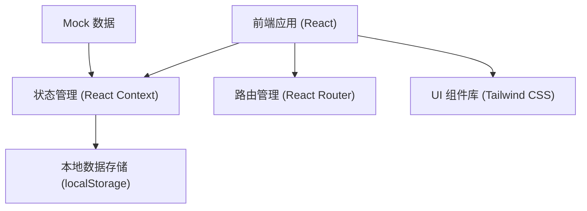
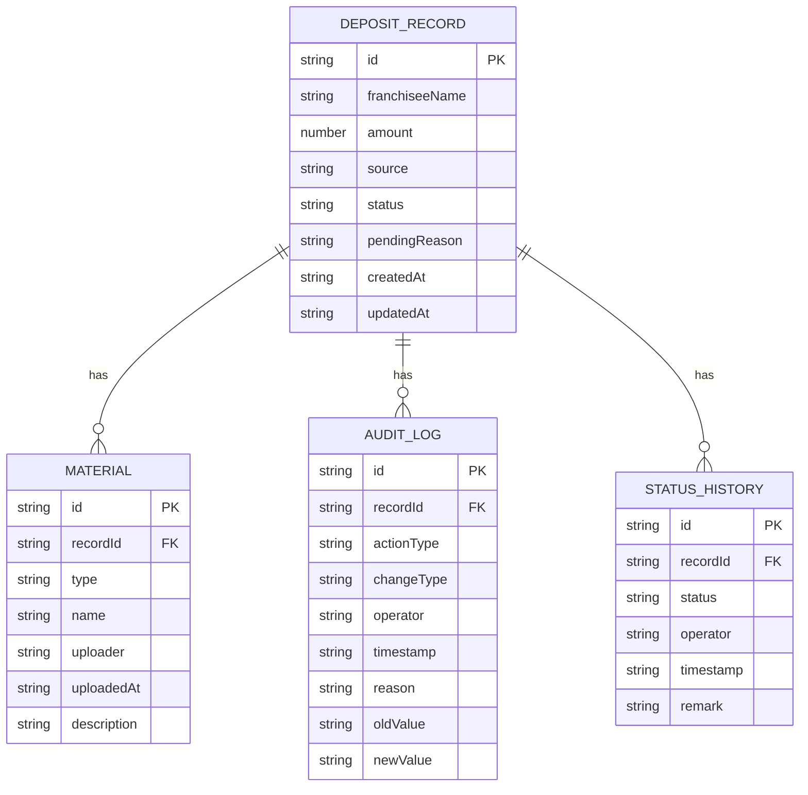

## 1. 架构设计



## 2. 技术描述
- 前端：React@18 + TypeScript + Tailwind CSS@3 + Vite
- 初始化工具：Vite
- 后端：无（纯前端应用，使用 localStorage 存储数据）
- 数据持久化：浏览器 localStorage
- 路由：React Router v6

## 3. 路由定义
| 路由 | 用途 |
|------|------|
| / | 记录列表页（首页） |
| /record/:id | 记录详情页 |
| /record/new | 新建记录页 |
| /record/:id/edit | 编辑记录页 |

## 4. 数据模型

### 4.1 数据模型定义



### 4.2 TypeScript 类型定义

```typescript
// 保证金记录
interface DepositRecord {
  id: string;
  franchiseeName: string; // 加盟商名称
  amount: number; // 保证金金额
  source: string; // 来源渠道
  status: DepositStatus; // 当前状态
  pendingReason: string; // 待处理原因
  createdAt: string;
  updatedAt: string;
}

// 状态枚举
type DepositStatus = 
  | 'pending_entry'        // 待录入
  | 'refund_list_entered'  // 退款清单已录入
  | 'waiting_settlement'   // 待结算附件
  | 'settlement_attached'  // 结算附件已补
  | 'pending_review'       // 待审核
  | 'pending_recheck'      // 待复核
  | 'completed'            // 已完成
  | 'rejected';            // 已驳回

// 材料附件
interface Material {
  id: string;
  recordId: string;
  type: 'refund_list' | 'settlement' | 'statement';
  name: string;
  uploader: string;
  uploadedAt: string;
  description: string;
}

// 审计日志
interface AuditLog {
  id: string;
  recordId: string;
  actionType: 'create' | 'update' | 'upload' | 'status_change';
  changeType: 'material' | 'conclusion'; // 补材料 / 改结论
  operator: string;
  timestamp: string;
  reason: string;
  oldValue?: string;
  newValue?: string;
}

// 状态历史
interface StatusHistory {
  id: string;
  recordId: string;
  status: DepositStatus;
  operator: string;
  timestamp: string;
  remark: string;
}
```

## 5. 核心模块设计

### 5.1 状态管理模块
- 使用 React Context + useReducer
- 管理保证金记录列表、当前选中记录、筛选条件
- 提供增删改查方法

### 5.2 审计追踪模块
- 所有操作自动记录审计日志
- 强制要求填写改动原因
- 区分"补材料"和"改结论"两种变更类型

### 5.3 导出模块
- 生成纯文本格式的对账说明
- 包含完整的状态流转历史和操作记录
- 重点突出待处理原因和变更说明

### 5.4 Mock 数据
- 包含正常退款流程的样例
- 包含缺结算附件的样例
- 包含重复对账单的样例
- 包含边界情况（如状态回退、多次修改）
