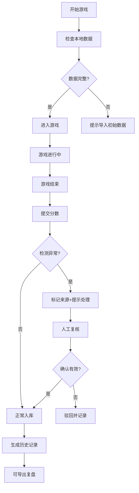

## 1. 产品概述

夜市摊位经营赛是一款基于Canvas的本地Web游戏，玩家在限定时间内经营夜市摊位，通过策略性的商品定价、备货和客户服务来获取高分。游戏使用IndexedDB进行本地数据持久化，支持数据导入、复核、修正、历史追溯和导出功能，确保数据在断线、刷新或重启后保持一致性。

- **核心解决问题**：解决以往版本断线后进度错乱、数据留底不全、刷分来源不明等痛点
- **目标用户**：一线运营同事，用于社群活动和玩家互动
- **核心价值**：提供稳定可靠、数据可追溯、操作友好的游戏体验

## 2. 核心功能

### 2.1 用户角色

| 角色 | 登录方式 | 核心权限 |
|------|----------|----------|
| 运营用户 | 本地免登录 | 完整游戏体验、数据导入导出、复核修正、历史查询 |
| 玩家 | 通过运营分享参与 | 参与游戏、提交分数 |

### 2.2 功能模块

1. **游戏主界面**：Canvas游戏画布、实时分数面板、操作控制区
2. **数据管理**：导入数据、导出活动复盘、数据复核、数据修正、历史记录
3. **分数管理**：分数提交、刷分检测、来源标记、异常处理
4. **筛选与视图**：时间筛选、关卡筛选、玩家筛选、视图同步

### 2.3 页面详情

| 页面名称 | 模块名称 | 功能描述 |
|----------|----------|----------|
| 游戏主页 | 游戏画布 | Canvas渲染夜市场景、摊位、顾客、动画效果 |
| 游戏主页 | 控制面板 | 开始/暂停/重置、时间控制、关卡选择 |
| 游戏主页 | 实时数据 | 当前分数、客户满意度、库存状态 |
| 数据管理 | 数据导入 | 支持JSON格式导入关卡配置、玩家历史数据 |
| 数据管理 | 数据复核 | 对比不同来源数据、标记异常、标注状态 |
| 数据管理 | 数据修正 | 人工修正异常数据、记录修正原因、保留操作日志 |
| 数据管理 | 历史记录 | 按时间/玩家/关卡筛选历史数据、版本追溯 |
| 数据管理 | 导出复盘 | 导出当前视图范围的活动复盘报告，确保筛选一致 |
| 分数处理 | 分数提交 | 游戏结束后提交分数、自动记录来源 |
| 分数处理 | 异常处理 | 检测到刷分时提示来源（关卡草表/玩家反馈）、指引下一步处理人 |

## 3. 核心流程

### 3.1 游戏主流程
用户打开页面 → 检查本地数据 → 选择关卡 → 开始游戏 → 实时操作摊位 → 游戏结束 → 提交分数 → 分数复核 → 查看排行

### 3.2 数据管理流程
导入数据 → 数据校验 → 异常标记 → 人工复核 → 确认/修正 → 数据入库 → 生成历史版本

### 3.3 刷分处理流程
检测异常分数 → 识别来源（关卡草表/玩家反馈） → 显示友好提示 → 标记待处理 → 指引联系对应负责人 → 复核后确认/驳回

## 4. 用户界面设计

### 4.1 设计风格
- **设计主题**：夜市烟火气 - 温暖热闹的霓虹风格
- **主色调**：暖橙色 `#FF6B35`（夜市灯笼）、深紫色 `#2D1B4E`（夜空背景）
- **辅助色**：霓虹粉 `#FF4D8D`、霓虹绿 `#00FFA3`、霓虹黄 `#FFE066`
- **字体**：标题使用 `ZCOOL KuaiLe`（快乐体），正文使用 `Noto Sans SC`
- **按钮风格**：圆角胶囊按钮，霓虹发光效果，hover时有轻微放大动画
- **布局风格**：卡片式布局，半透明毛玻璃效果，层次感强
- **图标风格**：线性图标配合霓虹色彩，使用emoji增强夜市氛围（🏮🍜🍡🎪）

### 4.2 页面设计概述

| 页面名称 | 模块名称 | UI元素 |
|----------|----------|--------|
| 游戏主页 | 游戏画布 | 800x600 Canvas，夜市街景，摊位动画，顾客流动 |
| 游戏主页 | 顶部状态栏 | 关卡名称、剩余时间、当前分数、满意度条 |
| 游戏主页 | 底部操作区 | 商品选择、定价滑块、备货按钮，卡片式排列 |
| 游戏主页 | 侧边数据面板 | 库存列表、今日流水、顾客评价，滚动区域 |
| 数据管理 | 顶部筛选栏 | 时间范围选择器、关卡下拉、玩家搜索框 |
| 数据管理 | 数据列表 | 表格展示，异常行高亮，来源标签 |
| 数据管理 | 操作列 | 复核按钮、修正按钮、查看历史按钮 |
| 异常提示 | 弹窗 | 友好的错误说明，来源标记，处理人联系方式，下一步按钮 |

### 4.3 响应式
- **桌面优先**：1280px以上最优体验，Canvas游戏区域固定800x600
- **平板适配**：1024px-1279px，侧边面板改为底部抽屉
- **移动适配**：768px-1023px，Canvas缩放至屏幕宽度，操作区垂直排列
- **触摸优化**：按钮最小44x44px，滑动手势支持时间轴筛选

### 4.4 视觉动效
- **入场动画**：页面加载时元素从下往上渐入，延迟错开0.1s
- **游戏动画**：顾客行走动画、摊位烹饪动画、金币飞入动画
- **交互反馈**：按钮点击缩放、数据变更高亮闪烁、错误提示震动
- **霓虹效果**：关键元素使用text-shadow和box-shadow模拟霓虹灯光
