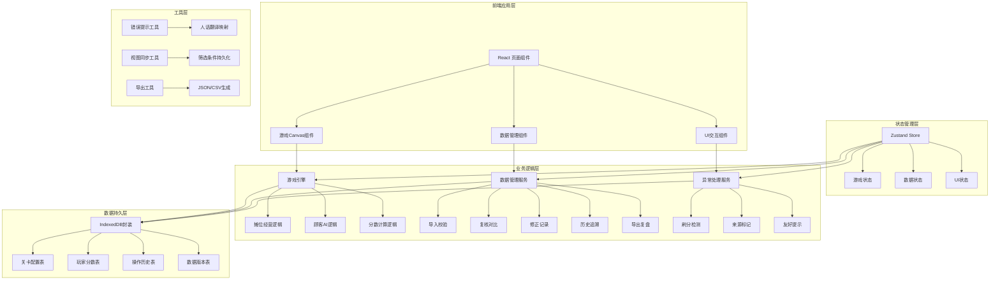
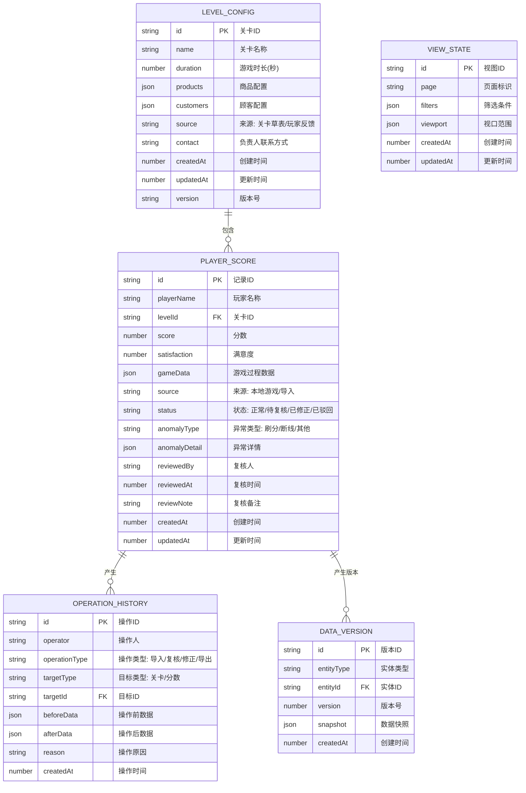

## 1. 架构设计



## 2. 技术描述

- **前端框架**：React@18 + TypeScript@5 + Vite@5
- **样式方案**：TailwindCSS@3 + 自定义CSS变量
- **状态管理**：Zustand@4
- **路由管理**：React Router DOM@6
- **图标库**：Lucide React
- **Canvas渲染**：原生Canvas 2D API
- **本地数据库**：IndexedDB（idb@7 封装）
- **构建工具**：Vite@5
- **包管理器**：npm

## 3. 路由定义

| 路由 | 页面组件 | 功能描述 |
|------|----------|----------|
| `/` | `GamePage` | 游戏主页，包含Canvas游戏区域和控制面板 |
| `/data` | `DataManagementPage` | 数据管理页，包含导入、复核、修正、历史、导出 |
| `/history` | `HistoryPage` | 历史记录查询页 |
| `/export` | `ExportPage` | 活动复盘导出页 |

## 4. 数据模型

### 4.1 IndexedDB 存储结构



### 4.2 TypeScript 类型定义

```typescript
// 游戏相关类型
interface Product {
  id: string;
  name: string;
  baseCost: number;
  basePrice: number;
  emoji: string;
}

interface Customer {
  id: string;
  name: string;
  patience: number;
  budget: number;
  preferences: string[];
  emoji: string;
}

interface LevelConfig {
  id: string;
  name: string;
  duration: number;
  products: Product[];
  customers: Customer[];
  source: 'draft' | 'player_feedback';
  contact: string;
  createdAt: number;
  updatedAt: number;
  version: string;
}

interface GameState {
  levelId: string;
  timeRemaining: number;
  score: number;
  satisfaction: number;
  inventory: Record<string, number>;
  prices: Record<string, number>;
  customers: CustomerInstance[];
  isPaused: boolean;
  isGameOver: boolean;
}

interface CustomerInstance {
  id: string;
  customerId: string;
  x: number;
  y: number;
  targetX: number;
  state: 'walking' | 'waiting' | 'ordering' | 'leaving' | 'happy';
  patience: number;
  order?: string;
  waitTime: number;
}

// 分数记录类型
interface PlayerScore {
  id: string;
  playerName: string;
  levelId: string;
  score: number;
  satisfaction: number;
  gameData: GameState;
  source: 'local' | 'import';
  status: 'normal' | 'pending' | 'corrected' | 'rejected';
  anomalyType?: 'score_cheat' | 'disconnect' | 'other';
  anomalyDetail?: {
    sourceType: 'level_draft' | 'player_feedback';
    contact: string;
    description: string;
  };
  reviewedBy?: string;
  reviewedAt?: number;
  reviewNote?: string;
  createdAt: number;
  updatedAt: number;
}

// 操作历史类型
interface OperationHistory {
  id: string;
  operator: string;
  operationType: 'import' | 'review' | 'correct' | 'export';
  targetType: 'level' | 'score';
  targetId: string;
  beforeData: unknown;
  afterData: unknown;
  reason: string;
  createdAt: number;
}

// 视图状态类型
interface ViewState {
  id: string;
  page: string;
  filters: {
    timeRange?: [number, number];
    levelId?: string;
    playerName?: string;
    status?: string[];
  };
  viewport: {
    scrollTop: number;
    scrollLeft: number;
    selectedColumns: string[];
  };
}

// 错误提示映射类型
interface ErrorMessage {
  code: string;
  message: string;
  suggestion: string;
  contact?: string;
}
```

## 5. 核心模块设计

### 5.1 IndexedDB 封装模块 (`src/utils/idb.ts`)

- 数据库名称：`nightMarketDB`，版本：1
- 提供CRUD封装，支持事务和版本管理
- 自动处理数据库升级和初始化

### 5.2 游戏引擎模块 (`src/game/GameEngine.ts`)

- Canvas渲染循环（requestAnimationFrame）
- 摊位经营逻辑：库存管理、定价策略、收入计算
- 顾客AI：随机生成、路径移动、排队等待、满意度计算
- 分数计算：基础分 + 满意度加成 + 时间奖励

### 5.3 数据管理服务 (`src/services/DataService.ts`)

- `importData()`: 导入JSON数据，校验格式，标记来源
- `reviewData()`: 复核数据，对比不同版本，标记状态
- `correctData()`: 修正数据，记录原因，保留历史版本
- `getHistory()`: 按筛选条件查询历史记录
- `exportReport()`: 导出当前视图范围的活动复盘

### 5.4 异常处理服务 (`src/services/AnomalyService.ts`)

- `detectCheating()`: 基于历史数据和阈值检测刷分
- `markSource()`: 标记数据来源（关卡草表/玩家反馈）
- `getFriendlyMessage()`: 将内部错误码转换为人话提示
- `getContactInfo()`: 获取对应负责人联系方式

### 5.5 视图同步工具 (`src/utils/ViewSync.ts`)

- `saveViewState()`: 保存当前筛选条件和视口位置
- `restoreViewState()`: 恢复上次的视图状态
- `syncExportRange()`: 确保导出范围与当前视图一致

### 5.6 错误提示系统 (`src/utils/errorMessages.ts`)

- 预定义错误码到人话的映射
- 包含问题描述、原因分析、解决建议、联系人
- 示例：
  ```typescript
  'IDB_VERSION_ERR': {
    message: '本地数据版本不兼容',
    suggestion: '请先导出当前数据备份，然后清除浏览器存储后重新导入',
    contact: '联系数据组 @小明'
  }
  ```

## 6. 关键技术点

### 6.1 断线恢复机制
- 游戏状态每5秒自动保存到IndexedDB
- 页面刷新/重开时自动检测未完成的游戏
- 提供"继续游戏"或"重新开始"选项
- 断线的分数记录标记异常状态，等待复核

### 6.2 刷分检测算法
- 基于同关卡历史分数的标准差计算
- 超过3倍标准差标记为异常
- 结合游戏过程数据（操作频率、时间分布）综合判断
- 异常分数不直接删除，而是标记待处理状态

### 6.3 数据版本控制
- 每次修改都创建新版本快照
- 支持回滚到任意历史版本
- 操作人、时间、原因完整记录

### 6.4 视图与导出同步
- 筛选条件实时保存到VIEW_STATE表
- 导出时读取当前视图的筛选条件
- 导出文件包含筛选条件元数据，确保可追溯

## 7. 项目结构

```
src/
├── components/          # React组件
│   ├── game/           # 游戏相关组件
│   │   ├── GameCanvas.tsx
│   │   ├── GameControls.tsx
│   │   └── GameHUD.tsx
│   ├── data/           # 数据管理组件
│   │   ├── DataImport.tsx
│   │   ├── DataReview.tsx
│   │   ├── DataCorrect.tsx
│   │   ├── DataHistory.tsx
│   │   └── DataExport.tsx
│   ├── common/         # 通用组件
│   │   ├── FriendlyModal.tsx
│   │   ├── FilterBar.tsx
│   │   └── Toast.tsx
│   └── layout/         # 布局组件
├── game/               # 游戏引擎
│   ├── GameEngine.ts
│   ├── CustomerAI.ts
│   ├── ScoreCalculator.ts
│   └── renderer/
├── services/           # 业务服务
│   ├── DataService.ts
│   ├── AnomalyService.ts
│   └── ExportService.ts
├── store/              # Zustand状态
│   ├── useGameStore.ts
│   ├── useDataStore.ts
│   └── useUIStore.ts
├── utils/              # 工具函数
│   ├── idb.ts
│   ├── errorMessages.ts
│   ├── viewSync.ts
│   └── helpers.ts
├── types/              # TypeScript类型
│   ├── game.ts
│   ├── data.ts
│   └── index.ts
├── pages/              # 页面组件
│   ├── GamePage.tsx
│   ├── DataManagementPage.tsx
│   ├── HistoryPage.tsx
│   └── ExportPage.tsx
├── App.tsx
├── main.tsx
└── index.css
```
