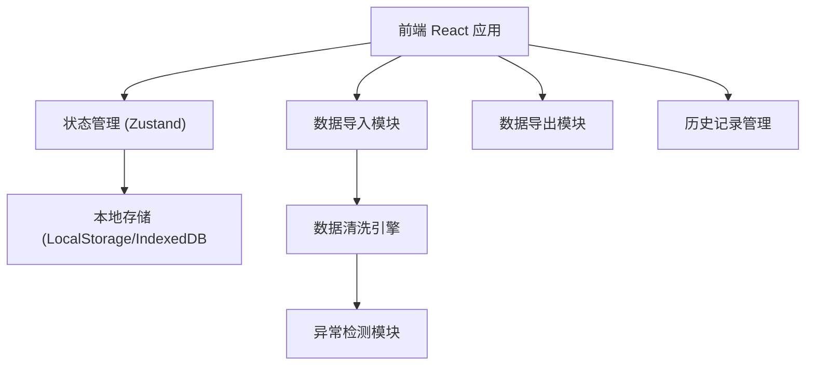
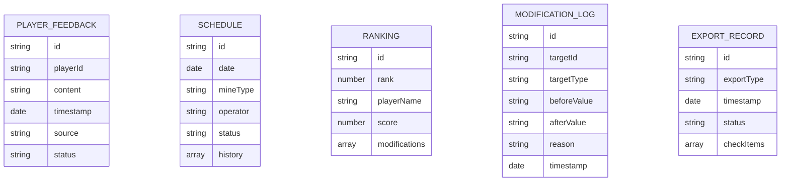

## 1. 架构设计



## 2. 技术说明
- 前端：React@18 + TypeScript + tailwindcss@3 + vite
- 初始化工具：vite-init
- 后端：无（纯前端应用，数据本地存储
- 数据存储：LocalStorage + IndexedDB（历史记录
- 文件处理：xlsx（Excel解析）、papaparse（CSV解析）

## 3. 路由定义
| 路由 | 用途 |
|-------|---------|
| /import | 数据导入页 |
| /schedule | 排班工作台 |
| /ranking | 排行榜管理 |
| /export | 导出中心 |
| /guide | 操作指南 |

## 4. 数据模型

### 4.1 数据模型定义



### 4.2 数据结构定义

```typescript
interface PlayerFeedback {
  id: string;
  playerId: string;
  playerName: string;
  content: string;
  timestamp: Date;
  source: 'manual' | 'file';
  status: 'pending' | 'confirmed' | 'resolved';
  attachments?: string[];
}

interface Schedule {
  id: string;
  date: string;
  mineType: string;
  operator: string;
  status: 'normal' | 'abnormal' | 'completed';
  history: ScheduleHistory[];
}

interface Ranking {
  id: string;
  rank: number;
  playerName: string;
  score: number;
  modifications: Modification[];
}

interface Modification {
  id: string;
  timestamp: Date;
  before: any;
  after: any;
  reason: string;
  operator: string;
}

interface CheckItem {
  id: string;
  name: string;
  checked: boolean;
  status: 'pass' | 'fail' | 'warning';
  message?: string;
}
```
