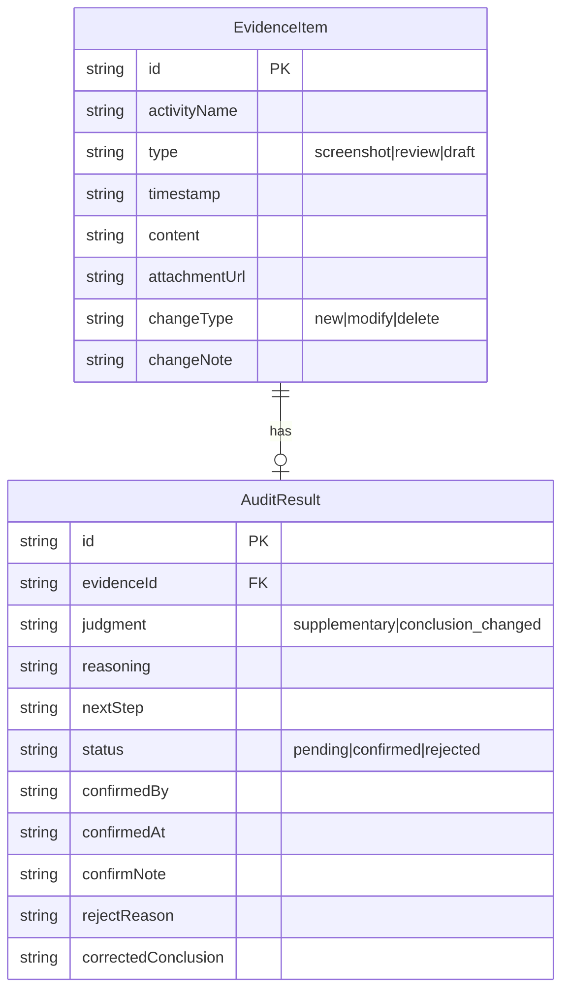

## 1. 架构设计

```mermaid
flowchart TD
    "前端 React 应用" --> "Zustand 状态管理"
    "Zustand 状态管理" --> "localStorage 持久化"
    "Zustand 状态管理" --> "对账引擎（古城巡逻解谜）"
    "对账引擎（古城巡逻解谜）" --> "判断结果+理由"
    "判断结果+理由" --> "Zustand 状态管理"
    "前端 React 应用" --> "JSON 导出/导入"
    "JSON 导出/导入" --> "文件系统"
```

纯前端架构，无后端服务。所有数据存储在浏览器 localStorage，支持 JSON 文件导出/导入实现跨设备迁移。

## 2. 技术说明

- 前端：React@18 + Tailwind CSS@3 + Vite
- 初始化工具：vite-init（react-ts 模板）
- 状态管理：Zustand（含 persist 中间件实现 localStorage 持久化）
- 后端：无
- 数据库：无（使用 localStorage + JSON 文件导出）

## 3. 路由定义

| 路由 | 用途 |
|------|------|
| / | 时间线总览页，三类证据合并展示 |
| /audit | 古城巡逻解谜页，对账结果与人工确认 |
| /evidence | 证据管理页，上传/录入/导出/导入 |

## 4. API 定义

无后端 API。前端内部通过 Zustand store 管理数据流。

## 5. 服务端架构图

不适用（纯前端项目）

## 6. 数据模型

### 6.1 数据模型定义



### 6.2 数据定义

```typescript
type EvidenceType = 'screenshot' | 'review' | 'draft'
type ChangeType = 'new' | 'modify' | 'delete'
type JudgmentType = 'supplementary' | 'conclusion_changed'
type AuditStatus = 'pending' | 'confirmed' | 'rejected'

interface EvidenceItem {
  id: string
  activityName: string
  type: EvidenceType
  timestamp: string
  content: string
  attachmentUrl?: string
  changeType?: ChangeType
  changeNote?: string
}

interface AuditResult {
  id: string
  evidenceId: string
  judgment: JudgmentType
  reasoning: string
  nextStep: string
  status: AuditStatus
  confirmedBy?: string
  confirmedAt?: string
  confirmNote?: string
  rejectReason?: string
  correctedConclusion?: string
}

interface AppState {
  evidences: EvidenceItem[]
  auditResults: AuditResult[]
  addEvidence: (item: EvidenceItem) => void
  removeEvidence: (id: string) => void
  confirmAudit: (id: string, by: string, note: string) => void
  rejectAudit: (id: string, reason: string, corrected: string) => void
  runAudit: () => void
  exportChain: () => string
  importChain: (json: string) => void
}
```

### 6.3 对账引擎逻辑（古城巡逻解谜）

对账规则：
1. **排行榜截图**早到时，检查是否有对应活动复盘：
   - 无复盘 → 标记"待对账"，理由："排行榜截图已入库，但尚未收到活动复盘，无法判断是否影响结论"
   - 有复盘 → 继续判断
2. **活动复盘**晚补时，与排行榜截图关联：
   - 复盘内容未提及结论变更 → 判断"仅补材料"，理由："复盘内容为补充说明，未改变原有结论"
   - 复盘内容提及结论变更 → 判断"改了结论"，理由需列出具体变更点
3. **关卡草表**手工改动时：
   - 新增关卡 → 判断"仅补材料"，理由："新增关卡草表为补充材料"
   - 修改关卡且影响排名 → 判断"改了结论"，理由："关卡修改影响排名结果"
   - 删除关卡 → 判断"改了结论"，理由："关卡删除改变了活动结构"
   - 重复草表（同关卡名同内容）→ 标记"待对账"，理由："发现重复关卡草表，需人工确认是否为误录入"
4. **边界情况**：
   - 缺活动复盘的截图 → 标记待对账
   - 重复关卡草表 → 标记待对账
   - 无对应截图的复盘 → 标记待对账，理由："活动复盘无对应排行榜截图，无法交叉验证"
