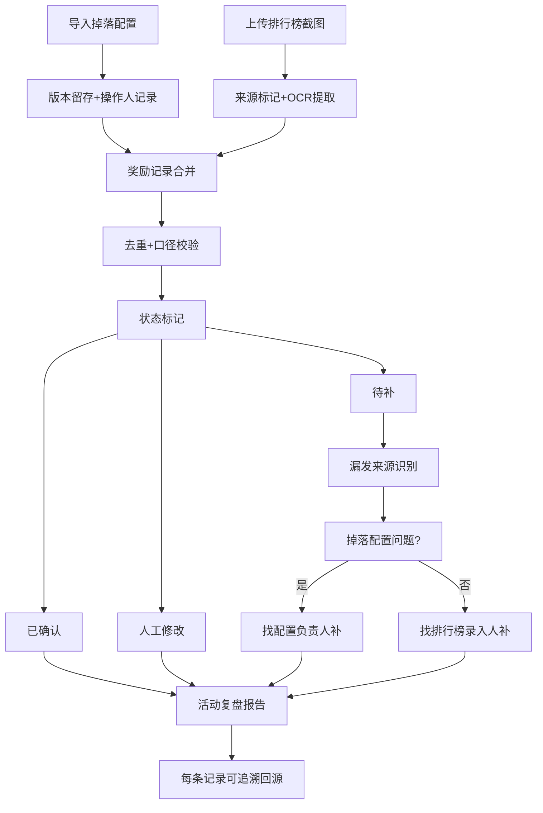

## 1. 产品概述

雪山救援小队是一款社群运营奖励管理工具，解决活动运营交接时依赖记忆、配置修改无迹可寻、奖励发放口径不一致的问题。通过完整的操作留痕、来源追溯、状态分类，让每一笔奖励都有据可查，每一次交接都清晰透明。

- 核心目标：消除运营交接的信息差，确保奖励发放全链路可追溯
- 目标用户：社群运营人员、活动负责人
- 核心价值：操作留痕、口径统一、来源可溯、责任清晰

## 2. 核心特性

### 2.1 用户角色

| 角色 | 登录方式 | 核心权限 |
|------|----------|----------|
| 运营人员 | 本地账号/无需登录 | 导入掉落配置、上传排行榜截图、处理奖励记录、导出数据 |
| 活动负责人 | 本地账号/无需登录 | 查看活动复盘报告、筛选各类状态记录 |

### 2.2 功能模块

1. **掉落配置管理**：配置导入、版本历史、操作留痕、修改对比
2. **排行榜管理**：截图上传、OCR识别、数据关联、来源标记
3. **奖励记录中心**：记录合并、去重筛选、状态标记、人工修改追踪
4. **活动复盘**：已确认/待补/人工修改分类统计、处理口径说明、导出报告
5. **漏发追踪**：漏发来源识别（掉落配置/排行榜）、责任人标记、补领进度

### 2.3 页面详情

| 页面名称 | 模块名称 | 功能描述 |
|----------|----------|----------|
| 首页概览 | 活动卡片 | 展示当前活动进度、各类状态数量统计、快捷操作入口 |
| 掉落配置页 | 配置列表 | 掉落配置导入、版本历史查看、配置对比、操作人追溯 |
| 排行榜页 | 截图管理 | 排行榜截图上传、数据提取、与掉落配置关联、来源标记 |
| 奖励记录页 | 记录列表 | 奖励记录合并去重、状态筛选、人工修改留痕、批量操作 |
| 活动复盘页 | 复盘报告 | 分状态统计、处理口径说明、可追溯链接、导出完整报告 |
| 漏发追踪页 | 漏发列表 | 漏发来源识别、责任人标记、补领进度追踪、下一步指引 |

## 3. 核心流程

### 3.1 奖励发放全流程

运营人员导入掉落配置 → 上传排行榜截图 → 系统自动匹配合并奖励记录 → 人工核对标记状态（已确认/待补/人工修改） → 筛选导出发放名单 → 生成活动复盘报告

### 3.2 漏发处理流程

发现漏发记录 → 系统自动识别来源（掉落配置缺失/排行榜未识别） → 标记责任方（配置负责人/数据录入人） → 记录补领进度 → 补领完成后更新状态

### 3.3 交接流程

新运营接手 → 查看活动总览 → 点击任意记录追溯来源（掉落配置版本/排行榜截图） → 查看操作历史和处理口径 → 无缝衔接

### 3.4 核心流程图

## 4. 用户界面设计

### 4.1 设计风格

- **主色调**：深邃蓝 (#1e3a5f) - 代表雪山的冷静和专业
- **辅助色**：冰蓝 (#60a5fa)、警示橙 (#f97316)、确认绿 (#10b981)、待补黄 (#eab308)
- **按钮风格**：微立体圆角按钮，hover时有轻微上浮效果
- **字体**：标题用"Noto Sans SC"粗体，正文用"PingFang SC"常规
- **布局风格**：左侧导航栏 + 右侧内容区，卡片式信息分组
- **视觉元素**：雪山剪影装饰、冰晶质感图标、轻微磨砂玻璃效果

### 4.2 页面设计概览

| 页面名称 | 模块名称 | UI元素 |
|----------|----------|----------|
| 首页概览 | 统计卡片 | 渐变背景、大号数字、状态色标、趋势箭头 |
| 掉落配置页 | 版本对比 | 双栏布局、差异高亮、操作时间轴、头像标识 |
| 奖励记录页 | 状态标签 | 彩色胶囊标签、可追溯链接图标、悬停显示来源摘要 |
| 活动复盘页 | 分类面板 | 三色分区（绿/黄/橙）、口径说明折叠面板、导出按钮悬浮 |
| 漏发追踪页 | 来源标识 | 掉落配置图标/排行榜图标、责任人头像、进度条 |

### 4.3 响应式

- 桌面端优先设计（1440px+）
- 平板端：导航栏收起为图标模式
- 移动端：底部tab导航，卡片纵向堆叠

### 4.4 交互动效

- 页面加载：卡片错落渐入（100ms间隔）
- 状态切换：颜色平滑过渡（300ms ease）
- 追溯链接：点击时轻微缩放反馈
- 时间轴：滚动时逐步点亮
