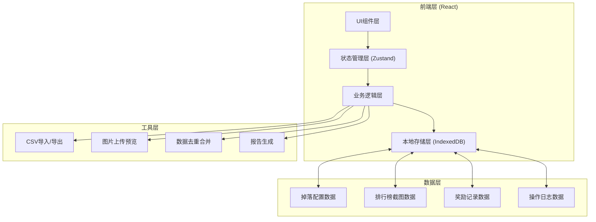
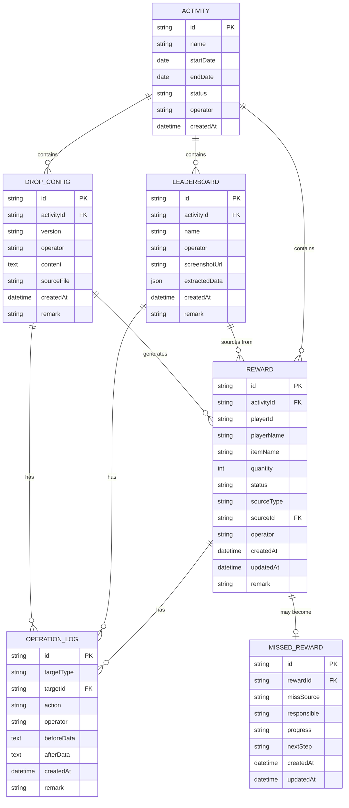

## 1. 架构设计



## 2. 技术说明

- **前端框架**: React@18 + TypeScript
- **构建工具**: Vite@5
- **样式方案**: TailwindCSS@3
- **状态管理**: Zustand@4
- **本地数据库**: IndexedDB (通过idb库封装)
- **UI组件库**: Headless UI + Lucide React图标
- **图表展示**: Recharts
- **文件处理**: PapaParse (CSV), xlsx (Excel)
- **动画**: Framer Motion

## 3. 路由定义

| 路由 | 页面 | 说明 |
|------|------|------|
| / | 首页概览 | 活动总览、数据统计、快捷操作 |
| /drop-config | 掉落配置管理 | 配置导入、版本历史、对比查看 |
| /leaderboard | 排行榜管理 | 截图上传、数据提取、来源管理 |
| /rewards | 奖励记录中心 | 记录列表、状态标记、批量操作 |
| /review | 活动复盘 | 分类统计、口径说明、报告导出 |
| /missed | 漏发追踪 | 漏发列表、来源识别、进度追踪 |

## 4. 数据模型

### 4.1 实体关系图



### 4.2 数据定义

```typescript
// 活动
interface Activity {
  id: string;
  name: string;
  startDate: string;
  endDate: string;
  status: 'draft' | 'active' | 'completed' | 'archived';
  operator: string;
  createdAt: string;
}

// 掉落配置版本
interface DropConfig {
  id: string;
  activityId: string;
  version: string;
  operator: string;
  content: DropConfigItem[];
  sourceFile: string;
  createdAt: string;
  remark: string;
}

interface DropConfigItem {
  itemId: string;
  itemName: string;
  dropCondition: string;
  quantity: number;
}

// 排行榜
interface Leaderboard {
  id: string;
  activityId: string;
  name: string;
  operator: string;
  screenshotUrl: string;
  extractedData: LeaderboardItem[];
  createdAt: string;
  remark: string;
}

interface LeaderboardItem {
  rank: number;
  playerId: string;
  playerName: string;
  score: number;
}

// 奖励记录
interface Reward {
  id: string;
  activityId: string;
  playerId: string;
  playerName: string;
  itemName: string;
  quantity: number;
  status: 'confirmed' | 'pending' | 'manual' | 'missed';
  sourceType: 'drop_config' | 'leaderboard' | 'manual';
  sourceId: string;
  operator: string;
  createdAt: string;
  updatedAt: string;
  remark: string;
}

// 漏发记录
interface MissedReward {
  id: string;
  rewardId: string;
  missSource: 'drop_config_missing' | 'leaderboard_missing' | 'merge_error' | 'other';
  responsible: string;
  progress: 'reported' | 'confirmed' | 'compensated' | 'closed';
  nextStep: string;
  createdAt: string;
  updatedAt: string;
}

// 操作日志
interface OperationLog {
  id: string;
  targetType: 'activity' | 'drop_config' | 'leaderboard' | 'reward' | 'missed_reward';
  targetId: string;
  action: 'create' | 'update' | 'delete' | 'import' | 'export';
  operator: string;
  beforeData: string;
  afterData: string;
  createdAt: string;
  remark: string;
}
```

## 5. 核心模块说明

### 5.1 导入去重模块
- 支持CSV/Excel格式的掉落配置和排行榜数据导入
- 基于playerId + itemName + sourceId进行去重判断
- 重复导入时自动标记并展示差异对比
- 提供撤回功能，保留完整操作历史

### 5.2 追溯模块
- 每条奖励记录关联sourceId和sourceType
- 点击记录可跳转至对应掉落配置版本或排行榜截图
- 展示完整的修改历史和操作人信息

### 5.3 状态管理模块
- 已确认(confirmed): 系统自动匹配无误
- 待补(pending): 需要人工确认或补充信息
- 人工修改(manual): 运营人员手动调整过
- 漏发(missed): 识别为漏发，进入追踪流程

### 5.4 报告生成模块
- 按状态分类统计
- 自动生成处理口径说明
- 导出带追溯链接的完整报告（CSV/Excel格式）
- 漏发记录单独标记来源和责任人
