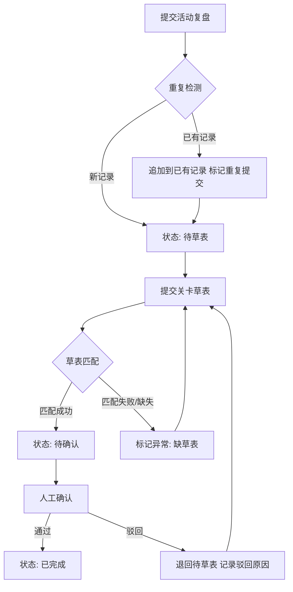

## 1. 产品概述

港口装卸排队系统——为游戏活动运营团队提供轻量化的材料流转跟踪工具，解决活动复盘、关卡草表等材料异步到达时的排队混乱问题。每条记录可追溯来源、状态变更、操作人和待处理原因，同一批材料二次进入时保留历史而非覆盖。

- 目标用户：游戏活动运营负责人、关卡策划、复盘执行人
- 核心价值：消除口头传递与内存态证据丢失，让材料流转可审计、可复现

## 2. 核心功能

### 2.1 用户角色

| 角色 | 注册方式 | 核心权限 |
|------|----------|----------|
| 运营负责人 | 系统预设 | 查看所有记录、人工确认、推进/驳回流程 |
| 复盘执行人 | 系统预设 | 提交活动复盘材料、查看自己提交的记录 |
| 关卡策划 | 系统预设 | 提交关卡草表、关联待处理记录 |

### 2.2 功能模块

1. **排队看板页**：全局排队状态总览、按阶段筛选、快速定位异常记录
2. **记录详情页**：单条材料的完整生命周期——来源、状态流转、变更日志、关联材料
3. **材料提交页**：录入活动复盘或关卡草表，自动触发重复检测和关联匹配
4. **操作审计页**：全局操作日志，按时间线展示所有变更

### 2.3 页面详情

| 页面名称 | 模块名称 | 功能描述 |
|----------|----------|----------|
| 排队看板页 | 状态列视图 | 按阶段（待复盘 / 待草表 / 待确认 / 已完成）分列展示记录卡片，支持拖拽排序 |
| 排队看板页 | 筛选栏 | 按来源类型、操作人、时间范围、异常标记筛选 |
| 排队看板页 | 异常高亮 | 缺草表、重复提交、边界情况自动标红 |
| 记录详情页 | 基本信息卡 | 显示材料来源、提交人、提交时间、当前阶段 |
| 记录详情页 | 状态时间线 | 纵向时间线展示每次状态变更：谁在什么时间从什么状态改为什么状态 |
| 记录详情页 | 待处理原因 | 当记录处于待处理时，展示具体原因（缺草表 / 重复提交 / 人工驳回等） |
| 记录详情页 | 变更日志 | 不可编辑的操作审计记录，持久化存储 |
| 记录详情页 | 关联材料 | 展示与当前记录关联的其他材料（如关联的关卡草表或活动复盘） |
| 材料提交页 | 表单录入 | 选择材料类型、填写内容摘要、关联已有记录 |
| 材料提交页 | 重复检测 | 提交时自动检测是否存在相同活动ID的记录，若存在则提示关联而非新建 |
| 材料提交页 | 历史保留 | 重复提交不覆盖，而是追加新的流转记录到已有条目 |
| 操作审计页 | 全局日志 | 展示所有操作的时间线，支持按操作人、记录ID筛选 |

## 3. 核心流程

材料从进入排队到完成确认的核心流转路径：

1. 复盘执行人提交活动复盘 → 系统创建记录，状态为"待草表"
2. 关卡策划提交关卡草表 → 系统匹配待草表记录，状态推进为"待确认"
3. 运营负责人人工确认 → 状态推进为"已完成"
4. 若关卡草表缺失超过阈值 → 自动标记异常，原因记录为"缺草表"
5. 若同一活动ID重复提交 → 不覆盖历史，追加新记录，标记"重复提交"
6. 人工驳回 → 退回上一阶段，原因记录在变更日志

## 4. 用户界面设计

### 4.1 设计风格

- 主色调：深蓝灰 (#1a2332) 搭配港口橙 (#e8722a) 强调色，体现工业港口调度感
- 辅助色：状态绿 (#22c55e) 用于已完成，警告黄 (#eab308) 用于待处理，危险红 (#ef4444) 用于异常
- 按钮风格：圆角矩形（rounded-lg），主按钮实心港口橙，次按钮描边
- 字体：标题使用 Noto Sans SC Bold，正文使用 Noto Sans SC Regular
- 布局风格：左侧导航 + 右侧内容区，看板页使用四列泳道布局
- 图标风格：Lucide 线性图标，与整体简洁工业风一致

### 4.2 页面设计概述

| 页面名称 | 模块名称 | UI 元素 |
|----------|----------|----------|
| 排队看板页 | 状态列视图 | 四列泳道（Kanban），卡片含活动ID、来源标签、时间戳、异常角标 |
| 排队看板页 | 筛选栏 | 顶部筛选条：下拉选择器 + 日期范围 + 搜索框 |
| 排队看板页 | 异常高亮 | 卡片左边框红色条纹 + 角标图标 |
| 记录详情页 | 基本信息卡 | 顶部信息卡片：大号活动ID + 状态徽章 + 来源标签 |
| 记录详情页 | 状态时间线 | 左侧纵向时间线：圆形节点 + 连线 + 状态标签 + 操作人 + 时间 |
| 记录详情页 | 变更日志 | 底部可展开的日志列表：操作类型 + 详情 + 时间戳 |
| 记录详情页 | 关联材料 | 右侧关联卡片列表：链接式跳转 |
| 材料提交页 | 表单录入 | 居中卡片式表单：选择器 + 文本框 + 提交按钮 |
| 材料提交页 | 重复检测提示 | 表单下方警告横幅：黄色背景 + 关联已有记录链接 |
| 操作审计页 | 全局日志 | 全宽表格：时间 + 操作人 + 操作类型 + 目标记录 + 详情 |

### 4.3 响应式

- 桌面优先设计，看板泳道在宽屏横向排列
- 平板端泳道可横向滚动
- 移动端泳道折叠为纵向标签切换

### 4.4 3D 场景

不适用
