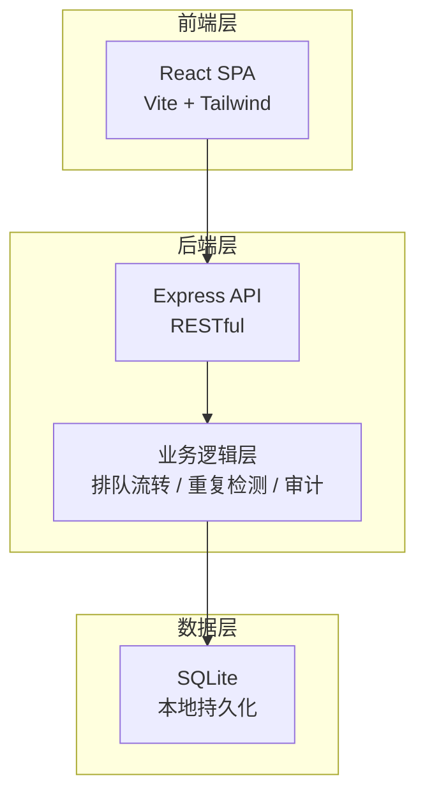
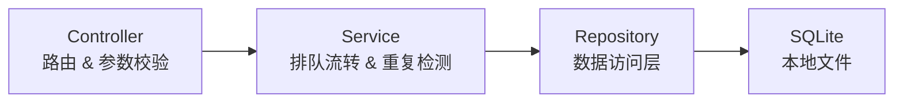
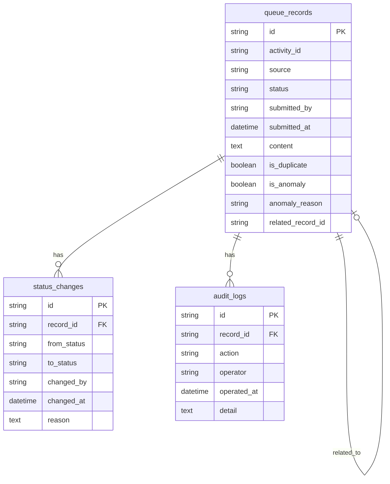

## 1. 架构设计



## 2. 技术说明

- 前端：React@18 + TailwindCSS@3 + Vite + Zustand
- 初始化工具：vite-init
- 后端：Express@4 + TypeScript (ESM)
- 数据库：SQLite（通过 better-sqlite3），本地文件持久化，无需外部数据库服务

## 3. 路由定义

| 路由 | 用途 |
|------|------|
| / | 排队看板页，展示所有记录的四列泳道视图 |
| /record/:id | 记录详情页，展示单条记录的完整生命周期 |
| /submit | 材料提交页，录入活动复盘或关卡草表 |
| /audit | 操作审计页，全局操作日志 |

## 4. API 定义

### 4.1 排队记录 API

```typescript
interface QueueRecord {
  id: string;
  activityId: string;
  source: "活动复盘" | "关卡草表";
  status: "待草表" | "待确认" | "已完成" | "已驳回";
  submittedBy: string;
  submittedAt: string;
  content: string;
  isDuplicate: boolean;
  isAnomaly: boolean;
  anomalyReason?: string;
  relatedRecordId?: string;
}

interface StatusChange {
  id: string;
  recordId: string;
  fromStatus: string;
  toStatus: string;
  changedBy: string;
  changedAt: string;
  reason: string;
}

interface AuditLog {
  id: string;
  recordId: string;
  action: "创建" | "状态变更" | "人工确认" | "驳回" | "关联" | "重复标记";
  operator: string;
  operatedAt: string;
  detail: string;
}
```

| 方法 | 路径 | 描述 |
|------|------|------|
| GET | /api/records | 获取所有排队记录（支持筛选参数） |
| GET | /api/records/:id | 获取单条记录详情（含变更日志） |
| POST | /api/records | 提交新材料（自动触发重复检测） |
| PATCH | /api/records/:id/status | 更新记录状态（需提供操作人和原因） |
| GET | /api/audit | 获取全局审计日志 |

### 4.2 请求/响应示例

**POST /api/records**
```typescript
interface CreateRecordRequest {
  activityId: string;
  source: "活动复盘" | "关卡草表";
  submittedBy: string;
  content: string;
}

interface CreateRecordResponse {
  record: QueueRecord;
  isDuplicate: boolean;
  relatedExistingId?: string;
}
```

**PATCH /api/records/:id/status**
```typescript
interface UpdateStatusRequest {
  toStatus: "待草表" | "待确认" | "已完成" | "已驳回";
  changedBy: string;
  reason: string;
}
```

## 5. 服务端架构图



## 6. 数据模型

### 6.1 数据模型定义



### 6.2 数据定义语言

```sql
CREATE TABLE IF NOT EXISTS queue_records (
  id TEXT PRIMARY KEY,
  activity_id TEXT NOT NULL,
  source TEXT NOT NULL CHECK(source IN ('活动复盘', '关卡草表')),
  status TEXT NOT NULL CHECK(status IN ('待草表', '待确认', '已完成', '已驳回')) DEFAULT '待草表',
  submitted_by TEXT NOT NULL,
  submitted_at TEXT NOT NULL DEFAULT (datetime('now')),
  content TEXT NOT NULL DEFAULT '',
  is_duplicate INTEGER NOT NULL DEFAULT 0,
  is_anomaly INTEGER NOT NULL DEFAULT 0,
  anomaly_reason TEXT,
  related_record_id TEXT,
  FOREIGN KEY (related_record_id) REFERENCES queue_records(id)
);

CREATE INDEX IF NOT EXISTS idx_records_activity_id ON queue_records(activity_id);
CREATE INDEX IF NOT EXISTS idx_records_status ON queue_records(status);
CREATE INDEX IF NOT EXISTS idx_records_source ON queue_records(source);

CREATE TABLE IF NOT EXISTS status_changes (
  id TEXT PRIMARY KEY,
  record_id TEXT NOT NULL,
  from_status TEXT NOT NULL,
  to_status TEXT NOT NULL,
  changed_by TEXT NOT NULL,
  changed_at TEXT NOT NULL DEFAULT (datetime('now')),
  reason TEXT NOT NULL DEFAULT '',
  FOREIGN KEY (record_id) REFERENCES queue_records(id) ON DELETE CASCADE
);

CREATE INDEX IF NOT EXISTS idx_status_changes_record_id ON status_changes(record_id);

CREATE TABLE IF NOT EXISTS audit_logs (
  id TEXT PRIMARY KEY,
  record_id TEXT NOT NULL,
  action TEXT NOT NULL CHECK(action IN ('创建', '状态变更', '人工确认', '驳回', '关联', '重复标记')),
  operator TEXT NOT NULL,
  operated_at TEXT NOT NULL DEFAULT (datetime('now')),
  detail TEXT NOT NULL DEFAULT '',
  FOREIGN KEY (record_id) REFERENCES queue_records(id) ON DELETE CASCADE
);

CREATE INDEX IF NOT EXISTS idx_audit_logs_record_id ON audit_logs(record_id);
CREATE INDEX IF NOT EXISTS idx_audit_logs_operated_at ON audit_logs(operated_at);
```

### 6.3 初始数据

```sql
INSERT INTO queue_records (id, activity_id, source, status, submitted_by, content, is_duplicate, is_anomaly, anomaly_reason) VALUES
  ('rec-001', 'ACT-2026-001', '活动复盘', '待草表', '张运营', '夏季活动复盘：玩家参与度超预期30%', 0, 0, NULL),
  ('rec-002', 'ACT-2026-002', '活动复盘', '待确认', '李策划', '周末双倍经验活动复盘', 0, 0, NULL),
  ('rec-003', 'ACT-2026-003', '活动复盘', '待草表', '张运营', '新服冲榜活动复盘', 0, 1, '关卡草表提交超时48小时'),
  ('rec-004', 'ACT-2026-001', '关卡草表', '待确认', '王策划', '夏季活动关卡草表v2.1', 1, 0, NULL),
  ('rec-005', 'ACT-2026-004', '活动复盘', '已完成', '赵运营', '春节限定活动复盘', 0, 0, NULL);

INSERT INTO status_changes (id, record_id, from_status, to_status, changed_by, reason) VALUES
  ('sc-001', 'rec-002', '待草表', '待确认', '王策划', '关卡草表已提交'),
  ('sc-002', 'rec-005', '待确认', '已完成', '负责人陈', '材料齐全，确认通过');

INSERT INTO audit_logs (id, record_id, action, operator, detail) VALUES
  ('log-001', 'rec-001', '创建', '张运营', '创建活动复盘记录，活动ID: ACT-2026-001'),
  ('log-002', 'rec-002', '创建', '李策划', '创建活动复盘记录，活动ID: ACT-2026-002'),
  ('log-003', 'rec-002', '状态变更', '王策划', '状态从 待草表 变更为 待确认，原因: 关卡草表已提交'),
  ('log-004', 'rec-003', '创建', '张运营', '创建活动复盘记录，活动ID: ACT-2026-003，标记异常: 关卡草表提交超时48小时'),
  ('log-005', 'rec-004', '创建', '王策划', '创建关卡草表记录，活动ID: ACT-2026-001，检测到重复提交，关联已有记录 rec-001'),
  ('log-006', 'rec-004', '重复标记', '系统', '活动ID ACT-2026-001 已存在记录 rec-001，本次提交标记为重复'),
  ('log-007', 'rec-005', '创建', '赵运营', '创建活动复盘记录，活动ID: ACT-2026-004'),
  ('log-008', 'rec-005', '人工确认', '负责人陈', '材料齐全，确认通过'),
  ('log-009', 'rec-005', '状态变更', '负责人陈', '状态从 待确认 变更为 已完成，原因: 材料齐全，确认通过');
```
