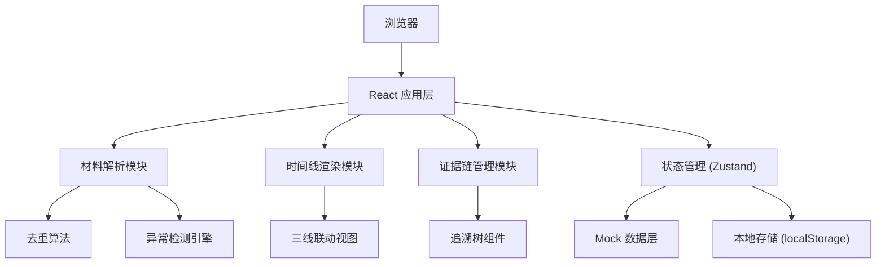

## 1. 架构设计
纯前端单页应用，所有数据处理在浏览器端完成，支持本地文件导入导出，无需后端服务。


## 2. 技术说明
- 前端框架：React@18 + TypeScript
- 构建工具：Vite@5
- 样式方案：TailwindCSS@3 + CSS 变量
- 状态管理：Zustand
- 图标：Lucide React (纯线条)
- 日期处理：date-fns
- 数据导入：原生 FileReader API
- 数据导出：Blob + URL.createObjectURL
- 无需后端，无需数据库，使用 localStorage 持久化本地数据

## 3. 路由定义
| 路由 | 页面用途 |
|-------|----------|
| / | 材料导入页，默认路由 |
| /timeline | 时间线主视图，三线联动展示 |
| /export | 导出页面，生成证据链报告 |

## 4. 数据模型

### 4.1 数据模型定义

```mermaid
erDiagram
    MATERIAL_PACK {
        string id PK
        string name
        datetime imported_at
        json raw_data
    }
    TEST_RECORD {
        string id PK
        string material_id FK
        int round
        datetime timestamp
        string content
        string source_type
        string status
        json anomalies
    }
    UNIT_ENTRY {
        string id PK
        string material_id FK
        string unit_code
        string unit_name
        json stats
        int effective_round
        string source
    }
    TERRAIN_RULE {
        string id PK
        string material_id FK
        string grid_position
        string rule_type
        string description
        int effective_round
    }
    ANOMALY {
        string id PK
        string record_id FK
        string type "边界穿越/战报不一致/回合顺序"
        string severity
        string status "待确认/已确认"
        string confirmed_by
        datetime confirmed_at
        string remark
    }
    EVIDENCE_CHAIN {
        string id PK
        string conclusion
        json node_refs
        string review_report_id FK
    }
    REVIEW_REPORT {
        string id PK
        string title
        string content
        datetime created_at
        json linked_records
    }
    CONFIRMATION_LOG {
        string id PK
        string anomaly_id FK
        string operator
        datetime timestamp
        string action
        string remark
    }
```


### 4.2 核心类型定义
```typescript
type SourceType = 'normal' | 'late_attachment' | 'duplicate' | 'manual_correction';
type AnomalyType = 'boundary_crossing' | 'report_mismatch' | 'turn_order_error';
type ConfirmStatus = 'pending' | 'confirmed';

interface TestRecord {
  id: string;
  materialId: string;
  round: number;
  timestamp: Date;
  content: string;
  sourceType: SourceType;
  status: 'valid' | 'duplicate' | 'superseded';
  anomalies: string[];
  linkedUnits: string[];
  linkedTerrain: string[];
}

interface UnitEntry {
  id: string;
  materialId: string;
  unitCode: string;
  unitName: string;
  stats: Record<string, number>;
  effectiveRound: number;
  source: string;
  isManualCorrection: boolean;
  replacesUnitId?: string;
}

interface TerrainRule {
  id: string;
  materialId: string;
  gridPosition: string;
  ruleType: 'movement' | 'combat' | 'supply';
  description: string;
  effectiveRound: number;
  source: string;
}

interface Anomaly {
  id: string;
  recordId: string;
  type: AnomalyType;
  severity: 'warning' | 'critical';
  status: ConfirmStatus;
  confirmedBy?: string;
  confirmedAt?: Date;
  remark?: string;
  description: string;
}

interface EvidenceChain {
  id: string;
  conclusion: string;
  nodeRefs: {
    testRecordId?: string;
    unitEntryId?: string;
    terrainRuleId?: string;
  }[];
  reviewReportId?: string;
}

interface ReviewReport {
  id: string;
  title: string;
  content: string;
  createdAt: Date;
  linkedRecordIds: string[];
}
```

## 5. 核心模块说明

### 5.1 材料解析模块
- 支持 JSON/CSV/Markdown 格式导入
- 自动识别来源类型（正常/晚到/重复/人工更正）
- 基于时间戳+内容哈希去重
- 保留所有原始数据供追溯

### 5.2 异常检测引擎
- **边界格穿越检测**：检查单位移动路径是否跨越不可通行地形边界
- **战报结算不一致检测**：对比战报描述与结算数据字段差异
- **回合顺序错误检测**：验证事件时间戳与回合编号的一致性

### 5.3 三线联动视图
- 三行等高布局，垂直时间轴对齐
- 滚动事件同步：任意一行滚动触发其他两行同步
- 悬浮联动：鼠标悬浮节点时，三线对应回合位置高亮
- 点击穿透：点击任意节点在详情面板显示完整证据链

### 5.4 证据链追溯
- 树形结构展示关联关系
- 结论节点与证据节点双向跳转
- 原始来源标记，区分自动/人工数据
- 支持一键导出完整证据链

## 6. Mock 数据
内置3组典型材料包用于演示：
1. 正常测试流程（含边界穿越异常）
2. 含晚到附件和重复项的复杂材料包
3. 战报与结算不一致案例
