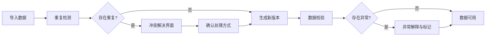
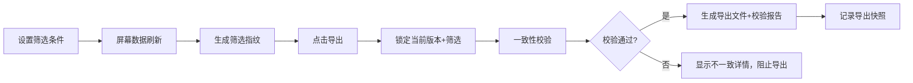
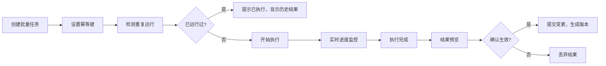

## 1. 产品概述

城市电网博弈系统是面向策划、数值和测试团队的专业数据核对工具，解决战报与结算数据不一致导致的信任危机。核心价值在于提供可追溯的状态回看、可解释的异常分析、以及口径绝对一致的导出能力。

- 目标用户：策划、数值策划、测试工程师
- 核心问题：战报与结算数据不一致、重复导入混乱、撤回修正无迹可寻、筛选导出口径不一
- 产品价值：让每一次数据操作都可追溯、可验证、可复现，消除数据核对的信任成本

## 2. 核心特性

### 2.1 用户角色

| 角色 | 注册方式 | 核心权限 |
|------|----------|----------|
| 策划 | 本地登录 | 导入数据、筛选查看、导出报告、撤回修正 |
| 数值 | 本地登录 | 批量处理、异常分析、版本对比 |
| 测试 | 本地登录 | 状态回看、一致性校验、导出审计 |

### 2.2 功能模块

1. **数据工作台**：导入、筛选、查看当前数据状态
2. **版本控制**：历史版本列表、变更追溯、撤回回滚
3. **异常中心**：数据不一致检测、异常解释、差异对比
4. **导出中心**：筛选条件同步、一致性校验报告、多格式导出
5. **批量处理**：幂等执行、任务监控、重复运行保护

### 2.3 页面详情

| 页面名称 | 模块名称 | 功能描述 |
|----------|----------|-------------|
| 数据工作台 | 数据导入区 | 支持单条/批量导入，重复数据检测，冲突可视化解决 |
| 数据工作台 | 筛选控制区 | 多维度筛选，筛选条件持久化，屏幕-导出口径绑定 |
| 数据工作台 | 数据展示区 | 分页列表，状态标识，异常高亮，当前版本号显示 |
| 版本历史 | 时间线 | 操作时间线，每次操作的快照，操作人/时间/备注 |
| 版本历史 | 版本对比 | 任意两版本差异对比，变更字段高亮，变更原因追溯 |
| 版本历史 | 撤回操作 | 一键回滚到指定版本，生成撤回审计记录 |
| 异常中心 | 异常检测 | 战报与结算自动比对，不一致项清单 |
| 异常中心 | 异常解释 | 每个异常的产生原因、影响范围、修正建议 |
| 异常中心 | 处理记录 | 异常处理状态，处理人，处理时间，处理结果 |
| 导出中心 | 导出配置 | 格式选择(CSV/Excel/PDF)，包含当前筛选条件元数据 |
| 导出中心 | 一致性校验 | 导出前校验屏幕数据与导出数据一致性，生成校验报告 |
| 导出中心 | 导出历史 | 每次导出的快照，包含筛选条件、版本号、数据指纹 |
| 批量处理 | 任务配置 | 批量操作配置，幂等键设置，重复运行检测 |
| 批量处理 | 执行监控 | 实时进度，运行日志，成功/失败统计 |
| 批量处理 | 结果确认 | 执行结果预览，变更影响分析，确认后生效 |

## 3. 核心流程

### 3.1 数据导入与核对流程

### 3.2 筛选与导出一致性流程

### 3.3 撤回修正流程

### 3.4 批量处理流程

## 4. 用户界面设计

### 4.1 设计风格

- **设计方向**：极简工业风，强调功能性和可信度，避免装饰性元素
- **主色调**：深灰蓝 `#1e293b` (专业、稳重)
- **辅助色**：
  - 正常状态：蓝绿 `#0d9488` (可信)
  - 警告状态：琥珀 `#f59e0b` (注意)
  - 异常状态：赤红 `#dc2626` (问题)
  - 操作状态：靛蓝 `#4f46e5` (执行中)
- **字体**：
  - 标题：JetBrains Mono (等宽，增强数据感)
  - 正文：Inter (清晰易读)
  - 数字：JetBrains Mono (等宽对齐，便于比对)
- **按钮风格**：直角矩形，细边框，悬停背景色变化，无圆角无阴影
- **布局风格**：模块化网格布局，清晰的区域分隔线，信息密度高
- **图标**：Lucide 线性图标，统一20px尺寸

### 4.2 页面设计概述

| 页面名称 | 模块名称 | UI元素 |
|----------|----------|---------|
| 数据工作台 | 顶部操作栏 | 版本号显示、刷新按钮、导入按钮、导出按钮、筛选条件摘要 |
| 数据工作台 | 筛选面板 | 可折叠，每个筛选器显示当前值，支持重置，显示筛选指纹 |
| 数据工作台 | 数据表格 | 斑马纹、行悬停高亮、异常行红边、状态列图标、列宽可调整 |
| 数据工作台 | 底部状态栏 | 数据总数、筛选后数量、当前版本、最后更新时间、一致性状态 |
| 版本历史 | 时间线 | 垂直时间线，每个节点显示操作类型/时间/人，可展开详情 |
| 版本历史 | 对比面板 | 双列对比，新增绿色背景，删除红色删除线，修改黄色高亮 |
| 异常中心 | 异常列表 | 卡片式，每张卡片显示异常类型、影响数据量、严重程度、发现时间 |
| 异常中心 | 异常详情 | 原因解释、影响分析、修正建议、相关版本链接 |
| 导出中心 | 导出配置 | 表单式，格式选择、是否包含校验报告、备注输入 |
| 导出中心 | 导出历史 | 表格，文件名、导出时间、导出人、筛选条件摘要、数据指纹、下载按钮 |
| 批量处理 | 任务列表 | 任务状态标签、进度条、幂等键、上次运行时间、运行次数 |
| 批量处理 | 执行监控 | 实时日志面板、进度百分比、成功/失败计数、暂停/取消按钮 |

### 4.3 响应性

- **桌面优先**：1280px以上为最优体验，三栏布局
- **平板适配**：768px-1279px，两栏布局，次要面板可折叠
- **移动适配**：768px以下，单栏布局，底部导航，适合查看而非操作

### 4.4 交互特性

- **状态持久化**：刷新页面后筛选条件、当前版本、展开状态保持不变
- **实时校验**：数据变更后自动进行一致性检查，异常即时标记
- **操作确认**：所有不可逆操作（回滚、批量提交）需要二次确认
- **键盘快捷键**：F5刷新，Ctrl+Z撤回，Ctrl+E导出，Ctrl+F筛选
