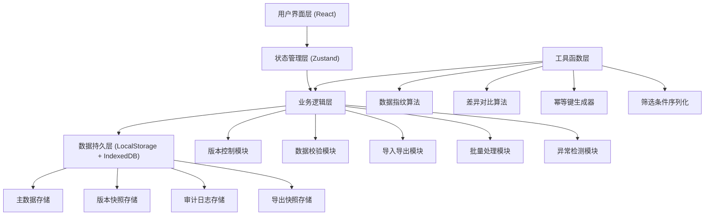
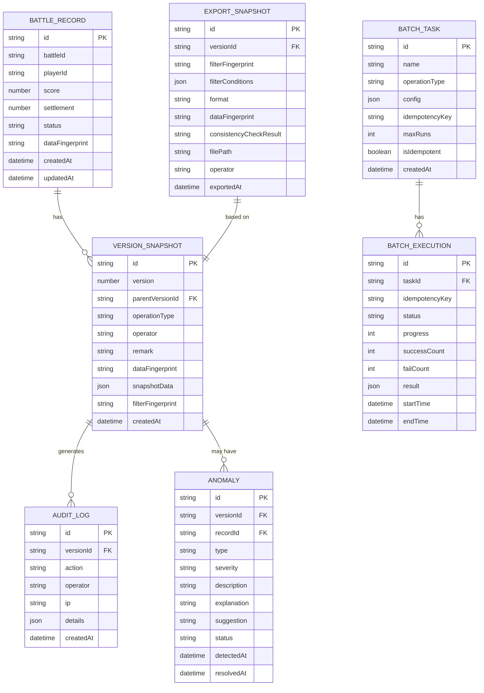

## 1. 架构设计



## 2. 技术描述

- **前端**：React@18 + TypeScript@5 + Vite@5
- **状态管理**：Zustand@4 (中间件：persist, devtools)
- **样式**：TailwindCSS@3
- **图标**：Lucide React@0.344
- **数据持久化**：LocalStorage (配置/状态) + IndexedDB (大量数据)
- **数据导出**：xlsx (Excel) + jspdf (PDF) + 原生Blob (CSV)
- **路由**：React Router Dom@6
- **后端**：无 (纯前端应用，数据本地存储)
- **数据库**：IndexedDB (通过 idb 库封装)

## 3. 路由定义

| 路由 | 页面组件 | 用途 |
|------|----------|------|
| `/` | `Workbench` | 数据工作台 - 默认首页 |
| `/versions` | `VersionHistory` | 版本历史与撤回 |
| `/anomalies` | `AnomalyCenter` | 异常中心 |
| `/export` | `ExportCenter` | 导出中心 |
| `/batch` | `BatchProcessing` | 批量处理 |

## 4. 核心数据模型

### 4.1 ER图



### 4.2 TypeScript 类型定义

```typescript
// 战报记录
interface BattleRecord {
  id: string;
  battleId: string;
  playerId: string;
  playerName: string;
  score: number;
  settlement: number;
  status: 'normal' | 'warning' | 'anomaly';
  battleTime: string;
  dataFingerprint: string;
  createdAt: string;
  updatedAt: string;
}

// 版本快照
interface VersionSnapshot {
  id: string;
  version: number;
  parentVersionId: string | null;
  operationType: 'import' | 'edit' | 'rollback' | 'batch' | 'delete';
  operator: string;
  remark: string;
  dataFingerprint: string;
  snapshotData: BattleRecord[];
  filterFingerprint: string;
  filterConditions: FilterConditions;
  createdAt: string;
}

// 筛选条件
interface FilterConditions {
  battleId?: string;
  playerId?: string;
  playerName?: string;
  status?: ('normal' | 'warning' | 'anomaly')[];
  battleTimeRange?: [string, string];
  scoreRange?: [number, number];
  settlementRange?: [number, number];
}

// 异常记录
interface Anomaly {
  id: string;
  versionId: string;
  recordId: string;
  type: 'mismatch' | 'duplicate' | 'out_of_range' | 'missing_data';
  severity: 'low' | 'medium' | 'high' | 'critical';
  fieldName?: string;
  expectedValue?: number | string;
  actualValue?: number | string;
  description: string;
  explanation: string;
  suggestion: string;
  status: 'open' | 'resolved' | 'ignored';
  detectedAt: string;
  resolvedAt?: string;
  resolvedBy?: string;
}

// 批量任务
interface BatchTask {
  id: string;
  name: string;
  operationType: 'import' | 'recalculate' | 'correct' | 'delete';
  config: Record<string, any>;
  idempotencyKey: string;
  maxRuns: number;
  isIdempotent: boolean;
  createdAt: string;
}

// 批量执行记录
interface BatchExecution {
  id: string;
  taskId: string;
  idempotencyKey: string;
  status: 'pending' | 'running' | 'completed' | 'failed' | 'cancelled';
  progress: number;
  successCount: number;
  failCount: number;
  logs: string[];
  result: Record<string, any>;
  startTime: string;
  endTime?: string;
}

// 导出快照
interface ExportSnapshot {
  id: string;
  versionId: string;
  filterFingerprint: string;
  filterConditions: FilterConditions;
  format: 'csv' | 'xlsx' | 'pdf';
  dataFingerprint: string;
  screenDataFingerprint: string;
  consistencyCheckPassed: boolean;
  consistencyCheckDetails: Record<string, any>;
  fileName: string;
  operator: string;
  remark: string;
  exportedAt: string;
}

// 审计日志
interface AuditLog {
  id: string;
  versionId: string;
  action: string;
  operator: string;
  details: Record<string, any>;
  createdAt: string;
}
```

## 5. 核心模块设计

### 5.1 状态管理 (Zustand)

```typescript
// store/appStore.ts
interface AppState {
  // 数据
  records: BattleRecord[];
  currentVersion: VersionSnapshot | null;
  versionHistory: VersionSnapshot[];
  
  // 筛选
  filterConditions: FilterConditions;
  filterFingerprint: string;
  
  // 异常
  anomalies: Anomaly[];
  
  // 批量处理
  batchTasks: BatchTask[];
  currentExecution: BatchExecution | null;
  
  // 导出
  exportHistory: ExportSnapshot[];
  
  // 操作方法
  importRecords: (records: BattleRecord[], remark: string) => VersionSnapshot;
  rollbackToVersion: (versionId: string, remark: string) => VersionSnapshot;
  applyFilter: (conditions: FilterConditions) => void;
  exportData: (format: string, remark: string) => ExportSnapshot;
  runBatchTask: (taskId: string) => BatchExecution;
  detectAnomalies: () => Anomaly[];
}
```

### 5.2 版本控制模块

核心功能：
- **快照生成**：每次数据变更生成完整快照，包含数据指纹
- **版本链**：维护版本父子关系，支持追溯
- **回滚机制**：创建新版本标记为回滚，而非删除历史
- **差异对比**：基于字段级对比，识别新增/修改/删除

### 5.3 数据指纹算法

```typescript
// utils/fingerprint.ts
import { createHash } from 'crypto-js';

export function generateDataFingerprint(data: any): string {
  const sortedData = JSON.stringify(data, Object.keys(data).sort());
  return createHash('sha256').update(sortedData).digest('hex').substring(0, 16);
}

export function generateFilterFingerprint(conditions: FilterConditions): string {
  const sorted = JSON.stringify(conditions, Object.keys(conditions).sort());
  return createHash('md5').update(sorted).digest('hex').substring(0, 8);
}

export function generateIdempotencyKey(taskId: string, params: any): string {
  const sorted = JSON.stringify({ taskId, params }, Object.keys(params).sort());
  return createHash('sha256').update(sorted).digest('hex');
}
```

### 5.4 一致性校验模块

```typescript
// utils/consistency.ts
export function checkConsistency(
  screenData: BattleRecord[],
  exportData: BattleRecord[],
  filterFingerprint: string
): {
  passed: boolean;
  details: {
    recordCountMatch: boolean;
    screenCount: number;
    exportCount: number;
    filterFingerprintMatch: boolean;
    mismatchedRecords: string[];
  };
} {
  const screenFingerprint = generateDataFingerprint(screenData);
  const exportFingerprint = generateDataFingerprint(exportData);
  
  const mismatchedRecords: string[] = [];
  
  if (screenData.length !== exportData.length) {
    screenData.forEach(s => {
      const match = exportData.find(e => e.id === s.id);
      if (!match) mismatchedRecords.push(`Missing in export: ${s.id}`);
    });
    exportData.forEach(e => {
      const match = screenData.find(s => s.id === e.id);
      if (!match) mismatchedRecords.push(`Extra in export: ${e.id}`);
    });
  } else {
    screenData.forEach((s, i) => {
      const e = exportData[i];
      if (generateDataFingerprint(s) !== generateDataFingerprint(e)) {
        mismatchedRecords.push(`Content mismatch: ${s.id}`);
      }
    });
  }
  
  return {
    passed: screenFingerprint === exportFingerprint && screenData.length === exportData.length,
    details: {
      recordCountMatch: screenData.length === exportData.length,
      screenCount: screenData.length,
      exportCount: exportData.length,
      filterFingerprintMatch: true,
      mismatchedRecords
    }
  };
}
```

### 5.5 幂等执行模块

```typescript
// utils/idempotent.ts
export class IdempotentExecutor {
  private executionHistory: Map<string, BatchExecution> = new Map();
  
  async execute(
    taskId: string,
    idempotencyKey: string,
    operation: () => Promise<BatchExecution>
  ): Promise<BatchExecution> {
    const existing = this.executionHistory.get(idempotencyKey);
    
    if (existing) {
      if (existing.status === 'completed') {
        return {
          ...existing,
          logs: [...existing.logs, `[INFO] 使用幂等键 ${idempotencyKey} 返回历史执行结果，避免重复执行`]
        };
      }
      if (existing.status === 'running') {
        throw new Error(`任务正在执行中，请稍后再试。幂等键: ${idempotencyKey}`);
      }
    }
    
    const execution: BatchExecution = {
      id: crypto.randomUUID(),
      taskId,
      idempotencyKey,
      status: 'running',
      progress: 0,
      successCount: 0,
      failCount: 0,
      logs: [`[START] 开始执行，幂等键: ${idempotencyKey}`],
      result: {},
      startTime: new Date().toISOString()
    };
    
    this.executionHistory.set(idempotencyKey, execution);
    
    try {
      const result = await operation();
      execution.status = 'completed';
      execution.progress = 100;
      execution.successCount = result.successCount;
      execution.failCount = result.failCount;
      execution.result = result.result;
      execution.endTime = new Date().toISOString();
      execution.logs.push(`[END] 执行完成，成功: ${result.successCount}，失败: ${result.failCount}`);
    } catch (error) {
      execution.status = 'failed';
      execution.logs.push(`[ERROR] 执行失败: ${error instanceof Error ? error.message : String(error)}`);
      execution.endTime = new Date().toISOString();
    }
    
    return execution;
  }
}
```

## 6. 项目结构

```
src/
├── components/          # 公共组件
│   ├── DataTable.tsx
│   ├── FilterPanel.tsx
│   ├── VersionTimeline.tsx
│   ├── AnomalyCard.tsx
│   ├── ProgressBar.tsx
│   ├── StatusBadge.tsx
│   └── ConfirmDialog.tsx
├── pages/               # 页面组件
│   ├── Workbench.tsx
│   ├── VersionHistory.tsx
│   ├── AnomalyCenter.tsx
│   ├── ExportCenter.tsx
│   └── BatchProcessing.tsx
├── store/               # 状态管理
│   └── appStore.ts
├── utils/               # 工具函数
│   ├── fingerprint.ts
│   ├── consistency.ts
│   ├── diff.ts
│   ├── idempotent.ts
│   ├── anomalyDetector.ts
│   ├── exporter.ts
│   └── importer.ts
├── types/               # 类型定义
│   └── index.ts
├── hooks/               # 自定义Hooks
│   ├── useVersionControl.ts
│   ├── useFilter.ts
│   ├── useAnomalyDetection.ts
│   └── useBatchProcessing.ts
├── mock/                # Mock数据
│   └── initialData.ts
├── App.tsx
├── main.tsx
└── index.css
```

## 7. 关键技术决策

1. **纯前端架构**：无需后端，数据本地存储，降低部署成本，适合内部工具
2. **IndexedDB存储**：支持大量战报数据的高效存储和查询
3. **Zustand状态管理**：轻量、高效，支持持久化中间件
4. **数据指纹机制**：确保数据一致性可验证，防止篡改
5. **幂等设计**：批量处理通过幂等键防止重复执行，保证结果可预测
6. **版本快照**：每次变更生成完整快照，支持任意时间点回滚
7. **筛选指纹**：将筛选条件序列化生成指纹，确保导出与屏幕口径一致
8. **导出前校验**：强制一致性检查，不通过则阻止导出，保证报告可信度
