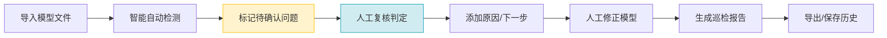
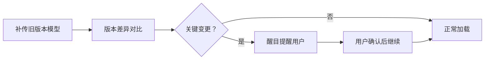

## 1. 产品概述

地下管廊巡视系统是一个基于Three.js的3D模型巡检工具，用于展厅项目中模型摆放的复核、修正和历史追溯。系统解决模型重复摆放不留痕、后期扯皮的问题，确保巡检过程可追溯、可复核、可导出。

- 核心用途：3D模型导入、智能复核、人工修正、历史记录追踪、巡检报告导出
- 目标用户：展厅项目经理、巡检人员、客户项目群审核人员

## 2. 核心功能

### 2.1 用户角色
| 角色 | 注册方式 | 核心权限 |
|------|----------|----------|
| 巡检人员 | 本地登录 | 导入模型、执行巡检、标记问题、导出报告 |
| 项目经理 | 本地登录 | 复核巡检结果、查看历史记录、审批修正 |

### 2.2 功能模块
1. **模型导入页**：模型文件上传、版本对比、变更提醒
2. **3D巡检页**：Three.js场景展示、智能检测、问题标记、人工修正
3. **历史记录页**：版本对比、变更追溯、操作日志
4. **报告导出页**：巡检单生成、问题汇总、导出PDF/Excel

### 2.3 页面详情
| 页面名称 | 模块名称 | 功能描述 |
|---------|----------|----------|
| 模型导入页 | 上传模块 | 支持GLB/GLTF格式上传，自动解析模型清单 |
| 模型导入页 | 版本对比 | 新旧版本模型对比，高亮显示变更项 |
| 3D巡检页 | 场景渲染 | Three.js 3D场景展示，支持旋转、缩放、平移 |
| 3D巡检页 | 智能检测 | 自动检测坐标轴翻转、模型重复、路线遮挡 |
| 3D巡检页 | 问题标记 | 标记问题位置，添加判断理由和下一步建议 |
| 3D巡检页 | 人工修正 | 支持模型位置、旋转调整，留痕记录修改过程 |
| 历史记录页 | 版本列表 | 按时间顺序展示所有巡检版本 |
| 历史记录页 | 变更对比 | 可视化展示两个版本间的差异 |
| 报告导出页 | 巡检单生成 | 自动生成包含问题截图和说明的巡检报告 |
| 报告导出页 | 导出功能 | 支持导出PDF、Excel格式巡检单 |

## 3. 核心流程

### 3.1 巡检主流程
用户导入模型文件后，系统自动进行智能检测并标记可疑问题。巡检人员逐一复核问题，添加判断理由和下一步建议，可直接在3D场景中修正模型位置。完成后生成巡检报告并导出，所有操作记录保存至历史版本。

### 3.2 版本对比流程
当补传旧版本模型清单时，系统自动与当前版本对比，高亮显示坐标轴翻转、模型重复、路线遮挡等关键变更，提醒用户注意差异，避免静默覆盖。

## 4. 用户界面设计

### 4.1 设计风格
- **主色调**：深蓝色 (#1e3a5f) - 代表专业、可靠的工程风格
- **辅助色**：橙色 (#ff6b35) - 用于警示和待确认标记
- **状态色**：绿色 (#28a745) 正常，黄色 (#ffc107) 待确认，红色 (#dc3545) 问题
- **按钮风格**：直角边框、轻微阴影、悬停浮起效果
- **字体**：思源黑体 - 清晰易读，适合工程类应用
- **布局风格**：左右分栏布局，左侧3D场景，右侧控制面板
- **图标风格**：线性图标，简洁明了

### 4.2 页面设计概述
| 页面名称 | 模块名称 | UI元素 |
|---------|----------|--------|
| 3D巡检页 | 场景区域 | 全屏Three.js画布，顶部工具栏，底部状态栏 |
| 3D巡检页 | 控制面板 | 问题列表卡片，每项含状态标签、原因、下一步 |
| 3D巡检页 | 标记系统 | 3D空间中彩色悬浮标记，点击显示详情面板 |
| 历史记录页 | 时间轴 | 垂直时间轴展示版本，可点击切换对比 |
| 报告导出页 | 预览区域 | 巡检单实时预览，支持翻页查看 |

### 4.3 响应式
- 桌面端优先设计，左侧70%场景，右侧30%面板
- 平板端改为上下布局，场景在上，面板在下
- 移动端简化为列表视图，保留核心功能

### 4.4 3D场景指导
- **环境**：中性灰色背景，柔和环境光，避免分散注意力
- **光照**：HemisphereLight + DirectionalLight，确保模型细节清晰
- **相机**：PerspectiveCamera，支持OrbitControls交互
- **标记系统**：使用Sprite或CSS2DRenderer在问题位置显示悬浮标记
- **交互**：鼠标悬停高亮模型，点击选中显示属性面板
- **性能**：模型面数控制在合理范围，使用InstancedMesh处理重复物体
