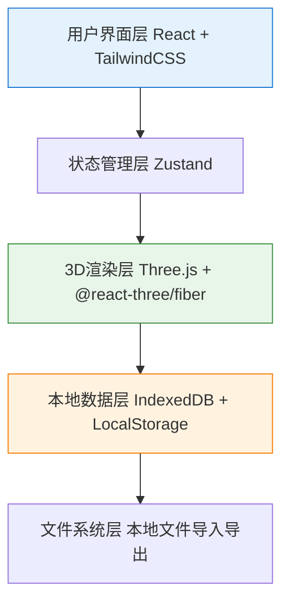
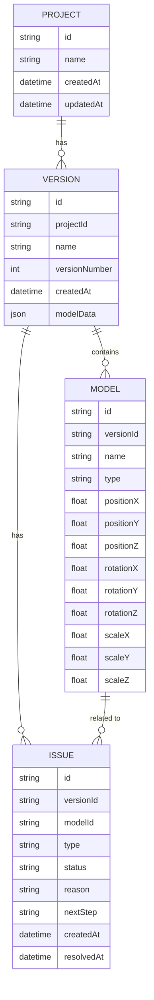

## 1. 架构设计

本项目为纯前端本地应用，无需后端服务，所有数据存储在浏览器本地存储(LocalStorage)和IndexedDB中。

## 2. 技术描述

- **前端框架**: React@18 + TypeScript
- **构建工具**: Vite@5
- **样式方案**: TailwindCSS@3
- **3D渲染**: Three.js + @react-three/fiber + @react-three/drei
- **状态管理**: Zustand
- **本地存储**: IndexedDB (大型模型数据) + LocalStorage (配置)
- **报告导出**: html2canvas + jspdf (PDF) + xlsx (Excel)

## 3. 路由定义

| 路由 | 页面名称 | 功能说明 |
|------|----------|----------|
| / | 首页 | 项目导航、最近项目列表 |
| /import | 模型导入 | 上传模型文件、版本对比 |
| /inspection | 3D巡检 | 主巡检页面，3D场景+问题面板 |
| /history | 历史记录 | 版本对比、操作日志 |
| /export | 报告导出 | 巡检单预览和导出 |

## 4. 数据模型

### 4.1 数据模型定义

### 4.2 问题类型定义

| 问题类型 | 编码 | 判定逻辑 | 默认状态 |
|---------|------|----------|----------|
| 坐标轴翻转 | AXIS_FLIPPED | 旋转角度接近180度或缩放值为负 | 待确认 |
| 模型重复摆放 | DUPLICATE | 两个模型位置距离小于阈值且名称相似 | 待确认 |
| 路线被挡住 | PATH_BLOCKED | 展品模型位于预设巡检路线上 | 待确认 |
| 位置偏移 | POSITION_SHIFT | 与参考位置偏差超过阈值 | 待确认 |

## 5. 核心模块设计

### 5.1 智能检测模块

**检测逻辑:**
1. **坐标轴翻转检测**
   - 检查模型rotation.y是否接近±π (180度)
   - 检查scale分量是否为负值
   - 记录: "检测到模型Y轴旋转接近180度，可能存在坐标轴翻转"
   - 下一步: "请人工确认模型朝向是否正确，如需调整请在3D场景中旋转修正"

2. **模型重复摆放检测**
   - 计算所有模型间的欧氏距离
   - 距离 < 0.5米且名称相似度 > 80% 标记为重复
   - 记录: "检测到A模型与B模型位置过于接近(距离: 0.3m)，可能存在重复摆放"
   - 下一步: "请确认是否为重复摆放，如重复请删除其中一个或调整位置"

3. **路线遮挡检测**
   - 预设巡检路线点集合
   - 检测模型包围盒是否与路线圆柱体相交
   - 记录: "检测到模型位于巡检路线第5段，可能遮挡通行"
   - 下一步: "请确认展品摆放是否影响巡视路线，如影响请调整位置"

### 5.2 版本对比模块

**变更检测算法:**
- 新增模型: 旧版无，新版有 → 绿色标记
- 删除模型: 旧版有，新版无 → 红色标记
- 位置变更: 同一模型位置差 > 阈值 → 黄色标记
- 旋转变更: 同一模型旋转差 > 阈值 → 橙色标记
- 属性变更: 名称/类型等变化 → 蓝色标记

### 5.3 历史记录模块

**操作日志记录:**
- 每次问题状态变更
- 每次模型位置/旋转调整
- 每次版本导入/导出
- 记录内容: 操作人、时间、操作类型、变更前后值

## 6. 本地存储方案

- **IndexedDB**: 存储大型3D模型数据、版本历史、操作日志
- **LocalStorage**: 存储用户偏好设置、当前项目ID、UI状态
- **文件导出**: 支持导出JSON格式的完整项目数据用于备份和分享
