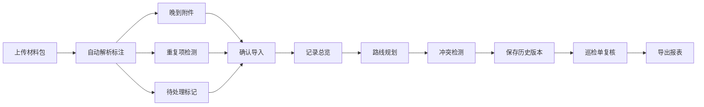

## 1. 产品概述
展车动线预演系统用于处理展厅展车布置前的材料包核验，解决模型清单、巡检照片不同步，重复项难识别，人工更正无追溯的问题。目标用户为展厅项目经理，通过标准化数据处理流程，确保巡检单与明细口径一致。

- 核心问题：模型清单与巡检照片异步到达、重复项混淆、人工修改无历史记录
- 产品价值：材料包统一入口、全链路可追溯、路线冲突可视化、巡检单自动复核

## 2. 核心功能

### 2.1 用户角色
| 角色 | 注册方式 | 核心权限 |
|------|----------|----------|
| 展厅项目经理 | 默认登录 | 导入材料包、编辑路线、复核巡检单、导出报表、查看历史 |

### 2.2 功能模块
1. **材料包导入页**：拖拽上传、自动解析、异常标注（晚到/重复/待处理）
2. **记录总览页**：记录列表、状态筛选、来源追踪、修改历史面板
3. **路线规划页**：展厅平面图、展品位置标注、动线绘制、冲突检测
4. **巡检单复核页**：明细对比、异常高亮、一键修正、导出PDF/Excel

### 2.3 页面详情
| 页面名称 | 模块名称 | 功能描述 |
|-----------|-------------|---------------------|
| 材料包导入页 | 上传区域 | 拖拽上传文件包，支持zip/csv/xlsx/jpg/png混合格式 |
| 材料包导入页 | 解析预览 | 自动识别记录类型，标注晚到附件、重复项、待处理原因 |
| 材料包导入页 | 导入确认 | 显示统计概览，支持逐条确认后导入 |
| 记录总览页 | 记录列表 | 卡片式列表，展示来源、状态、修改人、待处理原因 |
| 记录总览页 | 筛选面板 | 按状态/来源/时间/修改人多维度筛选 |
| 记录总览页 | 历史抽屉 | 点击记录展示完整修改历史，支持版本对比 |
| 路线规划页 | 展厅画布 | SVG平面图，支持缩放平移，展品位置可视化 |
| 路线规划页 | 动线编辑 | 点击绘制讲解路线，自动检测与展品的冲突 |
| 路线规划页 | 冲突提示 | 路线被挡处以红色高亮，显示遮挡展品信息 |
| 巡检单复核页 | 明细对比 | 左右分栏对比巡检单与明细，差异项高亮 |
| 巡检单复核页 | 复核操作 | 一键修正、添加备注、标记复核完成 |
| 巡检单复核页 | 导出功能 | 支持导出PDF巡检单和Excel明细表 |

## 3. 核心流程
项目经理拖拽上传材料包 → 系统自动解析并标注异常（晚到/重复/待处理）→ 项目经理逐条确认后导入 → 在记录总览中查看状态和来源 → 进入路线规划页绘制讲解路线 → 系统自动检测路线冲突 → 修改后保存历史版本 → 进入复核页对比巡检单与明细 → 完成复核后导出。

## 4. 用户界面设计

### 4.1 设计风格
- 主色调：深邃藏蓝 `#1a365d`，专业稳重
- 辅助色：警示橙 `#ed8936`（晚到/待处理）、成功绿 `#38a169`（正常）、冲突红 `#e53e3e`（重复/冲突）
- 按钮风格：圆角6px，悬停时微妙上浮阴影
- 字体：标题用`Noto Serif SC`衬线体体现专业感，正文用`Noto Sans SC`
- 布局：左侧导航 + 主内容区 + 右侧抽屉式详情面板
- 图标风格：lucide-react线性图标，统一16px尺寸

### 4.2 页面设计概述
| 页面名称 | 模块名称 | UI元素 |
|-----------|-------------|-------------|
| 材料包导入页 | 上传区域 | 虚线边框拖放区，渐变背景，悬停时缩放动效 |
| 记录总览页 | 记录卡片 | 左边界色条标识状态，hover展开更多操作 |
| 路线规划页 | 展厅画布 | 网格背景，展品用不同形状区分，路线用贝塞尔曲线 |
| 巡检单复核页 | 对比面板 | 左右联动滚动，差异处背景闪烁提示 |

### 4.3 响应式
桌面优先设计，主内容区最小宽度1200px。平板端右侧抽屉改为底部滑出，移动端简化为列表视图。

### 4.4 动效设计
- 页面加载：卡片错落出现（staggered fade-in）
- 状态变更：色条宽度过渡动画
- 冲突检测：红色脉冲闪烁提示
- 抽屉滑入：cubic-bezier缓动曲线
