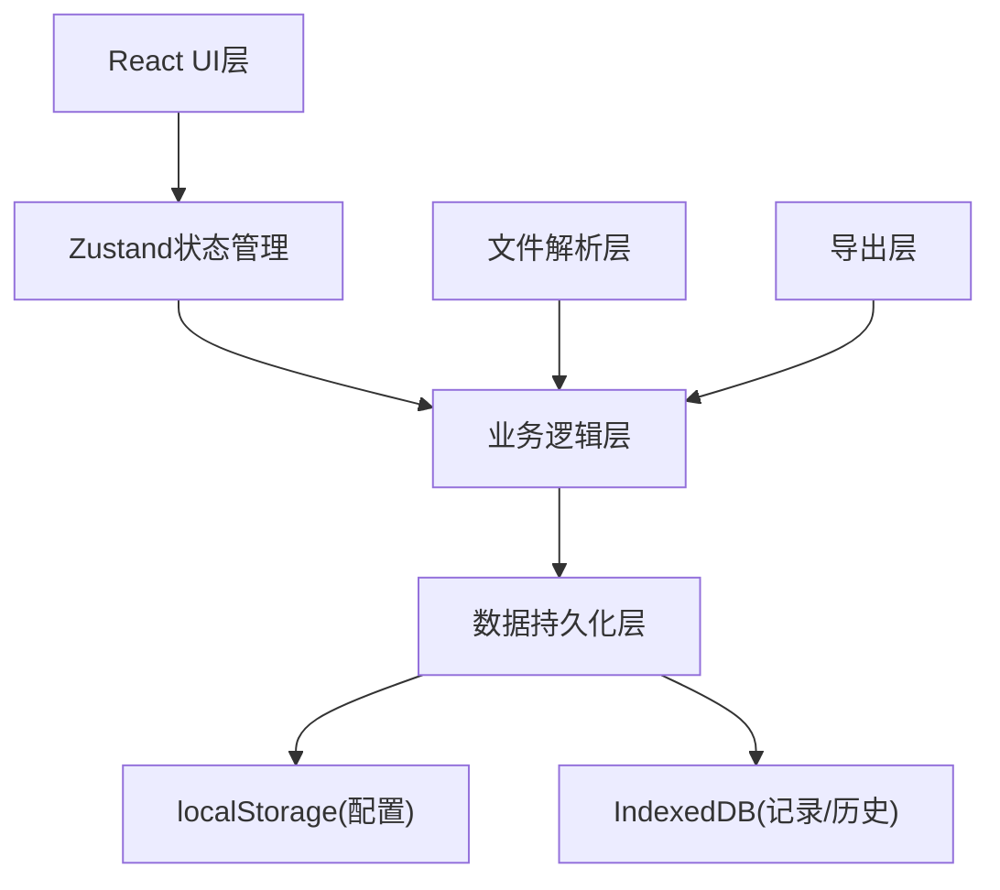
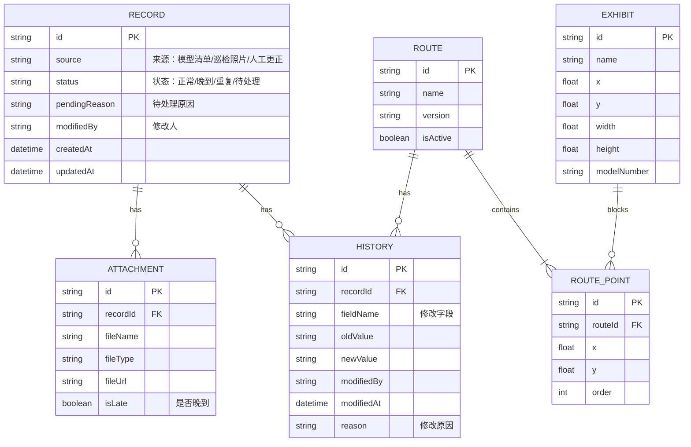

## 1. 架构设计
纯前端React应用，数据持久化使用localStorage和IndexedDB，无需后端服务。



## 2. 技术描述
- 前端：React@18 + TypeScript + Vite
- 样式：TailwindCSS@3
- 状态管理：Zustand
- 图标：lucide-react
- 文件解析：xlsx、jszip、papaparse
- 导出：jspdf、xlsx
- 数据持久化：localForage（IndexedDB封装）
- 初始化工具：vite-init

## 3. 路由定义
| 路由 | 用途 |
|-------|---------|
| / | 材料包导入页 |
| /records | 记录总览页 |
| /route | 路线规划页 |
| /review | 巡检单复核页 |

## 4. 数据模型

### 4.1 数据模型定义


### 4.2 TypeScript类型定义
```typescript
type RecordSource = 'model_list' | 'inspection_photo' | 'manual_correction';
type RecordStatus = 'normal' | 'late' | 'duplicate' | 'pending';

interface BaseRecord {
  id: string;
  source: RecordSource;
  status: RecordStatus;
  pendingReason?: string;
  modifiedBy: string;
  createdAt: string;
  updatedAt: string;
  attachments: Attachment[];
  content: Record<string, any>;
}

interface HistoryEntry {
  id: string;
  recordId: string;
  fieldName: string;
  oldValue: any;
  newValue: any;
  modifiedBy: string;
  modifiedAt: string;
  reason: string;
}

interface Exhibit {
  id: string;
  name: string;
  modelNumber: string;
  x: number;
  y: number;
  width: number;
  height: number;
}

interface Route {
  id: string;
  name: string;
  points: RoutePoint[];
  version: number;
  isActive: boolean;
  createdAt: string;
  modifiedBy: string;
}

interface RoutePoint {
  id: string;
  x: number;
  y: number;
  order: number;
}

interface Conflict {
  routePointId: string;
  exhibitId: string;
  exhibitName: string;
  distance: number;
}
```

## 5. 核心模块说明

### 5.1 材料包解析模块
- 支持zip包自动解压，识别csv/xlsx为数据记录，jpg/png为附件
- 重复项检测：基于车型+VIN后6位模糊匹配
- 晚到判断：对比材料包上传时间与记录内时间戳

### 5.2 状态管理
```typescript
// zustand store 结构
interface AppState {
  records: BaseRecord[];
  currentRoute: Route | null;
  exhibits: Exhibit[];
  history: HistoryEntry[];
  filters: RecordFilter;
  addRecord: (record: BaseRecord) => void;
  updateRecord: (id: string, updates: Partial<BaseRecord>, reason: string) => void;
  importPackage: (files: File[]) => Promise<ImportResult>;
  detectConflicts: () => Conflict[];
  exportInspection: () => Blob;
}
```

### 5.3 路线冲突检测算法
- 计算路线点与展品边界的最短距离
- 距离小于阈值（0.5米）标记为冲突
- 展示冲突展品名称和建议调整方向

## 6. 初始数据
- 预置3个展厅样例平面图
- 预置5条示例记录（覆盖所有状态类型）
- 预置2条历史版本路线用于对比演示
