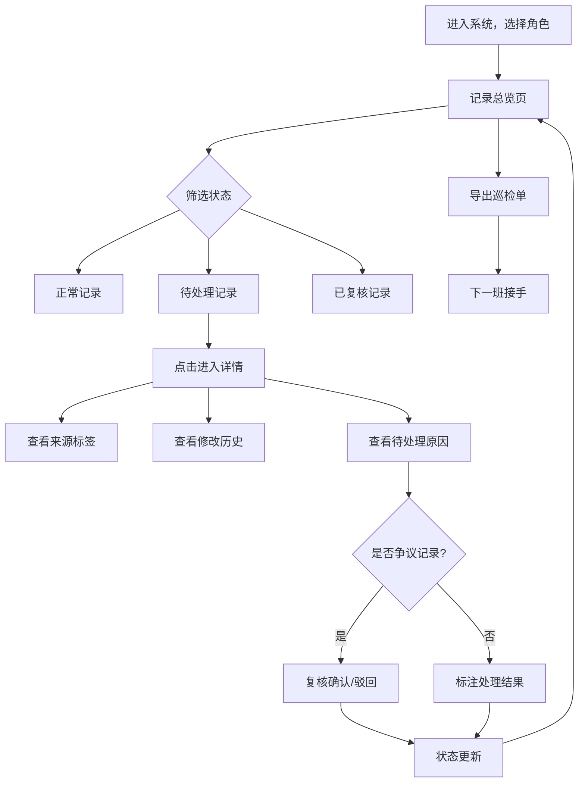

## 1. 产品概述

文物展柜摆位——面向博物馆布展、工程与讲解团队的轻量级展品摆位记录管理工具。解决彩排前临时补材料、模型清单与讲解路线对不上、坐标轴翻转等争议无法追溯的问题。每条记录可见来源、状态、修改人和待处理原因，导出的巡检单可供下一班直接接手，无需翻聊天记录。

- 目标用户：布展工程师、工程团队、客户方讲解员
- 核心价值：让摆位记录有据可查、争议可复核、交接不断裂

## 2. 核心功能

### 2.1 用户角色

| 角色 | 进入方式 | 核心权限 |
|------|----------|----------|
| 布展工程师 | 选择角色进入 | 录入记录、修改状态、导出巡检单 |
| 工程负责人 | 选择角色进入 | 录入记录、修改状态、复核争议记录、导出巡检单 |
| 讲解员 | 选择角色进入 | 查看记录、标注疑问、导出巡检单 |

### 2.2 功能模块

1. **记录总览页**：展柜摆位记录列表，按状态筛选，快速定位待处理项
2. **记录详情页**：单条记录的完整信息、修改历史、来源标注、待处理原因
3. **巡检单导出**：一键生成当前班次巡检单，下一班可直接使用

### 2.3 页面详情

| 页面名称 | 模块名称 | 功能说明 |
|----------|----------|----------|
| 记录总览 | 状态筛选栏 | 按正常/待处理/已复核/已关闭筛选，支持关键词搜索 |
| 记录总览 | 记录卡片列表 | 每条记录显示展柜编号、文物名称、当前状态、来源、最近修改人和时间 |
| 记录总览 | 统计摘要 | 各状态数量汇总，争议记录单独高亮 |
| 记录详情 | 基本信息 | 展柜坐标、文物信息、摆放位置、坐标轴方向 |
| 记录详情 | 来源标签 | 标注记录来源（初始录入/晚到附件/重复项/人工更正） |
| 记录详情 | 修改历史 | 时间线展示每次修改：谁、什么时候、改了什么、原因 |
| 记录详情 | 待处理原因 | 进入待处理的具体原因，可复核标注 |
| 记录详情 | 复核操作 | 工程负责人可对争议记录进行复核确认或驳回 |
| 巡检单导出 | 导出面板 | 选择导出范围，生成纯文本巡检单，含待处理项和复核结论 |

## 3. 核心流程

用户进入系统 → 选择角色 → 查看记录总览（默认显示待处理项）→ 点击记录进入详情 → 查看来源/修改历史/待处理原因 → 对争议记录复核或标注 → 导出巡检单交接下一班

## 4. 用户界面设计

### 4.1 设计风格

- **主色调**：深墨绿 (#1a3a2a) + 暖铜色 (#c48a5a) 点缀，传达文物展厅的沉稳质感
- **辅助色**：米白底 (#f5f0e8)、浅灰边框 (#d4cfc5)、状态色（琥珀-待处理、翠绿-正常、钢蓝-已复核、石灰-已关闭）
- **按钮风格**：圆角矩形，微投影，hover 态铜色描边
- **字体**：正文用 Noto Serif SC（衬线体，贴合文物气质），数据/标签用 Noto Sans SC
- **布局**：左侧固定导航栏 + 右侧内容区，卡片式列表，时间线式修改历史
- **图标**：Lucide 图标，线条风格

### 4.2 页面设计概览

| 页面名称 | 模块名称 | UI 元素 |
|----------|----------|----------|
| 记录总览 | 顶部统计栏 | 三组数字卡片（待处理/争议/总数），铜色数字 + 墨绿标签 |
| 记录总览 | 筛选栏 | 横排胶囊按钮（状态筛选），搜索输入框 |
| 记录总览 | 记录列表 | 竖排卡片，左侧状态色条，右下角来源标签和修改人头像 |
| 记录详情 | 基本信息区 | 双栏布局：左栏文物信息，右栏展柜坐标与轴向 |
| 记录详情 | 来源标签 | 彩色胶囊标签：初始录入(绿)、晚到附件(琥珀)、重复项(红)、人工更正(蓝) |
| 记录详情 | 修改历史 | 竖向时间线，圆点 + 连线，每条显示操作人、时间、变更内容 |
| 记录详情 | 待处理原因 | 黄色背景卡片，加粗原因文字，下方复核按钮 |
| 记录详情 | 复核区 | 复核/驳回按钮 + 复核意见输入框 |
| 巡检单导出 | 导出面板 | 范围选择（全部/仅待处理/仅争议），预览区 + 导出按钮 |

### 4.3 响应式设计

桌面优先设计，平板可自适应缩窄，手机端导航栏折叠为底部标签栏

### 4.4 3D 场景指引

不适用
