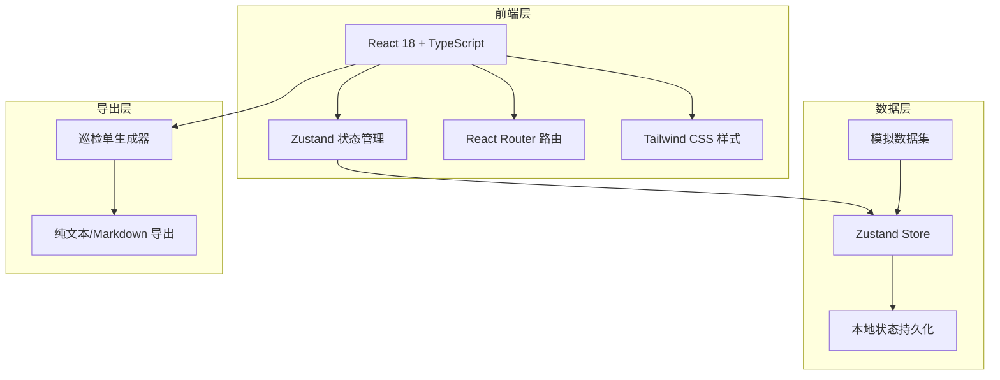
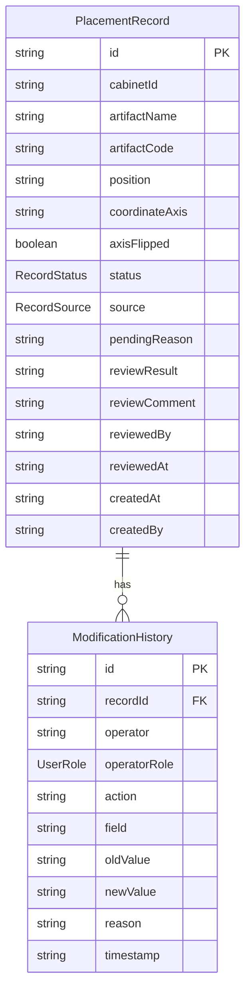

## 1. 架构设计



纯前端应用，无需后端服务。数据通过 Zustand 管理并持久化到 localStorage，巡检单导出为纯文本文件。

## 2. 技术说明

- **前端**：React@18 + TypeScript + Tailwind CSS@3 + Vite
- **初始化工具**：vite-init
- **状态管理**：Zustand（含 persist 中间件，localStorage 持久化）
- **路由**：react-router-dom@6
- **后端**：无（纯前端，模拟数据）
- **数据库**：无（Zustand + localStorage）
- **图标**：lucide-react

## 3. 路由定义

| 路由 | 用途 |
|------|------|
| / | 记录总览页，展示所有摆位记录列表与筛选 |
| /record/:id | 记录详情页，展示单条记录完整信息与修改历史 |
| /export | 巡检单导出页，选择范围并导出 |

## 4. API 定义

无后端 API，所有数据操作通过 Zustand Store 完成。

Store 对外接口：

```typescript
interface RecordStore {
  records: PlacementRecord[];
  currentUser: UserRole;
  setCurrentUser: (role: UserRole) => void;
  addRecord: (record: PlacementRecord) => void;
  updateRecord: (id: string, update: Partial<PlacementRecord>, reason: string) => void;
  reviewRecord: (id: string, result: 'confirmed' | 'rejected', comment: string) => void;
  getRecordsByStatus: (status: RecordStatus) => PlacementRecord[];
  exportInspectionSheet: (scope: 'all' | 'pending' | 'disputed') => string;
}
```

## 5. 服务器架构图

不适用（纯前端应用）

## 6. 数据模型

### 6.1 数据模型定义



### 6.2 数据定义

```typescript
type RecordStatus = 'normal' | 'pending' | 'reviewed' | 'closed';
type RecordSource = 'initial' | 'late_attachment' | 'duplicate' | 'manual_correction';
type UserRole = 'exhibit_engineer' | 'project_lead' | 'docent';

interface PlacementRecord {
  id: string;
  cabinetId: string;
  artifactName: string;
  artifactCode: string;
  position: string;
  coordinateAxis: string;
  axisFlipped: boolean;
  status: RecordStatus;
  source: RecordSource;
  pendingReason: string;
  reviewResult: 'confirmed' | 'rejected' | null;
  reviewComment: string;
  reviewedBy: string;
  reviewedAt: string;
  createdAt: string;
  createdBy: string;
  isDisputed: boolean;
}

interface ModificationHistory {
  id: string;
  recordId: string;
  operator: string;
  operatorRole: UserRole;
  action: string;
  field: string;
  oldValue: string;
  newValue: string;
  reason: string;
  timestamp: string;
}
```

### 6.3 初始数据说明

模拟数据集包含约 15-20 条记录，涵盖：
- 正常记录（约 8 条）：初始录入，状态正常
- 晚到附件（约 3 条）：标注为 late_attachment 来源
- 重复项（约 3 条）：同一文物在不同展柜出现，标记为 duplicate 来源，isDisputed=true
- 人工更正（约 2 条）：坐标轴翻转等需人工修正，标记为 manual_correction 来源
- 争议记录（约 2-3 条）：isDisputed=true，含坐标轴翻转争议和重复摆放争议
