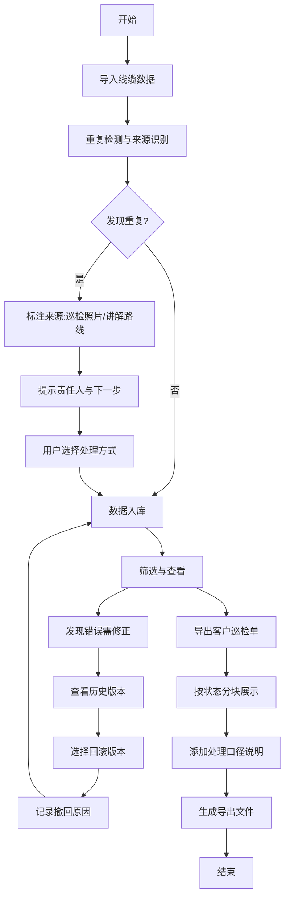

## 1. 产品概述

本系统解决机房线缆穿梭管理中表格混乱、坐标轴翻转难以追踪、重复数据来源不明等痛点。面向一线运维同事，提供导入、撤回、筛选、导出全流程口径一致的管理能力。

- 核心用户：机房运维工程师、巡检人员
- 核心价值：替代人工表格管理，确保数据口径一致，提供人性化错误提示
- 业务目标：让一线同事愿意主动使用，减少数据核对时间80%以上

## 2. 核心功能

### 2.1 用户角色

| 角色 | 登录方式 | 核心权限 |
|------|---------|---------|
| 运维工程师 | 工号登录 | 导入数据、编辑修正、撤回操作、导出巡检单 |
| 巡检人员 | 工号登录 | 录入巡检数据、查看线缆记录、标记待补项 |
| 项目经理 | 工号登录 | 导出客户巡检单、查看统计概览 |

### 2.2 功能模块

1. **线缆记录总览页**：数据列表、多条件筛选、状态分类展示
2. **数据导入页**：Excel/CSV导入、重复检测、来源标记、冲突预览
3. **记录详情页**：穿梭路径可视化、历史版本、操作日志、回滚修正
4. **巡检单导出页**：客户友好格式、分状态展示、处理口径说明

### 2.3 页面详情

| 页面名称 | 模块名称 | 功能描述 |
|---------|---------|---------|
| 线缆记录总览页 | 状态分类面板 | 已确认/待补/人工修改三栏展示，点击快速筛选 |
| 线缆记录总览页 | 高级筛选器 | 按机房、机柜、线缆类型、日期范围、数据来源筛选 |
| 线缆记录总览页 | 批量操作栏 | 批量标记状态、批量导出、批量撤回 |
| 数据导入页 | 上传区域 | 拖拽上传Excel/CSV，实时解析预览 |
| 数据导入页 | 重复检测面板 | 高亮重复项，显示来源（巡检照片/讲解路线），提示责任人 |
| 数据导入页 | 冲突处理向导 | 逐条对比差异，提供保留/覆盖/合并选项，附带操作建议 |
| 记录详情页 | 穿梭路径可视化 | 坐标系展示线缆走向，支持翻转查看，标注关键节点 |
| 记录详情页 | 历史版本时间线 | 展示每次修改记录，支持一键回滚到任意版本 |
| 记录详情页 | 操作备注区 | 人工修改必须填写原因，永久留存 |
| 巡检单导出页 | 导出配置向导 | 选择导出范围、格式模板、是否包含处理口径说明 |
| 巡检单导出页 | 预览面板 | 实时预览导出效果，确认后下载 |

## 3. 核心流程

### 3.1 数据导入流程

用户上传线缆数据文件 → 系统自动解析并检测重复 → 高亮重复项并标注来源（巡检照片/讲解路线）→ 提示"第3行与2024-05-20巡检照片中的A机柜线缆记录重复，建议联系张工确认最新走向"→ 用户选择处理方式 → 系统记录操作日志 → 数据入库并标记状态

### 3.2 撤回修正流程

用户在列表中选择需要撤回的记录 → 查看该记录的历史版本时间线 → 选择需要回滚的版本 → 系统提示"将撤销李明在2024-05-25 14:30对坐标Y轴的翻转修改"→ 确认后回滚 → 自动生成一条"人工撤回"状态标记

### 3.3 筛选导出流程

用户通过多条件筛选目标数据 → 选择"导出巡检单"→ 选择客户模板 → 系统按已确认/待补/人工修改分块展示 → 自动添加处理口径说明 → 预览确认后导出PDF/Excel

### 3.4 Mermaid 流程图

## 4. 用户界面设计

### 4.1 设计风格

**设计方向：工业精准风**
- 主色调：深青灰色（#1E293B）作为基底，体现工业稳重感
- 强调色：信号绿（#10B981）= 已确认，警示橙（#F59E0B）= 待补，编辑蓝（#3B82F6）= 人工修改
- 警示色：危险红（#EF4444）用于严重冲突提示
- 字体：JetBrains Mono（数字和代码感）搭配 Noto Sans SC（中文可读性）
- 按钮风格：直角边框，轻微凹陷效果，点击时有明确的按压反馈
- 布局：网格化数据表格为主，左侧固定筛选面板，顶部操作栏
- 图标风格：线性工业图标，避免卡通化，使用 lucide-react 的线条风格

### 4.2 页面设计概览

| 页面名称 | 模块名称 | UI 元素 |
|---------|---------|---------|
| 线缆记录总览页 | 状态分类面板 | 三个并排卡片，分别用绿/橙/蓝三色边框，显示数量统计，悬停时有浮起效果 |
| 线缆记录总览页 | 数据表格 | 斑马纹行，状态列带颜色标签，重复数据行有黄色背景高亮 |
| 数据导入页 | 上传区域 | 虚线边框，拖入文件时边框变实并变色，显示文件图标和解析进度 |
| 数据导入页 | 重复提示卡片 | 黄色背景，左侧来源图标（相机/地图标记），右侧责任人头像和联系方式 |
| 记录详情页 | 路径可视化 | SVG坐标系，带网格线，线缆用贝塞尔曲线绘制，关键节点可点击 |
| 记录详情页 | 时间线 | 垂直时间轴，每个节点带操作人头像、时间、修改摘要 |
| 巡检单导出页 | 预览区 | 模拟A4纸张效果，阴影边框，可缩放查看 |

### 4.3 响应式

- 桌面端（1280px+）：三栏布局，左侧筛选，中间表格，右侧详情预览
- 平板端（768px-1279px）：两栏布局，筛选面板可折叠
- 移动端（<768px）：单栏流式布局，筛选按钮悬浮底部

### 4.4 人性化错误提示规范

所有错误和提示必须包含三要素：
1. **发生了什么**：用业务语言描述，禁用字段名
2. **为什么会这样**：说明原因或数据来源
3. **我该怎么办**：明确的下一步操作，可点击的责任人或操作按钮

示例（错误示范）：
> "字段 coordinate_y 非法值 -1，堆栈：line 234"

示例（正确示范）：
> "⚠️ 这条线缆的Y坐标出现了负数，可能是上次导入时坐标轴被翻转了。这条记录来自王工2024-05-20的巡检照片，建议点击这里联系王工确认实际走向。"
