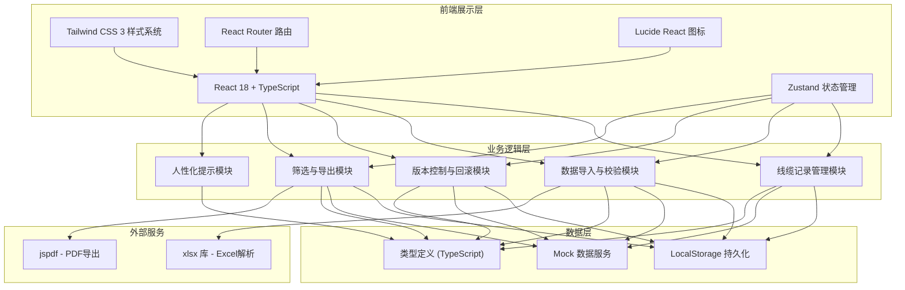
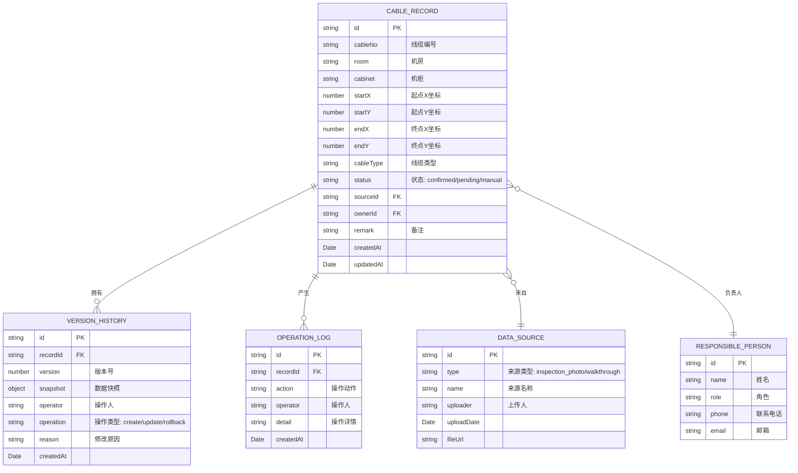

## 1. 架构设计



## 2. 技术描述

- **前端框架**: React 18 + TypeScript 5
- **构建工具**: Vite 5
- **样式方案**: Tailwind CSS 3
- **状态管理**: Zustand 4
- **路由管理**: React Router DOM 6
- **图标库**: Lucide React
- **Excel 解析**: xlsx (SheetJS)
- **PDF 导出**: jspdf + jspdf-autotable
- **数据持久化**: LocalStorage (前端模拟)
- **初始化工具**: vite-init

## 3. 路由定义

| 路由路径 | 页面组件 | 功能说明 |
|---------|---------|---------|
| `/` | `CableRecordsPage` | 线缆记录总览，列表展示与筛选 |
| `/import` | `DataImportPage` | 数据导入、重复检测、冲突处理 |
| `/record/:id` | `RecordDetailPage` | 单条记录详情、路径可视化、历史版本 |
| `/export` | `InspectionExportPage` | 巡检单导出配置与预览 |

## 4. 数据模型

### 4.1 实体关系图



### 4.2 TypeScript 类型定义

```typescript
// 线缆记录状态
export type CableStatus = 'confirmed' | 'pending' | 'manual';

// 数据来源类型
export type SourceType = 'inspection_photo' | 'walkthrough' | 'manual';

// 操作类型
export type OperationType = 'create' | 'update' | 'delete' | 'rollback' | 'import';

// 坐标点
export interface Point {
  x: number;
  y: number;
}

// 线缆记录
export interface CableRecord {
  id: string;
  cableNo: string;
  room: string;
  cabinet: string;
  startPoint: Point;
  endPoint: Point;
  cableType: string;
  status: CableStatus;
  sourceId: string;
  ownerId: string;
  remark: string;
  createdAt: string;
  updatedAt: string;
  coordinatesFlipped: boolean;
}

// 数据来源
export interface DataSource {
  id: string;
  type: SourceType;
  name: string;
  uploader: string;
  uploadDate: string;
  description: string;
}

// 负责人
export interface ResponsiblePerson {
  id: string;
  name: string;
  role: string;
  phone: string;
  email: string;
}

// 版本历史
export interface VersionHistory {
  id: string;
  recordId: string;
  version: number;
  snapshot: CableRecord;
  operator: string;
  operation: OperationType;
  reason: string;
  createdAt: string;
}

// 操作日志
export interface OperationLog {
  id: string;
  recordId: string;
  action: string;
  operator: string;
  detail: string;
  createdAt: string;
}

// 导入冲突
export interface ImportConflict {
  rowIndex: number;
  incomingData: Partial<CableRecord>;
  existingRecord?: CableRecord;
  conflictType: 'duplicate' | 'coordinate_flipped' | 'invalid_data';
  sourceInfo?: DataSource;
  suggestedAction: 'keep' | 'overwrite' | 'merge' | 'skip';
  humanMessage: string;
  nextStep: string;
  contactPerson?: ResponsiblePerson;
}

// 筛选条件
export interface FilterConditions {
  rooms: string[];
  cabinets: string[];
  statuses: CableStatus[];
  sourceTypes: SourceType[];
  dateRange: { start: string; end: string } | null;
  cableTypes: string[];
  searchText: string;
}

// 导出配置
export interface ExportConfig {
  format: 'pdf' | 'excel';
  includeCaliber: boolean;
  groupByStatus: boolean;
  template: 'customer' | 'internal';
  title: string;
  remark: string;
}

// 人性化提示
export interface HumanMessage {
  level: 'info' | 'warning' | 'error' | 'success';
  title: string;
  description: string;
  reason: string;
  nextSteps: {
    text: string;
    action?: () => void;
  }[];
  contact?: ResponsiblePerson;
}
```

### 4.3 状态管理 (Zustand)

```typescript
// store/cableStore.ts
import { create } from 'zustand';
import { CableRecord, VersionHistory, FilterConditions, DataSource, ResponsiblePerson } from '@/types';

interface CableState {
  records: CableRecord[];
  versionHistories: VersionHistory[];
  dataSources: DataSource[];
  persons: ResponsiblePerson[];
  filters: FilterConditions;
  selectedRecordIds: string[];
  
  // 操作方法
  setRecords: (records: CableRecord[]) => void;
  addRecord: (record: CableRecord, operator: string, reason: string) => void;
  updateRecord: (id: string, updates: Partial<CableRecord>, operator: string, reason: string) => void;
  rollbackRecord: (recordId: string, versionId: string, operator: string, reason: string) => void;
  deleteRecord: (id: string, operator: string, reason: string) => void;
  setFilters: (filters: Partial<FilterConditions>) => void;
  toggleRecordSelection: (id: string) => void;
  clearSelection: () => void;
  
  // 业务逻辑
  detectDuplicates: (incoming: Partial<CableRecord>[]) => ImportConflict[];
  findContactPerson: (sourceType: string) => ResponsiblePerson | undefined;
  generateHumanMessage: (conflict: ImportConflict) => HumanMessage;
  getFilteredRecords: () => CableRecord[];
}

export const useCableStore = create<CableState>((set, get) => ({
  // ... 实现
}));
```

## 5. 目录结构

```
src/
├── components/           # 可复用组件
│   ├── common/          # 通用组件
│   │   ├── StatusBadge.tsx
│   │   ├── HumanMessageCard.tsx
│   │   ├── DataTable.tsx
│   │   └── FilterPanel.tsx
│   ├── cable/           # 线缆相关组件
│   │   ├── CablePathVisualizer.tsx
│   │   ├── RecordCard.tsx
│   │   └── VersionTimeline.tsx
│   └── import/          # 导入相关组件
│       ├── FileUploadZone.tsx
│       ├── ConflictPreview.tsx
│       └── ConflictResolutionCard.tsx
├── pages/               # 页面组件
│   ├── CableRecordsPage.tsx
│   ├── DataImportPage.tsx
│   ├── RecordDetailPage.tsx
│   └── InspectionExportPage.tsx
├── hooks/               # 自定义 Hooks
│   ├── useCableFilters.ts
│   ├── useImportValidation.ts
│   └── useVersionControl.ts
├── store/               # Zustand 状态管理
│   └── cableStore.ts
├── types/               # TypeScript 类型定义
│   └── index.ts
├── utils/               # 工具函数
│   ├── excelParser.ts
│   ├── exportGenerator.ts
│   ├── duplicateDetector.ts
│   ├── humanMessageGenerator.ts
│   └── coordinateUtils.ts
├── data/                # Mock 数据
│   ├── mockRecords.ts
│   ├── mockSources.ts
│   └── mockPersons.ts
├── App.tsx
├── main.tsx
└── index.css
```

## 6. 核心算法模块说明

### 6.1 重复数据检测算法

```typescript
// utils/duplicateDetector.ts
// 基于线缆编号、起止坐标、机柜信息的多维重复检测
// 支持坐标翻转识别（坐标系被翻转的情况）
export function detectDuplicates(
  incoming: Partial<CableRecord>[],
  existing: CableRecord[]
): ImportConflict[] {
  const conflicts: ImportConflict[] = [];
  
  incoming.forEach((row, index) => {
    // 1. 精确匹配：线缆编号 + 机柜
    const exactMatch = existing.find(
      r => r.cableNo === row.cableNo && r.cabinet === row.cabinet
    );
    
    // 2. 坐标翻转匹配：检测坐标轴是否被整体翻转
    const flippedMatch = existing.find(r => 
      r.cableNo === row.cableNo &&
      r.startPoint.x === -row.startPoint?.x &&
      r.startPoint.y === -row.startPoint?.y
    );
    
    // 3. 生成人性化提示
    if (exactMatch || flippedMatch) {
      conflicts.push(generateConflict(
        index, row, exactMatch || flippedMatch!,
        exactMatch ? 'duplicate' : 'coordinate_flipped'
      ));
    }
  });
  
  return conflicts;
}
```

### 6.2 人性化提示生成器

```typescript
// utils/humanMessageGenerator.ts
// 将技术错误转换为业务可读的提示
export function generateHumanMessage(conflict: ImportConflict): HumanMessage {
  const messages = {
    duplicate: {
      title: '发现重复的线缆记录',
      description: `第 ${conflict.rowIndex + 1} 行的 ${conflict.incomingData.cableNo} 线缆已经存在记录`,
      reason: conflict.sourceInfo?.type === 'inspection_photo' 
        ? '这条记录来自巡检照片，可能之前已经录入过'
        : '这条记录来自现场讲解路线，可能与已有的巡检数据重复',
      nextSteps: [
        { text: '保留现有记录，跳过这条' },
        { text: '用新数据覆盖旧记录' },
        { text: '合并两条记录的信息' }
      ]
    },
    coordinate_flipped: {
      title: '检测到坐标轴可能被翻转',
      description: `${conflict.incomingData.cableNo} 的坐标与已有记录符号相反`,
      reason: '上次导入时可能误操作翻转了Y轴方向，导致坐标全部变号',
      nextSteps: [
        { text: '自动修正坐标符号' },
        { text: '保留当前坐标（确认是新走向）' },
        { text: `联系 ${conflict.contactPerson?.name} 确认` }
      ]
    }
  };
  
  return messages[conflict.conflictType];
}
```
