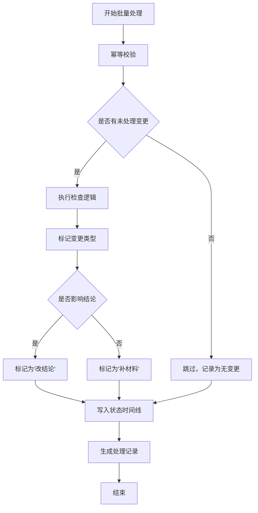

## 1. 产品概述

停车楼坡道检查系统用于解决布展、工程和客户方讲解员在坡道检查过程中遇到的坐标翻转确认难、变更类型混淆、批量处理不稳定等核心问题。系统聚焦状态回看、异常解释、导出一致性三大核心能力，帮助团队清晰区分"补材料"与"改结论"的变更类型，确保批量处理的可追溯性和稳定性。

- 核心解决：坐标轴翻转结果确认、变更类型可追溯、批量处理幂等性、导出数据一致性
- 目标用户：布展人员、工程人员、客户方讲解员、展厅项目经理

## 2. 核心 Features

### 2.1 用户角色

| 角色 | 注册方式 | 核心权限 |
|------|---------|----------|
| 布展人员 | 系统录入 | 导入讲解路线、查看检查状态、补充备注信息 |
| 工程人员 | 系统录入 | 处理CAD点位、坐标轴翻转确认、执行批量检查 |
| 讲解员 | 系统录入 | 查看巡检单、确认检查结果、反馈异常 |
| 项目经理 | 系统录入 | 全量权限、导出复核、批量管理、配置样例路线 |

### 2.2 功能模块

1. **检查工作台**：坡道检查列表、状态筛选、批量操作入口
2. **详情查看页**：状态回看时间线、变更类型标记、异常解释面板、坐标轴翻转对比
3. **批量处理**：批量导入、批量检查、幂等执行记录、处理结果汇总
4. **导出管理**：巡检单模板配置、导出前复核、一致性校验、导出历史
5. **配置管理**：讲解路线样例配置、坐标轴翻转规则、变更类型定义

### 2.3 页面详情

| 页面名称 | 模块名称 | 功能描述 |
|---------|---------|----------|
| 检查工作台 | 检查列表 | 按状态/时间/变更类型筛选，支持批量选择 |
| 检查工作台 | 状态概览 | 待确认、已通过、有异常、补材料的数量统计 |
| 检查工作台 | 批量操作 | 批量检查、批量标记、批量导出，显示幂等校验状态 |
| 详情查看页 | 状态时间线 | 按时间顺序展示所有操作记录，标记变更类型 |
| 详情查看页 | 变更类型标记 | 明确区分"讲解路线早到"、"设备备注晚补"、"CAD点位改动"三类变更，标注是否影响结论 |
| 详情查看页 | 异常解释面板 | 展示坐标轴翻转前后数据对比，自动计算偏差值并给出解释 |
| 详情查看页 | 翻转对比视图 | 左右分栏显示翻转前后的坐标数据和点位图 |
| 批量处理页 | 任务列表 | 显示批量处理任务，记录执行次数、变更数量、幂等校验结果 |
| 批量处理页 | 执行记录 | 每次运行的详细日志，避免越跑越多、越改越乱 |
| 导出管理页 | 导出复核 | 导出前展示数据一致性校验结果，高亮异常数据 |
| 导出管理页 | 导出历史 | 记录每次导出的内容、时间、操作人，支持对比 |
| 配置管理页 | 路线样例 | 项目经理配置标准讲解路线样例的位置和说明 |
| 配置管理页 | 翻转规则 | 配置坐标轴翻转的判定规则和查看入口 |

## 3. 核心流程

### 主流程
项目经理配置讲解路线样例 → 布展人员导入路线并标记早到 → 工程人员处理CAD点位并执行检查 → 系统自动标记变更类型 → 坐标轴翻转自动计算并展示偏差 → 相关人员查看状态时间线和异常解释 → 导出前执行一致性复核 → 导出巡检单

### 批量处理流程
选择多条检查记录 → 系统执行幂等校验（跳过已处理且未变更的记录） → 批量执行检查 → 记录每次运行的变更内容 → 生成处理汇总报告 → 标记"补材料"与"改结论"的变更

## 4. 用户界面设计

### 4.1 设计风格
- 主色：工业蓝 #1E40AF，代表工程专业性和可靠性
- 辅助色：橙 #F59E0B（待确认）、绿 #10B981（已通过）、红 #EF4444（异常）、灰 #6B7280（补材料）
- 按钮风格：直角矩形，2px边框，hover状态有轻微下沉效果
- 字体：系统等宽字体用于数据展示，确保数字对齐；思源黑体用于正文
- 布局风格：左侧导航 + 右侧内容区，数据表格为主，卡片为辅
- 图标：使用lucide-react的线性图标，保持简洁专业

### 4.2 页面设计概述

| 页面名称 | 模块名称 | UI元素 |
|---------|---------|--------|
| 检查工作台 | 状态概览 | 4个统计卡片，不同颜色区分状态，点击可筛选 |
| 检查工作台 | 检查列表 | 数据表格，每行显示状态标签、变更类型标签，支持批量选择 |
| 详情查看页 | 状态时间线 | 垂直时间线，每个节点显示操作人、时间、变更类型、内容摘要 |
| 详情查看页 | 翻转对比 | 左右两栏等宽布局，顶部有翻转开关，数据差异处高亮显示 |
| 批量处理页 | 执行记录 | 折叠面板，每次运行的变更详情可展开查看，避免页面混乱 |
| 导出管理页 | 复核清单 | 复选框列表，逐条显示校验项，全部通过才可导出 |

### 4.3 响应性
- 桌面端优先（1280px+），采用固定侧边栏 + 流体内容区
- 平板端（768px-1279px）：侧边栏可折叠，表格支持横向滚动
- 移动端（<768px）：仅保留核心查看功能，表格转为卡片式展示

### 4.4 数据可视化
- 状态时间线使用垂直线连接节点，不同变更类型使用不同颜色的圆点标记
- 坐标轴翻转对比使用简单的SVG点位图，不使用复杂的3D渲染
- 批量处理统计使用条形图展示每次运行的变更数量对比
