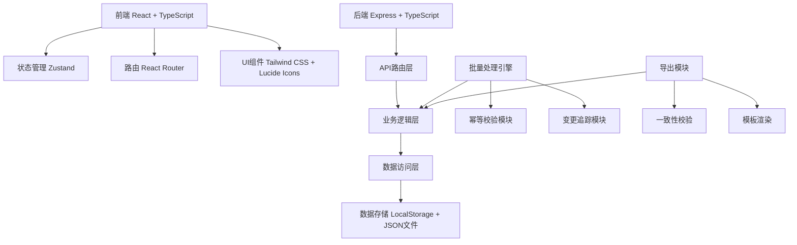
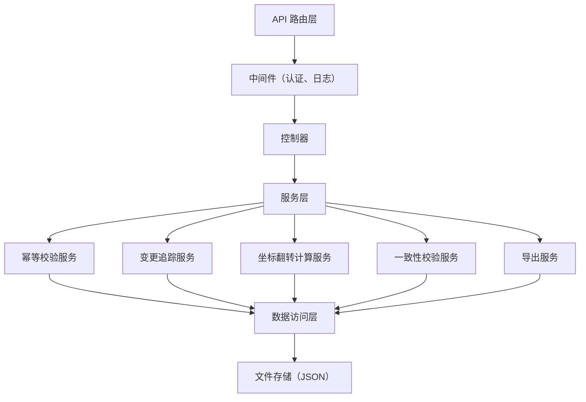
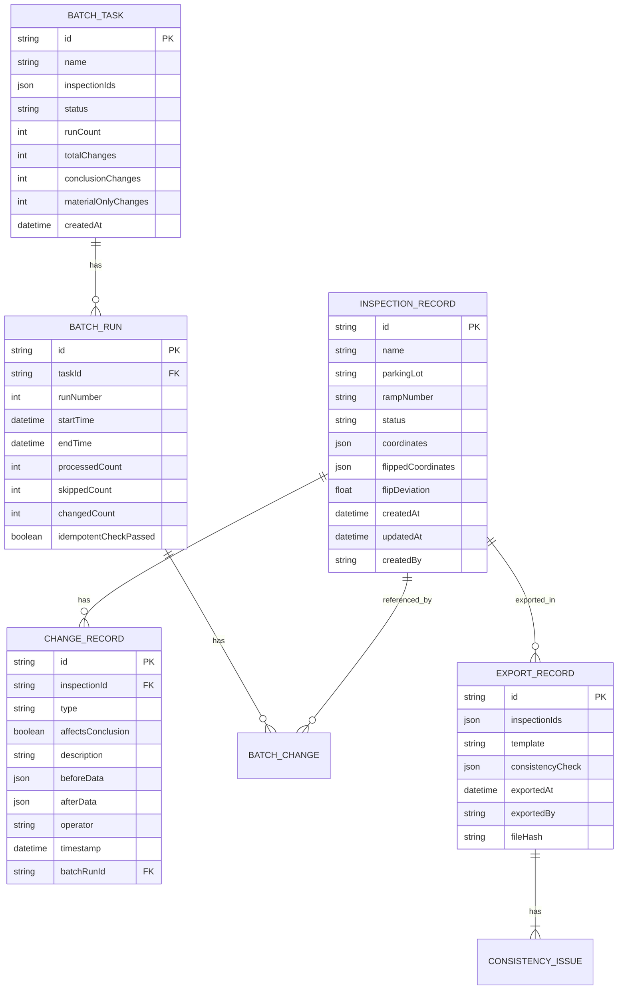

## 1. 架构设计



## 2. 技术描述

- 前端：React@18 + TypeScript + tailwindcss@3 + vite + react-router-dom@6 + zustand + lucide-react
- 后端：Express@4 + TypeScript
- 数据存储：前端LocalStorage（用于演示）+ JSON文件持久化
- 初始化工具：vite-init
- 技术选型说明：
  - 使用React + TypeScript确保类型安全和组件复用
  - Zustand轻量状态管理，避免Redux的过度复杂性
  - Tailwind CSS快速构建专业的工业风格界面
  - Express后端提供批量处理、导出、一致性校验等核心服务
  - 幂等校验模块确保批量处理重复运行时不会越跑越多、越改越乱

## 3. 路由定义

| 路由 | 页面 | 用途 |
|------|------|------|
| / | 检查工作台 | 检查列表、状态概览、批量操作入口 |
| /inspection/:id | 详情查看页 | 状态时间线、变更标记、翻转对比、异常解释 |
| /batch | 批量处理页 | 批量任务列表、执行记录、幂等校验状态 |
| /export | 导出管理页 | 导出复核、一致性校验、导出历史 |
| /settings | 配置管理页 | 路线样例配置、翻转规则、变更类型定义 |

## 4. API 定义

```typescript
// 检查记录
interface InspectionRecord {
  id: string;
  name: string;
  parkingLot: string;
  rampNumber: string;
  status: 'pending' | 'approved' | 'exception' | 'material_only';
  coordinates: CoordinateData;
  flippedCoordinates?: CoordinateData;
  flipDeviation?: number;
  changeHistory: ChangeRecord[];
  createdAt: string;
  updatedAt: string;
  createdBy: string;
}

// 坐标数据
interface CoordinateData {
  points: Point[];
  centerX: number;
  centerY: number;
  rotation: number;
}

// 点位
interface Point {
  id: string;
  x: number;
  y: number;
  label: string;
  type: 'cad' | 'route' | 'device';
}

// 变更记录
interface ChangeRecord {
  id: string;
  inspectionId: string;
  type: 'route_early' | 'note_late' | 'cad_manual' | 'flip' | 'export';
  affectsConclusion: boolean;
  description: string;
  beforeData?: any;
  afterData?: any;
  operator: string;
  timestamp: string;
  batchRunId?: string;
}

// 批量处理任务
interface BatchTask {
  id: string;
  name: string;
  inspectionIds: string[];
  status: 'pending' | 'running' | 'completed' | 'failed';
  runCount: number;
  totalChanges: number;
  conclusionChanges: number;
  materialOnlyChanges: number;
  createdAt: string;
  runs: BatchRun[];
}

// 批量运行记录
interface BatchRun {
  id: string;
  taskId: string;
  runNumber: number;
  startTime: string;
  endTime: string;
  processedCount: number;
  skippedCount: number;
  changedCount: number;
  idempotentCheckPassed: boolean;
  changes: BatchChange[];
}

// 批量变更
interface BatchChange {
  inspectionId: string;
  changeType: string;
  affectsConclusion: boolean;
  description: string;
}

// 导出记录
interface ExportRecord {
  id: string;
  inspectionIds: string[];
  template: string;
  consistencyCheck: ConsistencyCheckResult;
  exportedAt: string;
  exportedBy: string;
  fileHash: string;
}

// 一致性校验结果
interface ConsistencyCheckResult {
  passed: boolean;
  totalItems: number;
  issues: ConsistencyIssue[];
}

// 一致性问题
interface ConsistencyIssue {
  inspectionId: string;
  field: string;
  message: string;
  severity: 'warning' | 'error';
}

// API 请求/响应
interface ApiResponse<T> {
  success: boolean;
  data?: T;
  error?: string;
  message?: string;
}

interface BatchProcessRequest {
  inspectionIds: string[];
  taskName: string;
}

interface ExportRequest {
  inspectionIds: string[];
  template: 'standard' | 'detailed';
  performConsistencyCheck: boolean;
}
```

## 5. 服务端架构



### 核心模块说明

1. **幂等校验服务**：
   - 为每条检查记录计算内容哈希
   - 批量运行前比对哈希，跳过未变更记录
   - 记录每次运行的处理结果，避免重复统计

2. **变更追踪服务**：
   - 自动识别变更类型（路线早到、备注晚补、CAD改动）
   - 判定变更是否影响结论
   - 生成完整的状态时间线

3. **坐标翻转计算服务**：
   - 支持X轴、Y轴、原点翻转
   - 计算翻转前后的偏差值
   - 生成翻转对比数据

4. **一致性校验服务**：
   - 导出前检查数据完整性
   - 校验坐标数据与状态的一致性
   - 检查变更记录与结论的匹配性

## 6. 数据模型

### 6.1 数据模型定义



### 6.2 初始数据（Mock）

```typescript
// 初始检查记录
const mockInspections: InspectionRecord[] = [
  {
    id: '1',
    name: 'B1层东坡道检查',
    parkingLot: '展览中心停车楼',
    rampNumber: 'B1-E-01',
    status: 'pending',
    coordinates: {
      points: [
        { id: 'p1', x: 100, y: 200, label: '起点', type: 'route' },
        { id: 'p2', x: 300, y: 200, label: '转角1', type: 'cad' },
        { id: 'p3', x: 300, y: 400, label: '设备A', type: 'device' },
        { id: 'p4', x: 500, y: 400, label: '终点', type: 'route' },
      ],
      centerX: 300,
      centerY: 300,
      rotation: 0,
    },
    changeHistory: [
      {
        id: 'c1',
        inspectionId: '1',
        type: 'route_early',
        affectsConclusion: false,
        description: '讲解路线提前导入',
        operator: '张布展',
        timestamp: '2026-05-20T10:00:00Z',
      },
    ],
    createdAt: '2026-05-20T09:00:00Z',
    updatedAt: '2026-05-20T10:00:00Z',
    createdBy: '张布展',
  },
  {
    id: '2',
    name: 'B1层西坡道检查',
    parkingLot: '展览中心停车楼',
    rampNumber: 'B1-W-01',
    status: 'exception',
    coordinates: {
      points: [
        { id: 'p1', x: 100, y: 200, label: '起点', type: 'route' },
        { id: 'p2', x: 200, y: 300, label: '转角1', type: 'cad' },
        { id: 'p3', x: 400, y: 300, label: '设备B', type: 'device' },
        { id: 'p4', x: 500, y: 400, label: '终点', type: 'route' },
      ],
      centerX: 300,
      centerY: 300,
      rotation: 180,
    },
    flipDeviation: 0.05,
    changeHistory: [
      {
        id: 'c1',
        inspectionId: '2',
        type: 'cad_manual',
        affectsConclusion: true,
        description: 'CAD点位手工调整，X偏移+50',
        beforeData: { x: 150, y: 300 },
        afterData: { x: 200, y: 300 },
        operator: '李工程',
        timestamp: '2026-05-21T14:30:00Z',
      },
      {
        id: 'c2',
        inspectionId: '2',
        type: 'flip',
        affectsConclusion: true,
        description: '坐标轴翻转，偏差5%需确认',
        operator: '李工程',
        timestamp: '2026-05-21T15:00:00Z',
      },
    ],
    createdAt: '2026-05-20T09:00:00Z',
    updatedAt: '2026-05-21T15:00:00Z',
    createdBy: '李工程',
  },
  {
    id: '3',
    name: 'B2层北坡道检查',
    parkingLot: '展览中心停车楼',
    rampNumber: 'B2-N-01',
    status: 'material_only',
    coordinates: {
      points: [
        { id: 'p1', x: 100, y: 200, label: '起点', type: 'route' },
        { id: 'p2', x: 300, y: 200, label: '转角1', type: 'cad' },
        { id: 'p3', x: 500, y: 200, label: '终点', type: 'route' },
      ],
      centerX: 300,
      centerY: 200,
      rotation: 0,
    },
    changeHistory: [
      {
        id: 'c1',
        inspectionId: '3',
        type: 'note_late',
        affectsConclusion: false,
        description: '补充设备备注：消防栓位置确认',
        operator: '王讲解',
        timestamp: '2026-05-22T11:00:00Z',
      },
    ],
    createdAt: '2026-05-20T09:00:00Z',
    updatedAt: '2026-05-22T11:00:00Z',
    createdBy: '张布展',
  },
  {
    id: '4',
    name: 'B2层南坡道检查',
    parkingLot: '展览中心停车楼',
    rampNumber: 'B2-S-01',
    status: 'approved',
    coordinates: {
      points: [
        { id: 'p1', x: 100, y: 400, label: '起点', type: 'route' },
        { id: 'p2', x: 300, y: 400, label: '转角1', type: 'cad' },
        { id: 'p3', x: 300, y: 200, label: '设备C', type: 'device' },
        { id: 'p4', x: 500, y: 200, label: '终点', type: 'route' },
      ],
      centerX: 300,
      centerY: 300,
      rotation: 0,
    },
    changeHistory: [
      {
        id: 'c1',
        inspectionId: '4',
        type: 'route_early',
        affectsConclusion: false,
        description: '讲解路线提前导入',
        operator: '张布展',
        timestamp: '2026-05-20T10:30:00Z',
      },
      {
        id: 'c2',
        inspectionId: '4',
        type: 'note_late',
        affectsConclusion: false,
        description: '补充设备备注：应急照明正常',
        operator: '王讲解',
        timestamp: '2026-05-22T09:00:00Z',
      },
    ],
    createdAt: '2026-05-20T09:00:00Z',
    updatedAt: '2026-05-22T09:00:00Z',
    createdBy: '张布展',
  },
];
```

## 7. 核心算法说明

### 7.1 幂等校验算法
```typescript
function calculateContentHash(inspection: InspectionRecord): string {
  const content = JSON.stringify({
    coordinates: inspection.coordinates,
    name: inspection.name,
    status: inspection.status,
  });
  return crypto.createHash('sha256').update(content).digest('hex');
}

function idempotentCheck(inspection: InspectionRecord, lastRunHash?: string): {
  shouldProcess: boolean;
  currentHash: string;
} {
  const currentHash = calculateContentHash(inspection);
  return {
    shouldProcess: lastRunHash !== currentHash,
    currentHash,
  };
}
```

### 7.2 坐标轴翻转计算
```typescript
function flipCoordinates(
  coordinates: CoordinateData,
  flipType: 'x' | 'y' | 'origin'
): { flipped: CoordinateData; deviation: number } {
  const flipped = JSON.parse(JSON.stringify(coordinates)) as CoordinateData;
  
  flipped.points = flipped.points.map(p => {
    const np = { ...p };
    switch (flipType) {
      case 'x': np.y = -np.y + 2 * coordinates.centerY; break;
      case 'y': np.x = -np.x + 2 * coordinates.centerX; break;
      case 'origin':
        np.x = -np.x + 2 * coordinates.centerX;
        np.y = -np.y + 2 * coordinates.centerY;
        break;
    }
    return np;
  });
  
  const deviation = calculateDeviation(coordinates, flipped);
  
  return { flipped, deviation };
}

function calculateDeviation(orig: CoordinateData, flipped: CoordinateData): number {
  let totalDist = 0;
  orig.points.forEach((p, i) => {
    const fp = flipped.points[i];
    totalDist += Math.sqrt(Math.pow(p.x - fp.x, 2) + Math.pow(p.y - fp.y, 2));
  });
  return totalDist / orig.points.length;
}
```

### 7.3 变更类型判定
```typescript
function determineChangeType(
  before: Partial<InspectionRecord>,
  after: Partial<InspectionRecord>
): { type: ChangeType; affectsConclusion: boolean } {
  if (before.coordinates !== after.coordinates) {
    return { type: 'cad_manual', affectsConclusion: true };
  }
  if (before.changeHistory?.length !== after.changeHistory?.length) {
    const lastChange = after.changeHistory![after.changeHistory!.length - 1];
    if (lastChange.description.includes('备注') || lastChange.description.includes('说明')) {
      return { type: 'note_late', affectsConclusion: false };
    }
    if (lastChange.description.includes('路线') || lastChange.description.includes('讲解')) {
      return { type: 'route_early', affectsConclusion: false };
    }
  }
  return { type: 'note_late', affectsConclusion: false };
}
```
