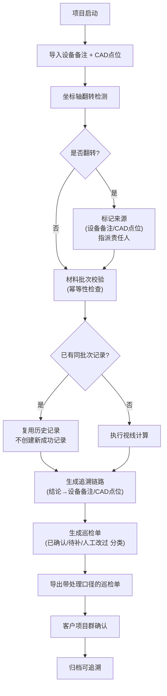

## 1. 产品概述

"剧院座席视线"系统是为展厅项目经理设计的专业工具，解决剧院座席视线分析过程中依赖人工记忆、数据不可追溯、重复工作等痛点。系统实现设备备注修改追踪、幂等性处理、可追溯性分析、坐标轴翻转检测、巡检单生成等核心功能，让视线分析过程可反复跑、可追溯、可审计。

- 核心价值：消除人工记忆依赖，实现数据全链路可追溯，提升项目交接效率
- 目标用户：展厅项目经理、CAD设计师、设备工程师、客户项目群

## 2. 核心 Features

### 2.1 用户角色

| 角色 | 登录方式 | 核心权限 |
|------|----------|----------|
| 项目经理 | 工号登录 | 全功能访问、发起视线分析、导出巡检单 |
| CAD设计师 | 工号登录 | 上传CAD点位、维护坐标信息 |
| 设备工程师 | 工号登录 | 维护设备备注、处理坐标轴翻转问题 |
| 客户用户 | 授权链接 | 查看巡检单、确认处理结果 |

### 2.2 Feature Module

1. **总览仪表盘**：项目列表、分析状态概览、待处理事项
2. **设备备注管理**：设备列表、修改历史追踪、变更对比
3. **CAD点位管理**：点位上传、坐标校验、翻转检测
4. **视线分析引擎**：幂等性校验、视线计算、追溯链路生成
5. **巡检单中心**：分类视图（已确认/待补/人工改过）、处理口径、导出
6. **坐标轴翻转处理**：来源标记、责任人指派、补全流程

### 2.3 页面详情

| 页面名称 | 模块名称 | 功能描述 |
|----------|----------|----------|
| 项目总览 | 项目列表卡片 | 展示所有剧院项目，显示分析状态、最后修改人、修改时间 |
| 项目总览 | 待办提醒区 | 高亮显示待补记录、翻转待处理、人工改过待确认 |
| 设备备注 | 设备列表 | 按区域/类型筛选设备，展示最新备注和历史变更入口 |
| 设备备注 | 修改历史面板 | 时间线展示每次修改的操作人、时间、前后内容对比 |
| CAD点位 | 点位列表 | 展示坐标数据、翻转状态、来源标记 |
| CAD点位 | 翻转检测面板 | 自动检测坐标轴翻转，标记来源（设备备注/CAD点位），指派人 |
| 视线分析 | 分析结果总表 | 展示视线分析结论，每条记录带追溯链接 |
| 视线分析 | 追溯链路视图 | 从结论点击回溯到设备备注或CAD点位原始数据 |
| 巡检单 | 分类视图 | 三栏布局：已确认/待补/人工改过，每条带处理口径说明 |
| 巡检单 | 导出功能 | 生成带处理口径的PDF/Excel，供客户项目群查看 |

## 3. 核心流程

## 4. 用户界面设计

### 4.1 设计风格

- 主色调：深蓝系 (#1e3a5f) 代表专业和可信赖
- 辅助色：绿色 (#22c55e) 已确认，橙色 (#f59e0b) 待补，红色 (#ef4444) 人工改过，紫色 (#8b5cf6) 坐标轴翻转
- 按钮风格：直角微圆角 (4px)，悬浮有微妙阴影，强调专业感
- 字体：标题使用 "Noto Serif SC" 宋体体现建筑行业的稳重，正文使用 "Inter" 保障可读性
- 布局风格：卡片式分区，清晰的视觉层级，时间线式历史记录
- 图标风格：线性图标，统一 24px 栅格，状态色区分清晰

### 4.2 页面设计概述

| 页面名称 | 模块名称 | UI 元素 |
|----------|----------|----------|
| 项目总览 | 项目卡片 | 渐变边框、状态标签角标、修改人头像、时间戳、骨架屏加载 |
| 设备备注 | 时间线 | 左右交替布局、变更diff高亮、操作人信息卡片 |
| CAD点位 | 坐标表格 | 翻转行红色背景、来源标签、快速操作按钮 |
| 视线分析 | 追溯链路 | 可点击面包屑、原始数据弹窗、引用关系连线 |
| 巡检单 | 三栏布局 | 拖拽高度调节、颜色编码分类、处理口径折叠面板 |

### 4.3 响应式

- Desktop-first 设计，针对 1920px 优化
- 1280px 以上：完整三栏布局
- 1024px-1280px：巡检单改为两栏，待补单列
- 768px-1024px：巡检单改为标签页切换
- 768px 以下：列表式布局，隐藏次要信息

### 4.4 交互细节

- 追溯点击：结论单元格点击后滑出侧边栏，展示完整链路动画
- 翻转检测：检测到翻转时表格行微震动 + 边框高亮动画
- 历史对比：鼠标悬停在历史记录上时，原位置显示半透明覆盖层对比
- 加载状态：骨架屏 + 进度条，按模块渐进式加载
