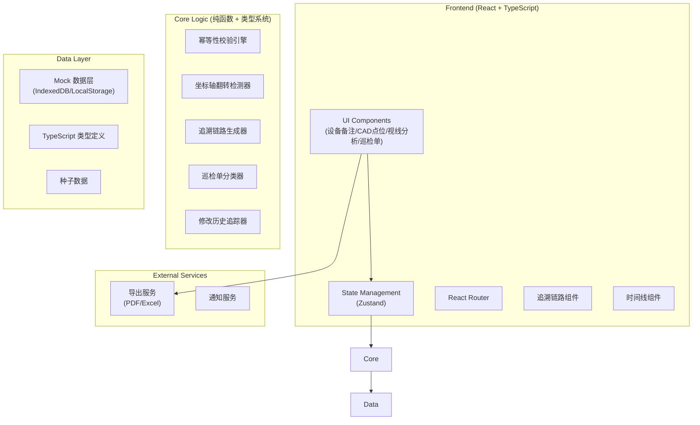
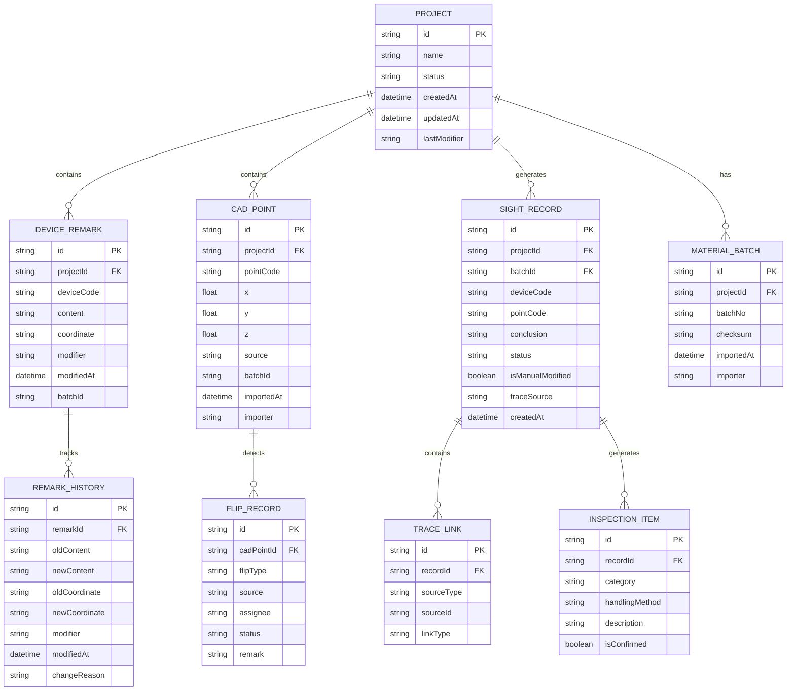

## 1. 架构设计



## 2. 技术描述

- **前端框架**: React@18 + TypeScript@5 + Vite@5
- **样式方案**: TailwindCSS@3 + CSS Variables (主题系统)
- **状态管理**: Zustand (轻量级，支持时间旅行调试)
- **路由**: React Router@6
- **图标**: Lucide React (线性风格，符合设计规范)
- **导出**: html2canvas + jspdf (PDF), SheetJS (Excel)
- **数据持久化**: IndexedDB (Dexie.js) + LocalStorage
- **开发工具**: ESLint + Prettier + Husky + TypeScript Strict Mode
- **后端**: 无后端，纯前端应用，数据存储在浏览器端

## 3. 路由定义

| Route | 页面 | 说明 |
|-------|------|------|
| `/` | 项目总览 | 项目列表、待办提醒、快捷操作 |
| `/projects/:id` | 项目详情 | 项目信息、功能入口导航 |
| `/projects/:id/device-remarks` | 设备备注 | 设备列表、修改历史追踪 |
| `/projects/:id/cad-points` | CAD点位 | 点位管理、翻转检测 |
| `/projects/:id/sight-analysis` | 视线分析 | 分析引擎、追溯链路 |
| `/projects/:id/inspection` | 巡检单 | 三栏分类视图、导出 |
| `/inspection/:shareId` | 客户巡检单 | 授权访问的只读视图 |

## 4. 数据模型

### 4.1 ER 图



### 4.2 核心类型定义

```typescript
// 坐标轴翻转类型
type FlipType = 'x-flip' | 'y-flip' | 'z-flip' | 'xy-flip' | 'xz-flip' | 'yz-flip' | 'xyz-flip';

// 翻转来源
type FlipSource = 'device-remark' | 'cad-point' | 'both';

// 视线记录状态
type SightStatus = 'confirmed' | 'pending' | 'manual-modified' | 'flip-detected';

// 巡检单分类
type InspectionCategory = 'confirmed' | 'pending-supplement' | 'manual-modified';

// 追溯源类型
type TraceSourceType = 'device-remark' | 'cad-point' | 'manual-input';

interface Coordinate {
  x: number;
  y: number;
  z: number;
}

interface ChangeDiff<T> {
  oldValue: T;
  newValue: T;
  changed: boolean;
}

interface AuditInfo {
  modifier: string;
  modifiedAt: Date;
  changeReason?: string;
}
```

## 5. 核心模块说明

### 5.1 修改历史追踪模块

- **职责**: 记录设备备注的每次修改，包括修改人、时间、前后内容对比
- **核心算法**: 深度对比对象差异，生成结构化 diff
- **幂等键**: `remarkId + timestamp + modifier`

### 5.2 幂等性校验引擎

- **职责**: 防止同一批材料重复创建视线记录
- **核心算法**: 基于材料内容计算 SHA-256 checksum，校验 batchId + checksum
- **处理逻辑**: 存在相同批次时，复用历史记录的 `id` 和 `createdAt`，只更新 `updatedAt`

### 5.3 坐标轴翻转检测器

- **职责**: 检测坐标轴翻转情况，标记来源
- **检测逻辑**:
  1. 比对设备备注坐标与CAD点位坐标
  2. 检查单一轴符号翻转 (如 x 全部取反)
  3. 标记翻转类型和来源 (设备备注/CAD点位)
  4. 指派对应责任人处理

### 5.4 追溯链路生成器

- **职责**: 建立从视线结论到原始数据的可追溯链路
- **链路结构**: `SightRecord → TraceLink → DeviceRemark/CADPoint → History`
- **UI 表现**: 可点击的面包屑导航，每一步可查看原始数据

### 5.5 巡检单分类器

- **职责**: 按状态分类视线记录，生成带处理口径的巡检单
- **分类规则**:
  - `confirmed`: 状态为 confirmed 且非人工修改
  - `pending-supplement`: 状态为 pending 或 flip-detected
  - `manual-modified`: isManualModified 为 true
- **处理口径**: 每条记录附带标准处理说明和下一步操作指南

## 6. 性能优化

- **虚拟滚动**: 设备列表、CAD点位列表使用 react-window 处理大数据量
- **按需加载**: 追溯链路数据懒加载，点击时才查询历史
- **Web Worker**: 坐标轴翻转检测、checksum 计算在 Worker 中执行
- **缓存策略**: 分析结果缓存 24 小时，相同批次直接复用
- **增量更新**: 修改历史只追加不修改，保证数据不可篡改
