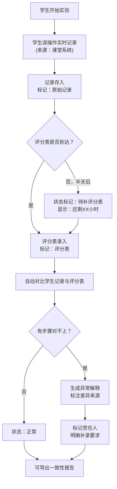
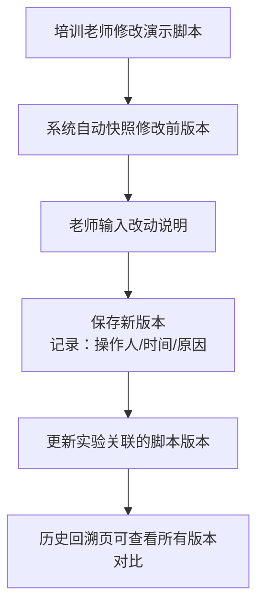

## 1. 产品概述

桥梁受力拼装实验教学过程管理系统，解决实验记录时序错位（学生误操作记录先到、评分表晚到）、数据来源追溯不清、异常操作解释困难等实际工作流问题。核心目标是让教研负责人能清晰区分"补材料"与"改结论"，每一步异常都有来源可查、有责任人可找。

## 2. 核心功能

### 2.1 用户角色

| 角色 | 登记方式 | 核心权限 |
|------|----------|----------|
| 授课教师 | 工号登录 | 录入学生操作记录、评分表、修改演示脚本 |
| 教研负责人 | 工号登录 | 查看完整时序、异常解释、导出一致性报告、版本对比 |
| 系统管理员 | 工号登录 | 数据备份、权限管理 |

### 2.2 功能模块

1. **实验列表页**：按班级/时间筛选，突出显示时序异常、缺失项、待补项
2. **实验详情页**：完整时间轴视图，区分不同来源数据（学生记录/评分表/脚本改动）
3. **时序对比页**：并排展示多源数据到达时间，标注时间差和补录标记
4. **异常解释页**：步骤跳过说明、来源追溯、下一步补录责任人
5. **历史回溯页**：演示脚本改动前后对比，完整变更历史
6. **导出中心**：一致性导出（PDF/Excel），附数据来源说明

### 2.3 页面详情

| 页面名称 | 模块名称 | 功能描述 |
|---------|---------|----------|
| 实验列表 | 筛选区 | 按班级、日期、状态（正常/待补/异常）筛选 |
| 实验列表 | 数据卡片 | 显示实验基本信息、数据到达状态、异常数量、待补项 |
| 实验列表 | 快捷操作 | 直接跳转异常解释、导出、时序对比 |
| 实验详情 | 时间轴 | 按实际发生时间排列，不同颜色标记数据来源 |
| 实验详情 | 步骤状态 | 每步骤标注：完成/跳过/待补，悬停显示来源和说明 |
| 实验详情 | 补录标记 | 明确标识"补材料"项与原始记录的区别 |
| 时序对比 | 双栏对比 | 左栏学生误操作记录，右栏评分表，中间显示时间差 |
| 时序对比 | 差异高亮 | 对不上的步骤用红色标记，说明差异原因 |
| 异常解释 | 跳过详情 | 步骤被跳过的原因、来源（学生记录/评分表）、责任人 |
| 异常解释 | 补录指引 | 明确下一步找谁补、需要补什么 |
| 历史回溯 | 版本列表 | 演示脚本所有修改版本，按时间排列 |
| 历史回溯 | 差异对比 | 选中两版本并排对比，高亮改动部分 |
| 历史回溯 | 改动说明 | 每次改动的原因、操作人、时间 |
| 导出中心 | 导出选项 | 选择导出格式、是否包含异常说明、是否包含版本历史 |
| 导出中心 | 一致性校验 | 导出前自动校验数据一致性，标出不一致项 |
| 导出中心 | 来源标注 | 导出文件每页附数据来源说明，区分原始记录与补录 |

## 3. 核心流程

### 3.1 实验记录完整流程

### 3.2 演示脚本修改流程

## 4. 用户界面设计

### 4.1 设计风格

**设计方向：工业/工程类管理系统， brutally minimal（极简实用）**

- **主色调**：深蓝 `#1e3a5f`（专业、稳重），辅助色：橙色 `#e67e22`（警告/待补），红色 `#c0392b`（异常），绿色 `#27ae60`（正常）
- **按钮风格**：方角、细边框、极简，hover时轻微背景色变化
- **字体**：标题用 `JetBrains Mono`（等宽字体，工程感），正文用 `PingFang SC`（清晰易读）
- **布局风格**：信息密度高，表格为主，少用卡片装饰，数据优先
- **图标**：用简洁的线条图标（SVG），不使用emoji，保持专业感

### 4.2 页面设计概述

| 页面名称 | 模块名称 | UI元素 |
|---------|---------|--------|
| 实验列表 | 顶部导航 | 极简文字导航，当前页下划线标记 |
| 实验列表 | 筛选栏 | 紧凑排列的下拉筛选器，不占过多空间 |
| 实验列表 | 数据表格 | 斑马纹表格，状态列用彩色圆点标记 |
| 实验详情 | 时间轴 | 左侧垂直线，不同颜色圆点标记不同来源，右侧是事件内容 |
| 实验详情 | 补录标记 | 灰色斜体文字 + `[补录]` 标签，与原始记录明显区分 |
| 时序对比 | 双栏布局 | 左右等高滚动，中间时间差用连接线显示 |
| 异常解释 | 异常卡片 | 红色边框，顶部显示"跳过原因"，底部显示"下一步" |
| 历史回溯 | 版本选择器 | 左侧垂直时间线，点击版本在右侧显示内容 |
| 历史回溯 | 差异对比 | 删除线标记删除内容，绿色背景标记新增内容 |
| 导出中心 | 校验进度条 | 导出前显示一致性校验进度，异常项列出 |

### 4.3 响应式

- Desktop-first，主内容区最小宽度1200px
- 表格在移动端可横向滚动
- 时间轴在窄屏转为上下布局
- 触屏操作：点击区域不小于44x44px

### 4.4 数据展示特殊要求

1. **时间显示**：所有时间精确到分钟，同时显示"记录时间"和"实际发生时间"
2. **来源标记**：每条数据前必须有来源标签：
   - `[学生记录]` - 蓝色
   - `[评分表]` - 绿色
   - `[补录]` - 灰色斜体
   - `[脚本修改]` - 紫色
3. **结论改动标记**：如果评分表结论与学生记录结论不一致，必须用红色边框突出显示，并附改动说明
4. **步骤跳过显示**：被跳过的步骤不直接隐藏，而是用灰色删除线显示，悬停显示跳过原因和来源
