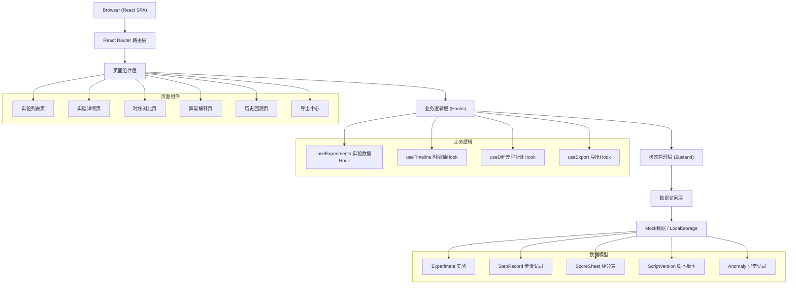
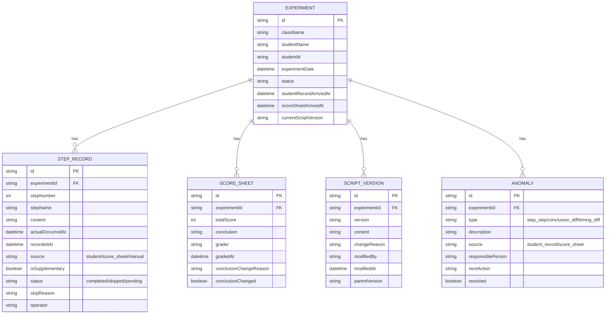

## 1. 架构设计



## 2. 技术描述

- **前端**：React@18 + TypeScript + tailwindcss@3 + vite
- **初始化工具**：npm create vite@latest
- **后端**：无后端，使用 Mock 数据 + LocalStorage 持久化
- **状态管理**：Zustand（轻量级，适合中小项目）
- **路由**：React Router v6
- **UI组件**：纯 Tailwind CSS 实现，不引入第三方UI库
- **导出功能**：xlsx（Excel导出）+ html2canvas + jspdf（PDF导出）
- **差异对比**：diff-match-patch（文本差异对比）

## 3. 路由定义

| 路由 | 用途 |
|------|------|
| / | 重定向到 /experiments |
| /experiments | 实验列表页 |
| /experiments/:id | 实验详情页（含时间轴） |
| /experiments/:id/timeline | 时序对比页 |
| /experiments/:id/anomalies | 异常解释页 |
| /experiments/:id/history | 历史回溯页 |
| /export | 导出中心 |

## 4. 数据模型

### 4.1 数据模型定义（ER图）



### 4.2 TypeScript 类型定义

```typescript
// 数据来源类型
type DataSource = 'student' | 'score_sheet' | 'manual' | 'script_mod';

// 步骤状态
type StepStatus = 'completed' | 'skipped' | 'pending';

// 实验状态
type ExperimentStatus = 'normal' | 'pending_score' | 'has_anomaly' | 'incomplete';

// 异常类型
type AnomalyType = 'step_skip' | 'conclusion_diff' | 'timing_diff' | 'missing_data';

interface Experiment {
  id: string;
  className: string;
  studentName: string;
  studentId: string;
  experimentDate: string;
  status: ExperimentStatus;
  studentRecordArrivedAt: string;
  scoreSheetArrivedAt?: string;
  currentScriptVersion: string;
  anomalyCount: number;
  pendingCount: number;
}

interface StepRecord {
  id: string;
  experimentId: string;
  stepNumber: number;
  stepName: string;
  content: string;
  actualOccurredAt: string;
  recordedAt: string;
  source: DataSource;
  isSupplementary: boolean;
  status: StepStatus;
  skipReason?: string;
  skipSource?: DataSource;
  operator?: string;
}

interface ScoreSheet {
  id: string;
  experimentId: string;
  totalScore: number;
  conclusion: string;
  originalConclusion?: string;
  grader: string;
  gradedAt: string;
  conclusionChangeReason?: string;
  conclusionChanged: boolean;
  stepScores: { stepNumber: number; score: number; comment?: string }[];
}

interface ScriptVersion {
  id: string;
  experimentId: string;
  version: string;
  content: string;
  changeReason: string;
  modifiedBy: string;
  modifiedAt: string;
  parentVersion?: string;
}

interface Anomaly {
  id: string;
  experimentId: string;
  type: AnomalyType;
  description: string;
  source: DataSource;
  responsiblePerson: string;
  nextAction: string;
  resolved: boolean;
  relatedStepNumber?: number;
  createdAt: string;
}
```

## 5. 目录结构

```
src/
├── types/              # 类型定义
│   └── index.ts
├── data/               # Mock数据
│   └── mockData.ts
├── store/              # 状态管理
│   └── useExperimentStore.ts
├── hooks/              # 自定义Hooks
│   ├── useExperiments.ts
│   ├── useTimeline.ts
│   ├── useDiff.ts
│   └── useExport.ts
├── components/         # 公共组件
│   ├── Layout.tsx
│   ├── SourceTag.tsx
│   ├── StatusBadge.tsx
│   ├── Timeline.tsx
│   ├── DiffViewer.tsx
│   └── DataTable.tsx
├── pages/              # 页面组件
│   ├── ExperimentList.tsx
│   ├── ExperimentDetail.tsx
│   ├── TimelineCompare.tsx
│   ├── AnomalyExplain.tsx
│   ├── HistoryReview.tsx
│   └── ExportCenter.tsx
├── utils/              # 工具函数
│   ├── date.ts
│   ├── diff.ts
│   └── export.ts
├── App.tsx
├── main.tsx
└── index.css
```

## 6. 关键功能实现说明

### 6.1 时序对比核心算法

```typescript
// 按实际发生时间合并多源数据，保留来源信息
function mergeTimeline(studentRecords: StepRecord[], scoreRecords: StepRecord[]): TimelineItem[] {
  const allRecords = [...studentRecords, ...scoreRecords];
  return allRecords.sort((a, b) => 
    new Date(a.actualOccurredAt).getTime() - new Date(b.actualOccurredAt).getTime()
  );
}

// 计算时间差
function calculateTimeGap(recordedAt: string, actualAt: string): string {
  const gap = new Date(recordedAt).getTime() - new Date(actualAt).getTime();
  const hours = Math.floor(gap / (1000 * 60 * 60));
  const minutes = Math.floor((gap % (1000 * 60 * 60)) / (1000 * 60));
  if (hours > 0) return `${hours}小时${minutes}分钟`;
  return `${minutes}分钟`;
}
```

### 6.2 差异检测算法

```typescript
// 检测学生记录与评分表的步骤差异
function detectStepAnomalies(studentRecords: StepRecord[], scoreRecords: StepRecord[]): Anomaly[] {
  const anomalies: Anomaly[] = [];
  const allStepNumbers = new Set([
    ...studentRecords.map(r => r.stepNumber),
    ...scoreRecords.map(r => r.stepNumber)
  ]);
  
  for (const stepNum of allStepNumbers) {
    const studentRec = studentRecords.find(r => r.stepNumber === stepNum);
    const scoreRec = scoreRecords.find(r => r.stepNumber === stepNum);
    
    if (!studentRec && scoreRec?.status === 'completed') {
      anomalies.push({ /* 学生记录缺失 */ });
    }
    if (!scoreRec && studentRec?.status === 'completed') {
      anomalies.push({ /* 评分表缺失 */ });
    }
    if (studentRec?.status !== scoreRec?.status) {
      anomalies.push({ /* 状态不一致 */ });
    }
  }
  return anomalies;
}
```

### 6.3 版本对比实现

使用 `diff-match-patch` 库实现文本差异对比，标记：
- 删除内容：红色删除线 + 浅红背景
- 新增内容：绿色文字 + 浅绿背景
- 不变内容：正常显示

### 6.4 导出功能

- **Excel导出**：使用 `xlsx` 库，每个数据来源分Sheet，第一页是汇总和一致性校验报告
- **PDF导出**：使用 `html2canvas` + `jspdf`，保留页面上的所有格式标记（来源标签、颜色标记等）
- **所有导出文件必须包含**：数据来源说明页、异常说明列表、版本信息
