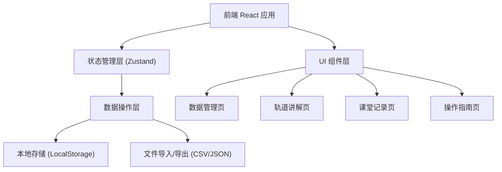
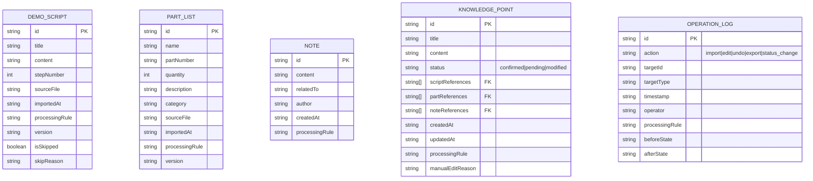

## 1. 架构设计



## 2. 技术描述

- **前端框架**：React@18 + TypeScript + Vite
- **状态管理**：Zustand（轻量级，适合本地数据管理）
- **样式方案**：TailwindCSS@3 + CSS 变量
- **图标库**：lucide-react
- **数据持久化**：LocalStorage（无需后端，纯前端应用）
- **文件处理**：原生 File API + Papa Parse（CSV 解析）
- **导出功能**：原生 Blob + 自定义 CSV 生成

## 3. 路由定义

| 路由 | 页面 | 用途 |
|------|------|------|
| `/` | 数据管理页 | 导入演示脚本、零件清单、备注 |
| `/orbit` | 轨道讲解页 | 知识点总览、追溯、状态标记 |
| `/records` | 课堂记录页 | 分类查看、筛选、导出 |
| `/guide` | 操作指南页 | 样例说明、跳过步骤、复核清单 |

## 4. 数据模型

### 4.1 核心数据结构



### 4.2 状态枚举

```typescript
// 知识点状态
type KnowledgeStatus = 'confirmed' | 'pending' | 'modified';

// 操作类型
type OperationAction = 'import' | 'edit' | 'undo' | 'export' | 'status_change' | 'skip';

// 数据类型
type DataType = 'script' | 'part' | 'note' | 'knowledge';
```

### 4.3 处理口径（ProcessingRule）

每条数据必须附带处理口径，确保所有操作可追溯：

```typescript
interface ProcessingInfo {
  rule: string;           // 口径描述，如 "2024-05-31 重复导入自动合并"
  timestamp: string;      // 处理时间
  operator: string;       // 操作人
  version: string;        // 数据版本号
}
```

## 5. 核心功能实现要点

### 5.1 重复导入口径一致

- 导入时检查 `sourceFile` + `stepNumber`/`partNumber` 组合
- 重复数据自动合并，保留两个版本，处理口径标记："重复导入自动合并，保留较新版本"
- 所有导入记录写入 `OPERATION_LOG`

### 5.2 撤回修正机制

- 每次修改前保存 `beforeState` 到 `OPERATION_LOG`
- 撤回操作从日志中恢复 `beforeState`，处理口径标记："撤回至 [时间戳] 版本"
- 撤回操作本身也记录日志，可再次撤回

### 5.3 筛选后导出口径一致

- 导出时记录当前筛选条件到处理口径
- 导出文件名包含筛选条件和时间戳，如：`课堂记录_已确认_20240531_1530.csv`
- CSV 首行插入处理口径说明

### 5.4 追溯链接机制

- `KNOWLEDGE_POINT` 中的 `scriptReferences`/`partReferences` 存储关联ID
- 点击追溯按钮时，右侧面板显示关联的原始数据全文
- 追溯面板中高亮显示关联段落

## 6. 状态管理设计（Zustand Store）

```typescript
interface AppState {
  // 数据
  scripts: DemoScript[];
  parts: Part[];
  notes: Note[];
  knowledgePoints: KnowledgePoint[];
  operationLogs: OperationLog[];
  
  // UI 状态
  activeTab: string;
  selectedKnowledgeId: string | null;
  filterStatus: KnowledgeStatus | 'all';
  showTracePanel: boolean;
  
  // 操作方法
  importData: (type: DataType, data: any[]) => void;
  updateKnowledgeStatus: (id: string, status: KnowledgeStatus, reason?: string) => void;
  undoLastOperation: () => void;
  exportRecords: (filters: any) => Blob;
  setTracePanel: (show: boolean, knowledgeId?: string) => void;
}
```

## 7. 项目目录结构

```
src/
├── components/
│   ├── layout/           # 布局组件（导航、侧边栏）
│   ├── data/             # 数据导入、列表组件
│   ├── orbit/            # 轨道讲解相关组件
│   ├── records/          # 课堂记录相关组件
│   ├── guide/            # 操作指南相关组件
│   └── common/           # 通用组件（表格、标签、按钮）
├── store/                # Zustand 状态管理
├── types/                # TypeScript 类型定义
├── utils/                # 工具函数（导入导出、处理口径生成）
├── pages/                # 页面组件
├── mock/                 # Mock 数据（演示脚本、零件清单样例）
└── App.tsx               # 路由入口
```
