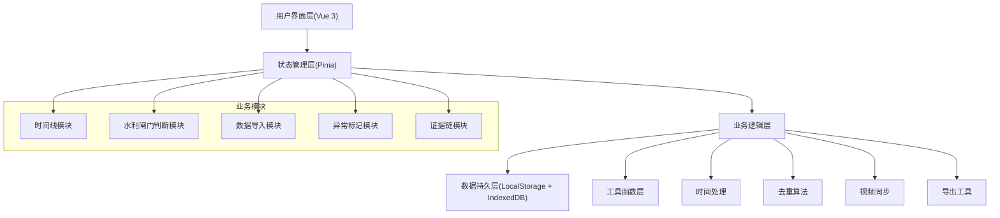
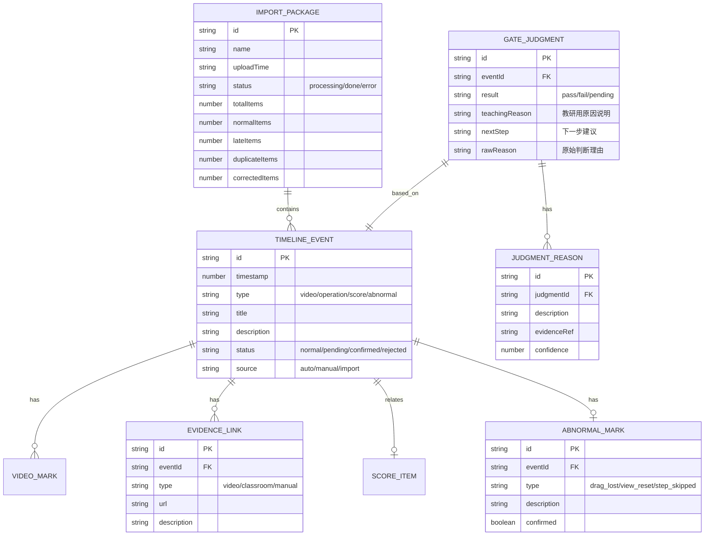

## 1. 架构设计



## 2. 技术描述

- **前端框架**：Vue 3.4 + TypeScript 5.4
- **构建工具**：Vite 5.2
- **状态管理**：Pinia 2.1
- **样式方案**：TailwindCSS 3.4
- **路由管理**：Vue Router 4.3
- **图标库**：Lucide Vue Next
- **数据存储**：LocalStorage（配置） + IndexedDB（证据数据）
- **视频处理**：原生 HTML5 Video API

## 3. 目录结构

```
src/
├── components/
│   ├── timeline/           # 时间线相关组件
│   │   ├── Timeline.vue
│   │   ├── TimelineEvent.vue
│   │   └── VideoPlayer.vue
│   ├── gate/               # 水利闸门模块
│   │   ├── GateJudgment.vue
│   │   ├── TeachingResearchView.vue
│   │   └── ReasonCard.vue
│   ├── import/             # 数据导入模块
│   │   ├── DataImport.vue
│   │   └── ImportProgress.vue
│   ├── score/              # 评分表模块
│   │   └── ScoreSheet.vue
│   └── common/             # 通用组件
│       ├── StatusBadge.vue
│       ├── ConfirmModal.vue
│       └── EvidenceLink.vue
├── stores/                 # Pinia 状态管理
│   ├── timeline.ts
│   ├── gate.ts
│   └── import.ts
├── types/                  # TypeScript 类型定义
│   ├── timeline.ts
│   ├── gate.ts
│   └── import.ts
├── utils/                  # 工具函数
│   ├── time.ts
│   ├── deduplicate.ts
│   ├── videoSync.ts
│   ├── gateJudgment.ts
│   └── export.ts
├── views/                  # 页面视图
│   ├── TimelineView.vue
│   ├── GateView.vue
│   └── ImportView.vue
├── mock/                   # Mock 测试数据
│   ├── gateData.ts
│   └── samplePackage.ts
└── router/                 # 路由配置
    └── index.ts
```

## 4. 路由定义

| 路由 | 用途 |
|------|------|
| / | 重定向到 /timeline |
| /timeline | 时间线主页面，整合视频、记录、评分表 |
| /gate | 水利闸门操作模块，自动判断 + 教研视图 |
| /import | 数据导入页面，处理真实材料包 |

## 5. 数据模型

### 5.1 ER图



### 5.2 核心类型定义

```typescript
// 时间线事件类型
type EventType = 'video' | 'operation' | 'score' | 'abnormal' | 'manual';
type EventStatus = 'normal' | 'pending' | 'confirmed' | 'rejected';
type EventSource = 'auto' | 'manual' | 'import';

interface TimelineEvent {
  id: string;
  timestamp: number;
  type: EventType;
  title: string;
  description: string;
  status: EventStatus;
  source: EventSource;
  videoMark?: VideoMark;
  evidenceLinks: EvidenceLink[];
  scoreItem?: ScoreItem;
  abnormalMark?: AbnormalMark;
  gateJudgment?: GateJudgment;
}

// 水利闸门判断
type JudgmentResult = 'pass' | 'fail' | 'pending';

interface GateJudgment {
  id: string;
  eventId: string;
  result: JudgmentResult;
  teachingReason: string;
  nextStep: string;
  rawReason: string;
  reasons: JudgmentReason[];
  createdAt: number;
}

interface JudgmentReason {
  id: string;
  description: string;
  evidenceRef: string;
  confidence: number;
}

// 异常标记
type AbnormalType = 'drag_lost' | 'view_reset' | 'step_skipped' | 'late_arrival' | 'duplicate';

interface AbnormalMark {
  id: string;
  eventId: string;
  type: AbnormalType;
  description: string;
  confirmed: boolean;
  confirmedAt?: number;
  confirmedBy?: string;
}

// 证据链接
type EvidenceType = 'video' | 'classroom' | 'manual' | 'attachment';

interface EvidenceLink {
  id: string;
  eventId: string;
  type: EvidenceType;
  url: string;
  description: string;
  timestamp: number;
}

// 导入数据包
type ImportStatus = 'processing' | 'done' | 'error';
type RecordType = 'normal' | 'late' | 'duplicate' | 'corrected';

interface ImportPackage {
  id: string;
  name: string;
  uploadTime: number;
  status: ImportStatus;
  totalItems: number;
  items: ImportItem[];
  stats: {
    normal: number;
    late: number;
    duplicate: number;
    corrected: number;
  };
}

interface ImportItem {
  id: string;
  packageId: string;
  type: RecordType;
  originalData: any;
  processedEventId?: string;
}
```

## 6. 核心算法说明

### 6.1 去重算法
- **策略**：基于时间戳（±2s）+ 操作类型 + 操作对象的三重匹配
- **优先级**：人工更正 > 正常记录 > 晚到附件 > 重复项
- **保留**：高优先级记录，低优先级标记为重复并关联主记录

### 6.2 水利闸门自动判断逻辑
1. 加载标准操作步骤序列
2. 比对学生操作的顺序、时机、幅度
3. 每项判断生成置信度（0-100）
4. 低于60分标记为失败，生成理由
5. 自动翻译为教研友好的"原因"和"下一步"

### 6.3 异常检测规则
| 异常类型 | 检测规则 |
|----------|----------|
| 拖拽丢失 | 拖拽事件开始后无结束事件，或结束坐标异常 |
| 视角重置 | 视角参数在短时间内跳回初始值 |
| 步骤跳过 | 标准步骤序列中出现缺失项，无对应操作记录 |
| 晚到附件 | 记录时间晚于对应操作时间超过阈值 |

## 7. 数据持久化方案

- **LocalStorage**：用户偏好、视图配置、当前选中状态（< 5MB）
- **IndexedDB**：时间线事件、视频证据、导入数据包（大容量）
- **导出格式**：JSON（完整数据）、CSV（评分表）、HTML（教研报告）
- **证据完整性**：每次修改生成版本快照，记录操作人时间戳
