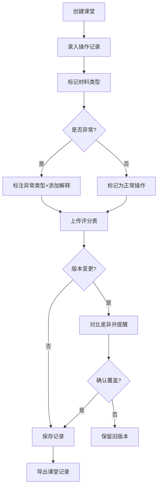

# 医学骨架标注 - 课堂记录系统 PRD

## 1. 产品概述

医学骨架标注是一个面向公开课教学场景的课堂记录与追溯系统，解决课前临时补材料导致的记录混乱问题。通过结构化记录操作时序、异常标注、版本对比，帮助老师、助教、学生清晰区分"补材料"与"改结论"，确保教学记录的可追溯性和一致性。

- 核心痛点：误操作记录、评分表、演示脚本混杂，难以追溯判断过程
- 目标用户：公开课授课老师、助教、学生小组
- 核心价值：记录可追溯、异常有解释、版本有对比、导出可复用

## 2. 核心功能

### 2.1 用户角色

| 角色 | 说明 | 核心权限 |
|------|------|----------|
| 老师 | 课程主讲人 | 创建课堂、审批记录、导出最终报告 |
| 助教 | 课程助理 | 录入操作记录、标注异常、管理评分表 |
| 学生 | 听课/演示学生 | 查看记录、提交操作日志、确认异常判定 |

### 2.2 功能模块

1. **课堂总览页**：课堂列表、快速创建、状态概览
2. **记录工作台**：时序操作记录、异常标注面板、评分表管理
3. **版本对比**：评分表版本差异对比、变更高亮提醒
4. **记录导出**：结构化JSON导出、简洁文本报告

### 2.3 页面详情

| 页面名称 | 模块名称 | 功能描述 |
|----------|----------|----------|
| 课堂总览 | 课堂列表卡片 | 显示课堂名称、时间、状态、记录数、异常数 |
| 课堂总览 | 快速创建 | 一键创建新课堂，自动生成课堂编号 |
| 记录工作台 | 时序记录流 | 按时间线展示所有操作，支持回溯查看 |
| 记录工作台 | 异常标注面板 | 标记异常类型（视角重置/误操作/正常）、添加解释说明 |
| 记录工作台 | 评分表管理 | 上传评分表、自动检测版本变更、版本对比 |
| 记录工作台 | 材料类型标记 | 区分"补材料"与"改结论"，用不同颜色标识 |
| 版本对比 | 差异视图 | 双栏对比评分表版本，高亮显示差异内容 |
| 版本对比 | 变更提醒 | 评分表覆盖前弹窗提醒，列出关键变更点 |
| 记录导出 | 导出配置 | 选择导出范围、格式、是否包含异常解释 |
| 记录导出 | 预览确认 | 导出前预览内容，确保一致性 |

## 3. 核心流程

### 3.1 课堂记录主流程

### 3.2 关键业务规则

1. **时序不可变原则**：所有记录按时间戳排序，历史记录不可删除，只能追加备注
2. **材料类型强制标记**：每条记录必须标记为「补材料」或「改结论」
3. **异常必解释**：标记为异常的记录必须填写解释说明
4. **版本覆盖提醒**：评分表上传时自动检测同课堂已有版本，差异处高亮提醒
5. **导出一致性**：导出格式固定，确保下一班查看时无需翻聊天记录

## 4. 用户界面设计

### 4.1 设计风格

- **设计理念**： brutalist/raw 粗粝工业风，强调功能性，减少装饰
- **主色调**：深灰 #1a1a1a 背景 + 荧光绿 #39ff14 强调色（医学实验室风格）
- **辅助色**：
  - 补材料：黄色 #ffd700 （警示但非错误）
  - 改结论：红色 #ff4444 （关键变更）
  - 异常：橙色 #ff8800 （需关注）
  - 正常：绿色 #39ff14
- **字体**：使用等宽字体 JetBrains Mono，营造控制台/日志感
- **按钮风格**：直角边框、粗边框、点击时有明显按下效果
- **布局风格**：模块化卡片、清晰分割线、数据密度高

### 4.2 页面设计概述

| 页面名称 | 模块名称 | UI 元素 |
|----------|----------|---------|
| 课堂总览 | 课堂列表 | 卡片式列表、状态标签、数字统计、单色图标 |
| 记录工作台 | 时间线 | 左侧垂直时间轴 + 右侧记录卡片、颜色编码标识 |
| 记录工作台 | 异常面板 | 表单式布局、下拉选择、多行文本输入、提交按钮 |
| 版本对比 | 双栏视图 | 左右分栏、差异行高亮、变更统计数字 |
| 记录导出 | 导出面板 | 复选框配置、实时预览、单文件导出按钮 |

### 4.3 响应式

- 桌面端优先设计，适配 1440px 及以上
- 平板端：堆叠布局，保留核心功能
- 移动端：简化视图，仅支持查看记录

### 4.4 动效设计

- 记录添加：滑入动画 + 边框闪烁提示
- 版本差异：逐行高亮显示变更
- 异常提醒：脉冲动画吸引注意力
- 导出成功：进度条 + 确认反馈
