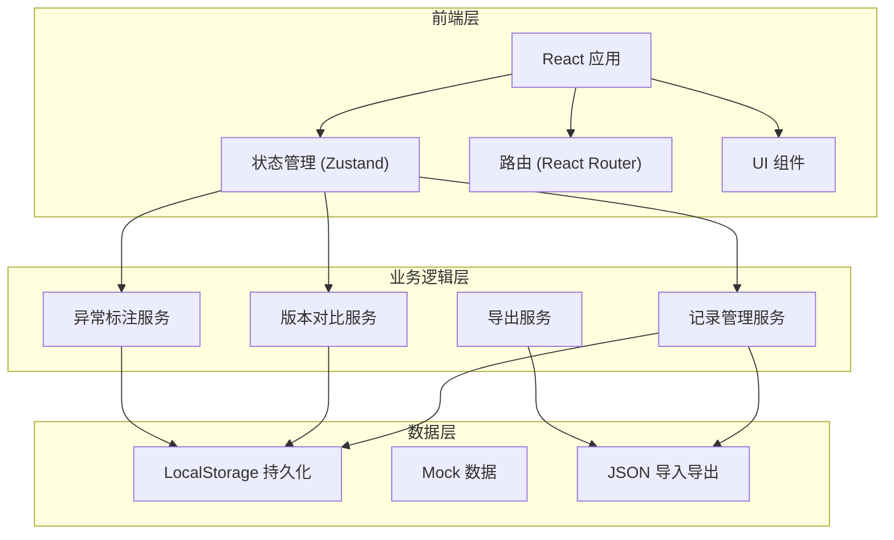
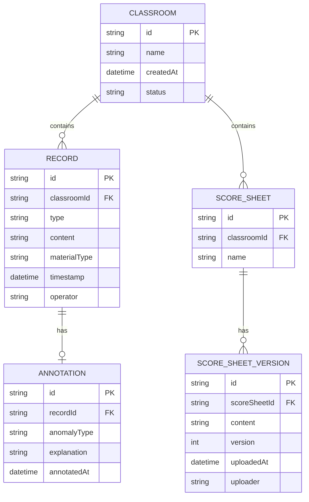

# 医学骨架标注 - 技术架构文档

## 1. 架构设计



## 2. 技术描述

- **前端框架**: React@18 + TypeScript
- **构建工具**: Vite@5
- **样式方案**: TailwindCSS@3 + CSS 变量
- **状态管理**: Zustand (轻量级，适合本地数据)
- **路由**: React Router@6
- **数据持久化**: LocalStorage (前端纯客户端方案)
- **图标**: Lucide React
- **版本对比**: diff-match-patch (文本差异算法)

## 3. 路由定义

| 路由 | 页面 | 功能 |
|------|------|------|
| `/` | 课堂总览页 | 课堂列表、创建课堂、快速入口 |
| `/classroom/:id` | 记录工作台 | 时序记录、异常标注、评分表管理 |
| `/classroom/:id/compare` | 版本对比页 | 评分表版本差异对比 |
| `/classroom/:id/export` | 导出预览页 | 导出配置、预览、下载 |

## 4. 数据模型

### 4.1 实体关系图



### 4.2 TypeScript 类型定义

```typescript
// 课堂
interface Classroom {
  id: string;
  name: string;
  createdAt: string;
  status: 'active' | 'archived';
}

// 记录类型
type RecordType = 'operation' | 'script' | 'note' | 'other';
type MaterialType = 'supplement' | 'conclusion_change'; // 补材料 / 改结论
type AnomalyType = 'normal' | 'view_reset' | 'misoperation' | 'other';

// 操作记录
interface Record {
  id: string;
  classroomId: string;
  type: RecordType;
  content: string;
  materialType: MaterialType;
  timestamp: string;
  operator: string;
  annotation?: Annotation;
}

// 异常标注
interface Annotation {
  id: string;
  recordId: string;
  anomalyType: AnomalyType;
  explanation: string;
  annotatedAt: string;
  annotator: string;
}

// 评分表
interface ScoreSheet {
  id: string;
  classroomId: string;
  name: string;
  versions: ScoreSheetVersion[];
}

// 评分表版本
interface ScoreSheetVersion {
  id: string;
  version: number;
  content: string;
  uploadedAt: string;
  uploader: string;
}

// 导出版本
interface ExportData {
  classroom: Classroom;
  records: Record[];
  scoreSheets: ScoreSheet[];
  exportedAt: string;
  version: string;
}
```

## 5. 核心服务设计

### 5.1 记录管理服务

```typescript
interface RecordService {
  // 创建记录（强制标记材料类型）
  createRecord(data: Omit<Record, 'id' | 'timestamp'>): Promise<Record>;
  
  // 获取课堂所有记录（按时序排序）
  getRecordsByClassroom(classroomId: string): Promise<Record[]>;
  
  // 添加异常标注
  addAnnotation(recordId: string, annotation: Omit<Annotation, 'id' | 'annotatedAt'>): Promise<Record>;
  
  // 不可删除，只能追加备注
  appendNote(recordId: string, note: string): Promise<Record>;
}
```

### 5.2 版本对比服务

```typescript
interface VersionCompareService {
  // 对比两个版本的差异
  compareVersions(v1: string, v2: string): DiffResult[];
  
  // 检测是否有关键变更（影响结论的变更）
  detectCriticalChanges(diffs: DiffResult[]): CriticalChange[];
  
  // 生成变更摘要
  generateChangeSummary(diffs: DiffResult[]): string;
}

interface DiffResult {
  type: 'added' | 'removed' | 'modified';
  line: number;
  content: string;
}

interface CriticalChange {
  severity: 'high' | 'medium' | 'low';
  description: string;
  location: string;
}
```

### 5.3 导出服务

```typescript
interface ExportService {
  // 导出为 JSON（完整数据，用于后续导入）
  exportToJSON(classroomId: string): Promise<string>;
  
  // 导出为文本报告（简洁版）
  exportToText(classroomId: string, options?: ExportOptions): Promise<string>;
  
  // 生成报告预览
  generatePreview(classroomId: string, options?: ExportOptions): Promise<string>;
}

interface ExportOptions {
  includeAnnotations: boolean;
  includeScoreSheets: boolean;
  includeSupplemental: boolean; // 是否包含补材料
}
```

## 6. 目录结构

```
src/
├── components/          # 通用组件
│   ├── Timeline/        # 时间线组件
│   ├── RecordCard/      # 记录卡片
│   ├── AnnotationForm/  # 异常标注表单
│   ├── DiffViewer/      # 差异查看器
│   └── ExportPanel/     # 导出面板
├── pages/               # 页面组件
│   ├── ClassroomList/
│   ├── RecordWorkspace/
│   ├── VersionCompare/
│   └── ExportPreview/
├── store/               # 状态管理
│   └── useClassroomStore.ts
├── services/            # 业务服务
│   ├── recordService.ts
│   ├── versionService.ts
│   └── exportService.ts
├── types/               # 类型定义
│   └── index.ts
├── utils/               # 工具函数
│   ├── diff.ts
│   ├── storage.ts
│   └── format.ts
├── data/                # Mock 数据
│   └── mockData.ts
└── App.tsx
```
