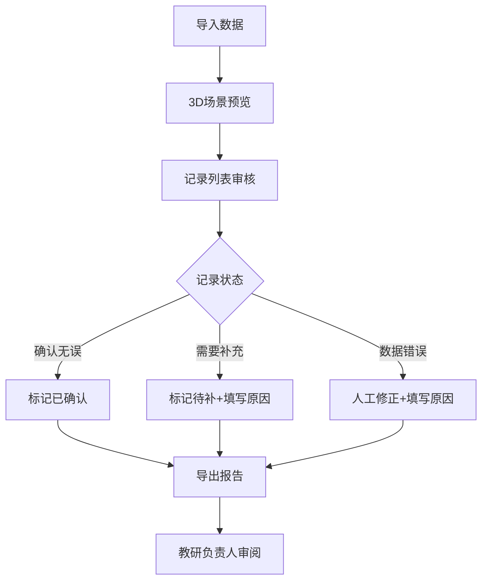

## 1. 产品概述

建筑日照推演系统是一个本地运行的教学辅助工具，解决传统表格管理建筑日照推演记录时视角重置、状态追踪困难的问题。每条记录完整展示来源、当前状态、修改人、修改原因，支持导入、复核、修正、历史追溯和导出全流程。

- 核心目标：替代表格管理方式，实现推演记录的可追溯性和状态一致性
- 目标用户：建筑专业教师、教研负责人、学生

## 2. 核心 Features

### 2.1 用户角色
| 角色 | 使用方式 | 核心权限 |
|------|----------|----------|
| 培训老师 | 本地操作 | 导入数据、复核记录、修正状态、导出课堂记录 |
| 教研负责人 | 查看导出报告 | 查看带处理口径的分类统计报告 |

### 2.2 Feature 模块
1. **3D场景页**：Three.js建筑模型展示、日照视角控制、建筑选择
2. **记录管理页**：记录列表、筛选搜索、状态变更、批量操作
3. **记录详情页**：来源信息、状态历史、修改原因、复核操作
4. **导出报告页**：教研视图、分类统计、处理口径说明、报告导出

### 2.3 页面详情
| 页面名称 | 模块名称 | Feature 描述 |
|---------|----------|--------------|
| 3D场景页 | 模型展示 | Three.js渲染建筑模型，支持旋转、缩放、平移 |
| 3D场景页 | 日照控制 | 时间滑块控制太阳位置，实时计算阴影效果 |
| 3D场景页 | 建筑选中 | 点击建筑高亮，显示关联记录摘要 |
| 记录管理页 | 记录列表 | 表格展示所有记录，支持分页和排序 |
| 记录管理页 | 筛选器 | 按状态、来源、修改人筛选，关键词搜索 |
| 记录管理页 | 批量操作 | 批量复核、批量导出、批量标记待处理 |
| 记录详情页 | 来源追踪 | 显示原始导入数据、导入时间、导入人 |
| 记录详情页 | 状态历史 | 时间线展示所有状态变更记录 |
| 记录详情页 | 复核修正 | 状态修改表单，必填修改原因 |
| 导出报告页 | 教研视图 | 按"已确认/待补/人工改过"分类展示 |
| 导出报告页 | 处理口径 | 显示各类记录的处理标准说明 |
| 导出报告页 | 报告导出 | 导出Excel格式的课堂记录报告 |

## 3. 核心流程

### 3.1 完整工作流
培训老师导入推演数据 → 在3D场景中查看建筑日照效果 → 复核每条记录的准确性 → 对有问题的记录标记"待处理"并填写原因 → 修正后确认 → 导出分类报告供教研负责人审阅

## 4. 用户界面设计

### 4.1 设计风格
- **主色调**：深青色 (#0F766E) - 代表专业和严谨
- **辅助色**：琥珀色 (#D97706) - 待处理状态；绿色 (#059669) - 已确认；红色 (#DC2626) - 需要修正
- **中性色**：石板灰系列，保证内容可读性
- **按钮风格**：圆角4px，轻微阴影，hover时有浮起效果
- **字体**：Inter 系列，标题18px/600，正文14px/400，备注12px/400
- **布局风格**：左侧导航+右侧内容区，卡片式模块划分
- **图标风格**：Lucide 线性图标，统一16px尺寸

### 4.2 页面设计概览
| 页面名称 | 模块名称 | UI 元素 |
|---------|----------|----------|
| 3D场景页 | 场景展示 | 全屏Canvas，底部控制条，右侧信息面板 |
| 记录管理页 | 数据表格 | 斑马纹行，状态标签，操作按钮组 |
| 记录详情页 | 时间线 | 垂直时间线，彩色状态节点，备注气泡 |
| 导出报告页 | 分类卡片 | 三栏卡片布局，数据统计，导出按钮 |

### 4.3 响应式
- Desktop-first 设计，支持1280px及以上屏幕
- 左侧导航在小屏幕可折叠
- 表格支持横向滚动
- 触控操作优化：按钮最小44x44px点击区域

### 4.4 3D 场景指引
- **环境**：日间晴朗天空，HDRI环境贴图提供真实光照
- **光照**：平行光模拟太阳光，随时间滑块动态调整角度和强度
- **相机**：透视相机，初始视角45度俯角，支持轨道控制
- **动画**：建筑选中时有轻微缩放动画，状态变化时有颜色过渡
- **性能**：建筑模型使用简化几何体，单页模型数控制在50以内
