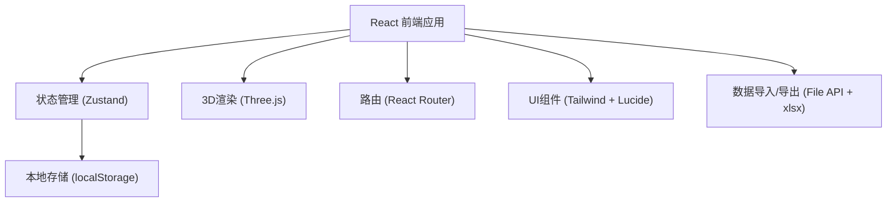
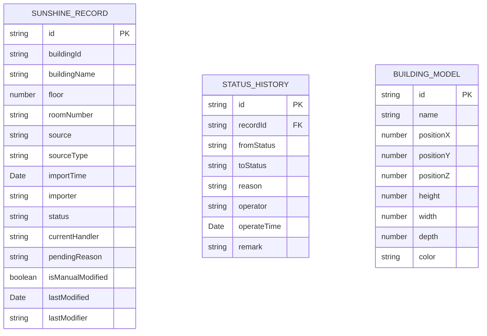

## 1. 架构设计



## 2. 技术选型说明

- **前端**: React@18 + TypeScript + Vite
- **初始化工具**: vite-init
- **状态管理**: Zustand
- **3D引擎**: Three.js + @react-three/fiber + @react-three/drei
- **样式**: TailwindCSS@3
- **数据存储**: localStorage (本地运行，无后端)
- **文件处理**: xlsx (Excel导入导出)
- **后端**: 无 (纯前端本地应用)

## 3. 路由定义

| 路由 | 用途 |
|-----|------|
| / | 3D场景页 - 建筑日照预览主界面 |
| /records | 记录管理页 - 所有推演记录列表 |
| /records/:id | 记录详情页 - 单条记录的完整信息和历史 |
| /export | 导出报告页 - 教研负责人分类视图 |

## 4. 数据模型

### 4.1 数据定义



### 4.2 TypeScript 类型定义

```typescript
// 记录状态枚举
type RecordStatus = 'pending' | 'confirmed' | 'to_supplement' | 'modified';

// 日照推演记录
interface SunshineRecord {
  id: string;
  buildingId: string;
  buildingName: string;
  floor: number;
  roomNumber: string;
  source: string;
  sourceType: 'import' | 'manual';
  importTime: Date;
  importer: string;
  status: RecordStatus;
  currentHandler: string;
  pendingReason?: string;
  isManualModified: boolean;
  lastModified: Date;
  lastModifier: string;
  remark?: string;
}

// 状态历史记录
interface StatusHistory {
  id: string;
  recordId: string;
  fromStatus: RecordStatus | null;
  toStatus: RecordStatus;
  reason: string;
  operator: string;
  operateTime: Date;
  remark?: string;
}

// 建筑模型
interface BuildingModel {
  id: string;
  name: string;
  position: { x: number; y: number; z: number };
  dimensions: { height: number; width: number; depth: number };
  color: string;
}

// 应用状态
interface AppState {
  records: SunshineRecord[];
  buildings: BuildingModel[];
  histories: StatusHistory[];
  currentUser: string;
  selectedBuildingId: string | null;
  selectedRecordId: string | null;
  sunTime: number; // 0-24 小时
}
```

## 5. 核心模块设计

### 5.1 Store 模块 (Zustand)
- useRecordStore: 记录CRUD、状态变更、历史追踪
- useBuildingStore: 建筑模型管理、选中状态
- useSunStore: 日照时间、光照参数控制

### 5.2 组件划分
```
src/
├── components/
│   ├── Scene3D/          # 3D场景组件
│   │   ├── Building.tsx
│   │   ├── SunLight.tsx
│   │   └── SceneControls.tsx
│   ├── RecordList/       # 记录列表组件
│   │   ├── RecordTable.tsx
│   │   ├── StatusFilter.tsx
│   │   └── BatchActions.tsx
│   ├── RecordDetail/     # 记录详情组件
│   │   ├── SourceInfo.tsx
│   │   ├── StatusTimeline.tsx
│   │   └── StatusForm.tsx
│   ├── ExportReport/     # 导出报告组件
│   │   ├── CategoryCard.tsx
│   │   ├── ProcessingGuide.tsx
│   │   └── ExportButton.tsx
│   └── common/           # 通用组件
│       ├── Sidebar.tsx
│       ├── StatusBadge.tsx
│       └── FileImport.tsx
├── pages/
│   ├── ScenePage.tsx
│   ├── RecordsPage.tsx
│   ├── RecordDetailPage.tsx
│   └── ExportPage.tsx
├── store/
│   ├── useRecordStore.ts
│   ├── useBuildingStore.ts
│   └── useSunStore.ts
├── utils/
│   ├── importExport.ts
│   ├── statusUtils.ts
│   └── mockData.ts
└── types/
    └── index.ts
```

### 5.3 导入导出格式
- 导入: Excel (.xlsx)，包含建筑名称、楼层、房间号、来源等字段
- 导出: Excel (.xlsx)，教研视图分三个sheet:
  - Sheet1: 已确认记录
  - Sheet2: 待补记录
  - Sheet3: 人工改过记录
- 每个sheet包含: 处理口径说明、数据列表、统计信息
