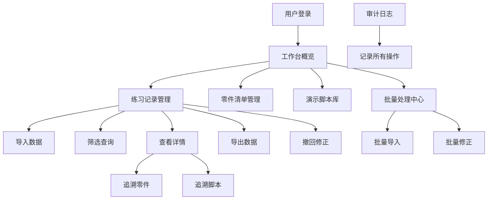

## 1. 产品概述

电路板焊接练习数据管理系统，解决教学场景下数据追溯难、操作口径不一致、批量处理不稳定等问题。面向老师、助教和学生，提供可追溯、可重复、可验证的焊接练习数据管理能力。

核心价值：确保练习记录的一致性、可追溯性和操作可审计，让接手的人能快速确认结果依据。

## 2. 核心功能

### 2.1 用户角色
| 角色 | 登录方式 | 核心权限 |
|------|----------|----------|
| 老师 | 账号登录 | 完整管理权限、批量操作、数据导出 |
| 助教 | 账号登录 | 数据录入、修正、筛选查看 |
| 学生 | 账号登录 | 查看个人练习记录、零件清单 |

### 2.2 功能模块
1. **工作台主页**：数据概览、操作记录、快捷入口
2. **练习记录管理**：记录导入、撤回修正、筛选查询、数据导出
3. **零件清单管理**：物料清单、追溯链接、库存管理
4. **演示脚本库**：操作视频、步骤说明、版本管理
5. **批量处理中心**：批量导入、批量修正、任务状态监控
6. **审计追溯**：操作日志、数据版本、变更对比

### 2.3 页面详情
| 页面名称 | 模块名称 | 功能描述 |
|----------|----------|----------|
| 工作台 | 数据概览卡片 | 展示练习总数、待处理数、异常数 |
| 工作台 | 近期操作记录 | 显示最近操作，支持点击跳转详情 |
| 练习记录 | 数据表格 | 支持多条件筛选、排序、分页 |
| 练习记录 | 详情面板 | 展示完整信息，包含追溯链接到零件/脚本 |
| 零件清单 | 物料列表 | 支持搜索、分类、关联练习记录 |
| 演示脚本 | 脚本库 | 版本管理、预览、关联练习 |
| 批量处理 | 任务列表 | 显示批量任务进度、支持重试、撤销 |
| 审计日志 | 操作记录 | 完整操作轨迹、变更对比、回滚 |

## 3. 核心流程

用户登录系统后，在工作台查看概览；进入练习记录页面可导入数据、筛选查询；每条记录可追溯到对应的零件清单和演示脚本；支持批量导入和修正操作；所有操作均记录审计日志确保可追溯。

## 4. 用户界面设计

### 4.1 设计风格
- **主色调**：深青色 #0F4C5C（专业、稳重）搭配橙色 #E36414（警示、操作）
- **按钮风格**：圆角 6px，轻微阴影，hover 状态有颜色渐变
- **字体**：标题使用 Noto Sans SC，正文使用 Inter
- **布局风格**：左侧导航 + 右侧内容区，卡片式布局
- **图标风格**：线性图标，统一 24px 尺寸

### 4.2 页面设计概览
| 页面名称 | 模块名称 | UI 元素 |
|----------|----------|---------|
| 工作台 | 数据概览 | 卡片网格、数字动画、趋势箭头 |
| 练习记录 | 数据表格 | 固定表头、斑马纹、行高亮、批量选择 |
| 详情面板 | 追溯链接 | 下划线链接、跳转图标、关联预览 |
| 批量处理 | 任务进度 | 进度条、状态标签、操作按钮组 |

### 4.3 响应式
- 桌面端优先设计（1440px）
- 平板端（1024px）导航折叠为图标
- 移动端（768px）单列布局，底部导航

### 4.4 交互细节
- 表格筛选后导出范围与屏幕显示一致
- 刷新页面保留筛选条件和滚动位置
- 追溯链接新窗口打开，支持返回
