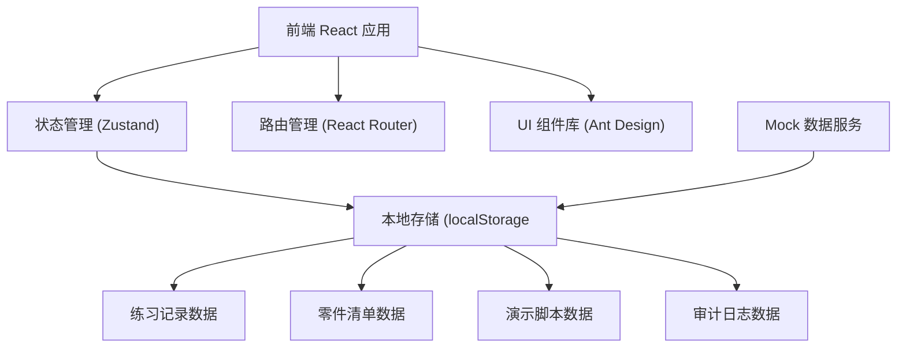
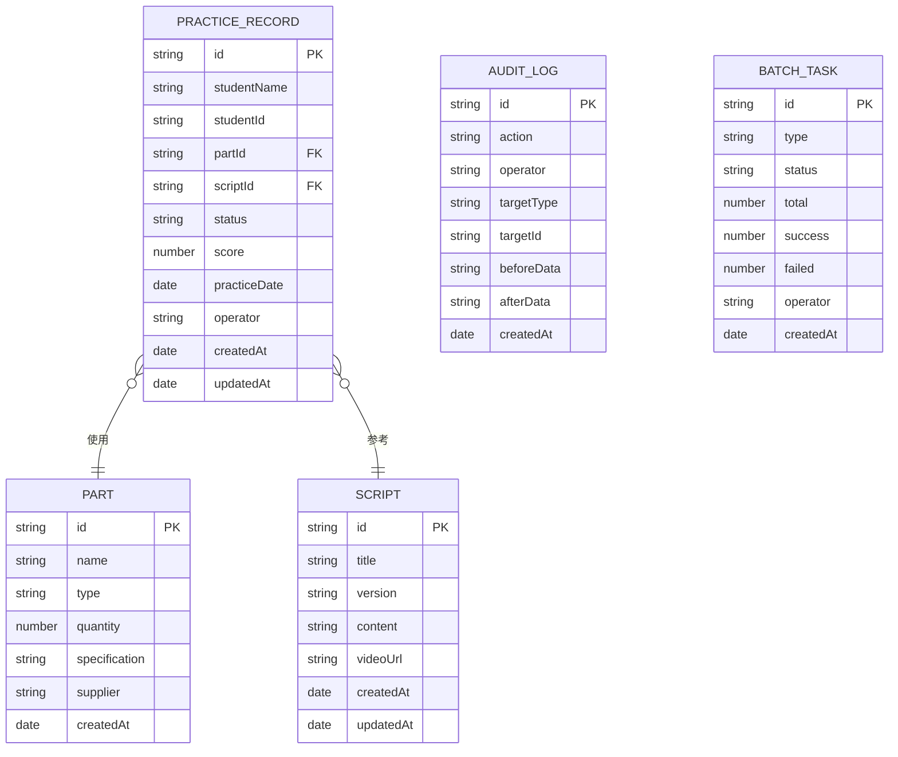

## 1. 架构设计

## 2. 技术描述

- **前端**: React@18 + TypeScript + Vite
- **状态管理**: Zustand（轻量级，支持状态持久化）
- **UI 组件库**: Ant Design@5
- **样式方案**: TailwindCSS@3
- **路由**: React Router@6
- **数据存储**: localStorage + IndexedDB（浏览器本地存储，无需后端）
- **导出功能**: SheetJS (xlsx)
- **初始化工具**: vite-init

## 3. 路由定义

| 路由 | 页面 | 用途 |
|------|------|------|
| /dashboard | 工作台 | 数据概览、操作记录 |
| /records | 练习记录 | 记录列表、筛选、导出 |
| /records/:id | 记录详情 | 单条记录详情、追溯链接 |
| /parts | 零件清单 | 物料列表、关联记录 |
| /scripts | 演示脚本 | 脚本库、版本管理 |
| /batch | 批量处理 | 批量任务管理 |
| /audit | 审计日志 | 操作记录、变更对比 |

## 4. 数据模型

### 4.1 数据模型定义

### 4.2 数据持久化

使用 Zustand + localStorage 持久化，确保刷新重启后数据一致。

## 5. 核心技术方案

### 5.1 状态一致性保障
- 所有筛选条件 URL 参数化，刷新后可还原
- 表格可视区域记录滚动位置
- 导出范围与当前筛选、分页、排序完全一致

### 5.2 数据追溯
- 练习记录关联零件ID和脚本ID
- 详情页展示关联零件和脚本链接
- 点击链接支持回溯历史版本

### 5.3 批量处理
- 批量操作使用事务机制
- 幂等设计，重复运行不重复数据
- 任务队列，支持暂停、重试、撤销

### 5.4 审计追踪
- 所有修改操作记录 before/after 数据
- 支持变更对比和回滚
- 操作人、时间、IP 完整记录
