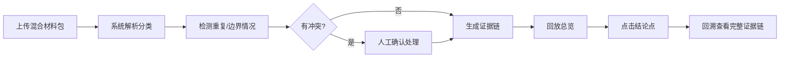

## 1. 产品概述

几何辅助线回放系统是一个专为教研组长设计的教学辅助工具，用于追踪和回放学生几何错题的完整处理流程。解决了教研工作中依赖记忆、证据链断裂的问题，确保每一步操作都有据可查。

- 核心目的：建立完整的证据链，让教研工作可追溯、可审计
- 解决问题：接手回放时需反复询问谁改过错题，核心证据只存在于记忆或页面提示中
- 目标用户：教研组长、几何教师

## 2. 核心功能

### 2.1 用户角色

| 角色 | 注册方式 | 核心权限 |
|------|---------|----------|
| 教研组长 | 系统分配 | 导入材料、查看回放、管理证据链、导出报告 |
| 教师 | 系统分配 | 提交错题、人工确认、上传讲义截图 |

### 2.2 功能模块

1. **材料导入页**：支持混合材料批量导入，自动分类处理
2. **回放总览页**：展示处理结果总表，支持多维度筛选
3. **证据链详情页**：从结论点回溯到原始学生错题和讲义截图
4. **人工确认页**：处理更正记录，记录操作人、时间、原因

### 2.3 页面详情

| 页面名称 | 模块名称 | 功能描述 |
|---------|---------|----------|
| 材料导入页 | 上传区域 | 拖拽上传混合材料包，支持JSON、图片附件 |
| 材料导入页 | 预处理预览 | 显示识别出的正常记录、晚到附件、重复项、人工更正 |
| 材料导入页 | 冲突处理 | 高亮显示重复项和边界情况，支持人工干预 |
| 回放总览页 | 结果总表 | 展示所有处理记录，按学生、题目、状态分类 |
| 回放总览页 | 筛选器 | 按难度标签、处理状态、时间范围筛选 |
| 证据链详情页 | 时间线 | 展示从原始错题到最终结论的完整处理流程 |
| 证据链详情页 | 证据展示 | 学生错题原图、讲义截图、人工更正记录并排展示 |
| 证据链详情页 | 操作人追踪 | 显示每一步的操作人、时间、备注 |

## 3. 核心流程

用户上传混合材料包 → 系统自动解析分类 → 检测重复项和边界情况 → 人工确认处理冲突 → 生成证据链 → 回放时点击结论点回溯 → 查看完整证据链

## 4. 用户界面设计

### 4.1 设计风格
- **主色调**：深蓝 #1e3a5f（专业、稳重），辅助色：琥珀 #f59e0b（强调重要信息）
- **按钮风格**：圆角8px，悬停时有轻微阴影和缩放效果
- **字体**：标题使用 Noto Serif SC（学术感），正文使用 Noto Sans SC（可读性）
- **布局风格**：卡片式布局，时间线组件贯穿证据链页面
- **图标风格**：使用 Lucide 线性图标，保持简洁专业

### 4.2 页面设计概述

| 页面名称 | 模块名称 | UI元素 |
|---------|---------|--------|
| 材料导入页 | 上传区域 | 虚线边框拖放区，文件图标动画，进度条 |
| 回放总览页 | 结果总表 | 斑马纹表格，状态徽章，悬停高亮 |
| 证据链详情页 | 时间线 | 垂直线连接节点，当前节点放大高亮 |
| 证据链详情页 | 证据对比 | 三栏布局，图片缩放查看器 |

### 4.3 响应式
- Desktop-first 设计，主内容区最小宽度 1200px
- 平板端调整为两栏布局，时间线改为左侧垂直展示
- 移动端单列布局，证据图片堆叠展示
- 所有交互元素支持触摸操作

### 4.4 动效设计
- 材料上传时文件卡片逐个滑入（staggered animation）
- 时间线节点加载时连线动画从下往上绘制
- 证据图片点击放大时使用流畅的缩放过渡
- 状态变更时徽章有脉冲效果提示
