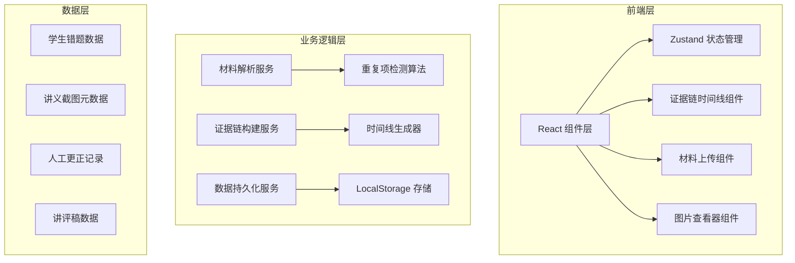
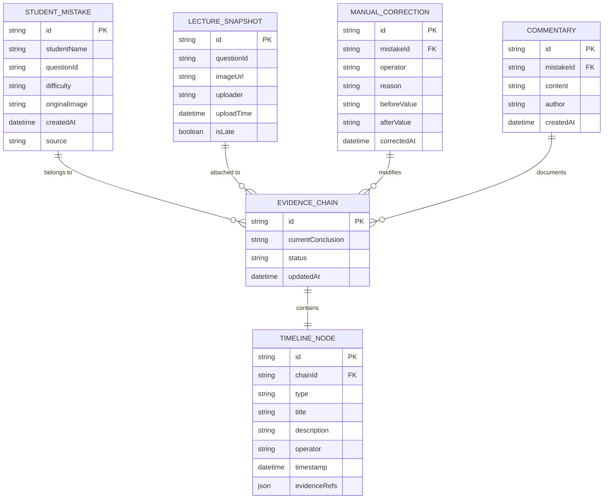

## 1. 架构设计



## 2. 技术描述

- **前端**：React@18 + TypeScript + Vite + TailwindCSS@3
- **状态管理**：Zustand（轻量级，适合中等复杂度状态）
- **路由**：React Router DOM
- **图标**：Lucide React
- **后端**：无（纯前端应用，数据存储在 LocalStorage）
- **数据存储**：LocalStorage + IndexedDB（用于存储图片 Blob）
- **图片处理**：Canvas API 生成缩略图

## 3. 路由定义

| 路由 | 页面 | 目的 |
|------|------|------|
| / | 材料导入页 | 首页，上传混合材料包 |
| /overview | 回放总览页 | 展示所有处理记录总表 |
| /evidence/:id | 证据链详情页 | 查看单条记录的完整证据链 |
| /confirm | 人工确认页 | 处理冲突和更正记录 |

## 4. 数据模型

### 4.1 数据模型定义



### 4.2 核心类型定义

```typescript
// 学生错题
interface StudentMistake {
  id: string;
  studentName: string;
  questionId: string;
  difficulty: 'easy' | 'medium' | 'hard';
  originalImage: string;
  createdAt: Date;
  source: 'normal' | 'late' | 'manual';
}

// 讲义截图
interface LectureSnapshot {
  id: string;
  questionId: string;
  imageUrl: string;
  uploader: string;
  uploadTime: Date;
  isLate: boolean;
}

// 人工更正
interface ManualCorrection {
  id: string;
  mistakeId: string;
  operator: string;
  reason: string;
  beforeValue: string;
  afterValue: string;
  correctedAt: Date;
}

// 讲评稿
interface Commentary {
  id: string;
  mistakeId: string;
  content: string;
  author: string;
  createdAt: Date;
}

// 证据链
interface EvidenceChain {
  id: string;
  mistakeId: string;
  currentConclusion: string;
  status: 'pending' | 'confirmed' | 'conflict';
  timeline: TimelineNode[];
  updatedAt: Date;
}

// 时间线节点
interface TimelineNode {
  id: string;
  type: 'mistake_created' | 'snapshot_attached' | 'correction_made' | 'commentary_added' | 'conclusion_reached';
  title: string;
  description: string;
  operator: string;
  timestamp: Date;
  evidenceRefs: {
    type: 'image' | 'text' | 'record';
    id: string;
    url?: string;
  }[];
}

// 导入材料包
interface ImportPackage {
  mistakes: StudentMistake[];
  snapshots: LectureSnapshot[];
  corrections: ManualCorrection[];
  commentaries: Commentary[];
}
```

## 5. 核心算法

### 5.1 重复项检测算法

1. **基于内容的相似度检测**：对比学生姓名 + 题目ID + 错题图片哈希
2. **难度标签去重**：同一题目ID保留最新的人工更正难度标签
3. **晚到附件识别**：根据上传时间与错题创建时间差判断

### 5.2 证据链构建算法

1. 按时间顺序排列所有相关事件（错题创建→截图上传→人工更正→讲评稿→结论）
2. 每个节点包含对前一节点的引用
3. 结论节点反向引用所有前置证据

### 5.3 数据持久化策略

1. 元数据（JSON）存储在 LocalStorage
2. 图片数据存储在 IndexedDB（避免 LocalStorage 容量限制）
3. 定期自动保存，支持手动导出备份
