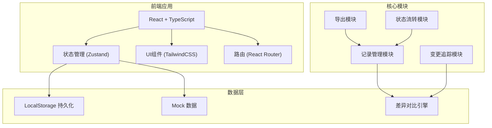
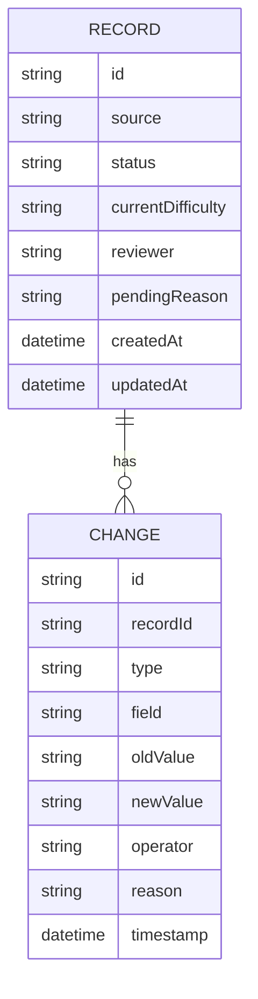

## 1. 架构设计



## 2. 技术描述
- 前端框架：React@18 + TypeScript
- 构建工具：Vite@5
- 样式方案：TailwindCSS@3
- 状态管理：Zustand
- 路由：React Router v6
- 图标：Lucide React
- 数据存储：LocalStorage（轻量持久化）
- 后端：无（纯前端应用）

## 3. 路由定义
| 路由 | 页面 | 用途 |
|------|------|------|
| / | 复核记录列表 | 展示所有复核记录、筛选、概览 |
| /record/:id | 记录详情 | 变更历史、差异对比、操作记录 |
| /guide | 教研组长指南 | 操作说明、注意事项 |

## 4. 数据模型

### 4.1 数据模型定义



### 4.2 TypeScript 类型定义

```typescript
// 记录状态
type RecordStatus = 'pending' | 'completed' | 'material_only' | 'conclusion_changed';

// 变更类型
type ChangeType = 'difficulty_update' | 'comment_add' | 'question_bank_edit' | 'status_update';

// 复核记录
interface ReviewRecord {
  id: string;
  source: string;           // 来源
  status: RecordStatus;     // 当前状态
  currentDifficulty: string; // 当前难度标签
  reviewer: string;         // 最后修改人
  pendingReason: string;    // 待处理原因
  comment: string;          // 讲评记录
  questionBankData: Record<string, any>; // 题库表数据
  createdAt: Date;
  updatedAt: Date;
}

// 变更历史
interface ChangeLog {
  id: string;
  recordId: string;
  type: ChangeType;
  field: string;
  oldValue: string;
  newValue: string;
  operator: string;
  reason: string;
  timestamp: Date;
}
```

## 5. 核心模块说明

### 5.1 状态流转模块
- 处理状态变更逻辑
- 自动标记"补材料"或"改结论"
- 待处理队列管理

### 5.2 变更追踪模块
- 记录每次操作的前后值
- 生成变更时间线
- 题库表改动差异对比

### 5.3 导出模块
- 导出讲评稿
- 包含完整变更历史
- 格式化为教研组长阅读格式
