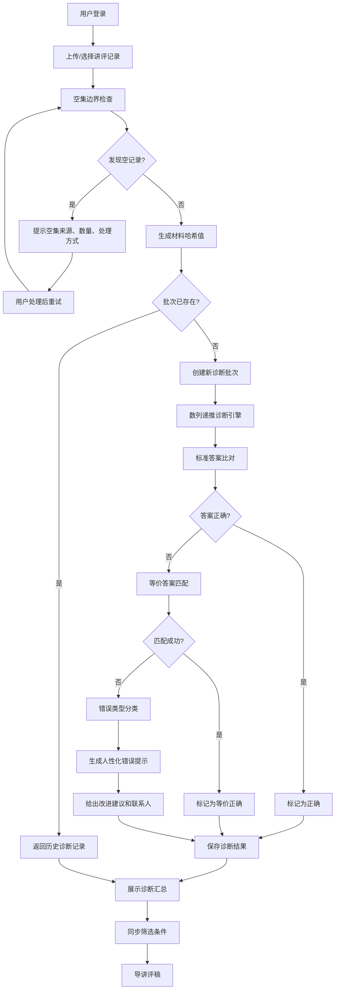

## 1. 产品概述

数列递推诊断系统是一款面向中学数学教研团队的智能诊断工具，帮助教研人员快速、准确地批量诊断学生数列递推题的答题情况。系统解决了传统人工批改效率低、等价答案误判、题库版本管理混乱等痛点，实现了诊断过程的可追溯、可重复、可导出。

- **主要用途**：批量诊断学生数列递推题答案、自动识别等价答案、生成讲评稿
- **解决的核心问题**：等价答案误判、历史记录重复创建、错误提示不友好、空集边界遗漏、屏幕与导出不一致
- **目标用户**：中学数学教师、教研组长、教学管理人员
- **核心价值**：提高诊断效率80%、减少误判率、建立题库版本追溯机制、生成人性化的诊断报告

## 2. 核心功能

### 2.1 用户角色

| 角色 | 注册方式 | 核心权限 |
|------|----------|----------|
| 教研老师 | 工号登录 | 上传讲评记录、发起诊断、查看结果、导出讲评稿 |
| 教研组长 | 工号登录 | 题库管理、等价答案配置、查看所有诊断批次 |
| 题库管理员 | 工号登录 | 题库版本管理、数据备份与恢复 |

### 2.2 功能模块

1. **首页仪表盘**：诊断批次概览、正确率趋势、错误类型分布
2. **题库管理**：题目CRUD、版本留底、等价答案配置
3. **讲评记录管理**：单条录入、批量导入（Excel/CSV）、记录查询
4. **诊断中心**：选择记录发起诊断、查看诊断结果、错误详情展示
5. **讲评稿导出**：筛选条件同步、Excel格式导出、结果一致性校验

### 2.3 页面详情

| 页面名称 | 模块名称 | 功能描述 |
|----------|----------|----------|
| 首页仪表盘 | 数据概览卡片 | 总诊断批次、今日诊断数、平均正确率、待处理问题数 |
| 首页仪表盘 | 趋势图表 | 近7天正确率趋势、错误类型分布饼图 |
| 首页仪表盘 | 最近批次列表 | 最近10条诊断批次快速访问 |
| 题库管理 | 题目列表 | 分页展示、筛选查询、版本切换、版本对比 |
| 题库管理 | 题目编辑 | 新增/修改题目、自动版本留底、等价答案管理 |
| 讲评记录管理 | 记录列表 | 分页展示、多条件筛选、批量选择 |
| 讲评记录管理 | 文件上传 | Excel/CSV批量导入、格式校验、错误提示 |
| 诊断中心 | 诊断发起 | 选择记录、命名批次、关联筛选条件、发起诊断 |
| 诊断中心 | 结果展示 | 诊断结果列表、正确率统计、错误详情展开 |
| 诊断中心 | 导出功能 | 筛选条件同步校验、Excel导出、下载提示 |
| 筛选条件 | 条件管理 | 保存筛选条件、设为当前条件、条件列表管理 |

## 3. 核心流程

### 3.1 诊断主流程

用户登录后，首先上传或选择讲评记录，系统先进行空集边界检查，如发现空记录则提示来源和处理方式；确认无误后发起诊断，系统通过哈希值检查是否为重复批次，如为重复批次则返回历史记录；新批次则调用诊断引擎进行数列递推判断和等价答案匹配，最后生成诊断结果和人性化错误提示，用户可同步筛选条件后导出讲评稿。

### 3.2 题库版本留底流程

用户修改题目时，系统自动将旧版本标记为非活跃，创建新版本并关联父版本，同时复制等价答案配置，确保历史诊断记录可追溯。

## 4. 用户界面设计

### 4.1 设计风格

**设计定位**：专业教研工具，简洁理性，注重数据可读性和操作效率

- **主色调**：深蓝 `#1e3a5f` - 代表专业、严谨、可信赖
- **辅助色**：
  - 成功绿 `#10b981` - 正确答案标记
  - 警告橙 `#f59e0b` - 等价答案标记
  - 错误红 `#ef4444` - 错误答案标记
  - 信息蓝 `#3b82f6` - 操作提示
- **中性色**：
  - 背景 `#f8fafc`
  - 卡片 `#ffffff`
  - 文字主 `#1e293b`
  - 文字次 `#64748b`
  - 边框 `#e2e8f0`
- **按钮样式**：圆角6px，轻微阴影，hover时有微妙的背景色加深和上移动效
- **字体**：
  - 标题：`"Noto Serif SC", serif` - 正式、书卷气
  - 正文：`"Noto Sans SC", sans-serif` - 清晰、易读
  - 数字/代码：`"JetBrains Mono", monospace` - 精确、专业
- **字号层级**：
  - 页面标题：24px / 粗体
  - 卡片标题：18px / 半粗
  - 正文：14px / 常规
  - 辅助文字：12px / 常规
- **布局风格**：
  - 左侧固定导航栏（240px）
  - 顶部面包屑和操作栏
  - 内容区卡片式布局
  - 数据表格为主，辅以图表
- **图标风格**：线性图标，16px/20px两种尺寸，颜色与文字层级对应

### 4.2 页面设计概述

| 页面名称 | 模块名称 | UI 元素 |
|----------|----------|----------|
| 首页仪表盘 | 数据概览卡片 | 4张并排卡片，渐变背景，数字动画，底部趋势箭头 |
| 首页仪表盘 | 趋势图表 | 折线图+饼图并排，图表库recharts，悬停显示详情 |
| 首页仪表盘 | 最近批次列表 | 表格展示，状态标签彩色，快速操作按钮 |
| 题库管理 | 题目列表 | 卡片网格，版本标签，展开查看详情 |
| 题库管理 | 题目编辑 | 模态框表单，左侧预览右侧编辑，实时校验 |
| 讲评记录管理 | 记录列表 | 数据表格，复选框批量选择，行展开查看详情 |
| 讲评记录管理 | 文件上传 | 拖拽上传区，格式说明，进度条，错误行高亮 |
| 诊断中心 | 诊断发起 | 步骤条引导，已选记录计数，条件选择器 |
| 诊断中心 | 结果展示 | 分组统计卡片，结果表格，行展开错误详情 |
| 诊断中心 | 导出功能 | 导出按钮带筛选条件校验，成功后下载提示 |
| 筛选条件 | 条件管理 | 侧边抽屉，条件列表，设为当前操作 |

### 4.3 响应式设计

- **桌面优先**：最小支持1280px宽度，1920px最优展示
- **平板适配**：1024px时导航栏可收起，表格支持横向滚动
- **移动端**：768px以下转为单列布局，底部Tab导航，表格转卡片列表

### 4.4 动画与交互

- **页面加载**：内容区淡入（opacity 0→1，300ms），卡片依次延迟出现（每个+50ms）
- **数据变化**：数字滚动动画（0→目标值，500ms），进度条平滑过渡
- **错误提示**：顶部滑入通知条（translateY -100%→0，300ms），自动消失（3s）
- **空集警告**：模态框弹出，红色边框，列表展示空记录详情，明确下一步操作
- **幂等提示**：黄色提示条，说明"已诊断过，返回历史记录"，提供查看历史入口
