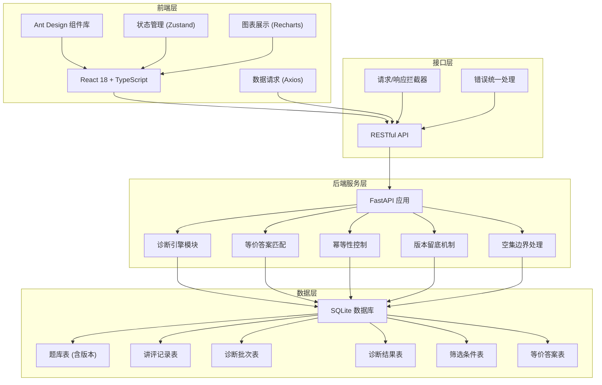
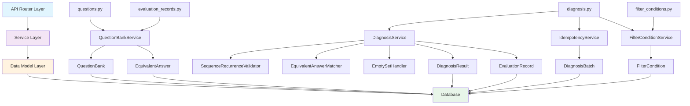
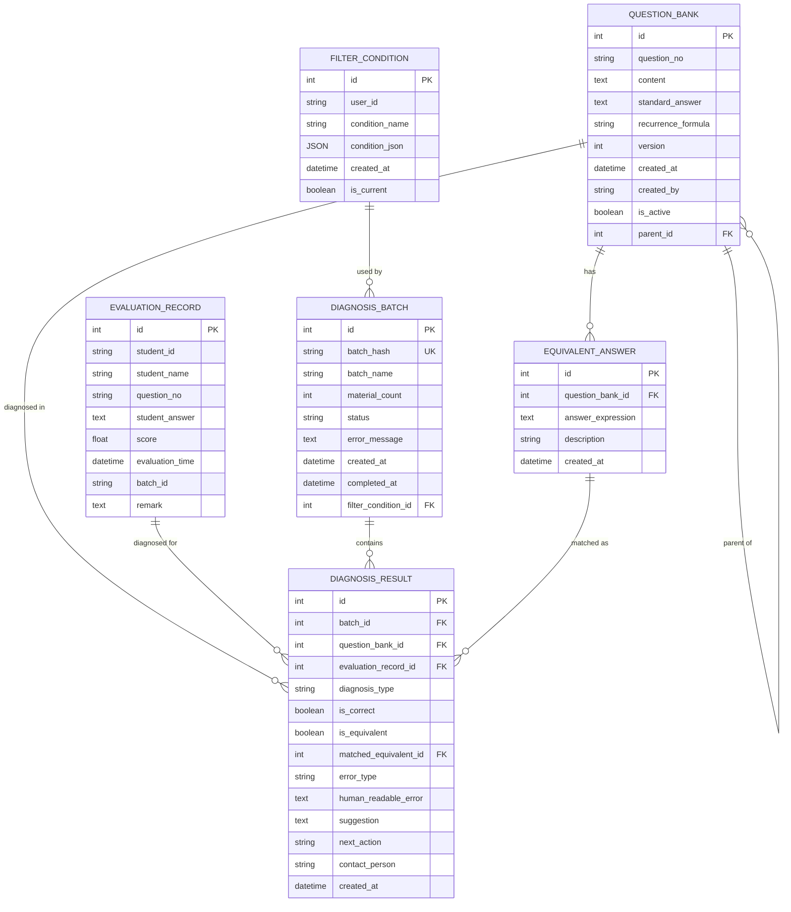

## 1. 架构设计

系统采用前后端分离的三层架构，后端负责业务逻辑和数据持久化，前端负责用户交互和数据展示，通过 RESTful API 进行通信。



## 2. 技术描述

### 2.1 前端技术栈
- **框架**：React 18 + TypeScript 5
- **构建工具**：Vite 5
- **UI 组件库**：Ant Design 5
- **状态管理**：Zustand 4
- **HTTP 客户端**：Axios 1.6
- **图表库**：Recharts 2.10
- **样式方案**：Tailwind CSS 3 + CSS Variables
- **路由管理**：React Router 6

### 2.2 后端技术栈
- **Web 框架**：FastAPI 0.104
- **ORM**：SQLAlchemy 2.0
- **数据校验**：Pydantic 2.5
- **数据库**：SQLite 3
- **数据处理**：Pandas 2.1 + OpenPyXL 3.1
- **异步服务器**：Uvicorn 0.24

### 2.3 项目目录结构

```
zy71864/
├── backend/                    # 后端应用
│   ├── app/
│   │   ├── routers/           # API 路由
│   │   │   ├── questions.py
│   │   │   ├── evaluation_records.py
│   │   │   ├── diagnosis.py
│   │   │   └── filter_conditions.py
│   │   ├── services/          # 业务逻辑层
│   │   │   ├── question_bank.py
│   │   │   ├── diagnosis_engine.py
│   │   │   └── diagnosis_service.py
│   │   ├── models.py          # 数据模型
│   │   ├── schemas.py         # Pydantic Schema
│   │   ├── database.py        # 数据库连接
│   │   ├── config.py          # 配置
│   │   └── errors.py          # 错误定义
│   ├── main.py                # 应用入口
│   └── requirements.txt       # Python 依赖
├── frontend/                   # 前端应用
│   ├── src/
│   │   ├── api/               # API 接口定义
│   │   ├── components/        # 公共组件
│   │   ├── pages/             # 页面组件
│   │   ├── store/             # 状态管理
│   │   ├── types/             # TypeScript 类型定义
│   │   ├── utils/             # 工具函数
│   │   ├── App.tsx
│   │   └── main.tsx
│   ├── package.json
│   ├── tsconfig.json
│   └── vite.config.ts
└── .trae/documents/           # 项目文档
    ├── 数列递推诊断系统_PRD.md
    └── 数列递推诊断系统_技术架构.md
```

## 3. 前端路由定义

| 路由路径 | 页面名称 | 功能说明 |
|----------|----------|----------|
| `/` | 首页仪表盘 | 数据概览、趋势图表、最近批次 |
| `/question-bank` | 题库管理 | 题目列表、版本管理、等价答案配置 |
| `/evaluation-records` | 讲评记录 | 记录列表、批量导入、筛选查询 |
| `/diagnosis` | 诊断中心 | 发起诊断、结果展示、详情查看 |
| `/export` | 讲评稿导出 | 筛选条件同步、Excel 导出 |
| `/filter-conditions` | 筛选条件 | 条件保存、管理、设为当前 |

## 4. API 接口定义

### 4.1 题库管理接口

```typescript
interface QuestionBank {
  id: number;
  question_no: string;
  content: string;
  standard_answer: string;
  recurrence_formula?: string;
  version: number;
  created_at: string;
  is_active: boolean;
  parent_id?: number;
}

interface EquivalentAnswer {
  id: number;
  question_bank_id: number;
  answer_expression: string;
  description?: string;
  created_at: string;
}

// GET /api/v1/questions
// GET /api/v1/questions/{id}
// POST /api/v1/questions
// PUT /api/v1/questions/{id}
// GET /api/v1/questions/{question_no}/versions
// POST /api/v1/questions/equivalent-answers
```

### 4.2 讲评记录接口

```typescript
interface EvaluationRecord {
  id: number;
  student_id: string;
  student_name: string;
  question_no: string;
  student_answer: string;
  score?: number;
  evaluation_time: string;
  batch_id?: string;
  remark?: string;
}

// GET /api/v1/evaluation-records
// POST /api/v1/evaluation-records
// POST /api/v1/evaluation-records/batch
// POST /api/v1/evaluation-records/upload
```

### 4.3 诊断接口

```typescript
interface DiagnosisBatch {
  id: number;
  batch_hash: string;
  batch_name: string;
  material_count: number;
  status: 'pending' | 'processing' | 'completed' | 'failed';
  error_message?: string;
  created_at: string;
  completed_at?: string;
  filter_condition_id?: number;
  is_reused?: boolean;
}

interface DiagnosisResult {
  id: number;
  batch_id: number;
  question_bank_id?: number;
  evaluation_record_id: number;
  diagnosis_type: string;
  is_correct: boolean;
  is_equivalent: boolean;
  matched_equivalent_id?: number;
  error_type?: string;
  human_readable_error?: string;
  suggestion?: string;
  next_action?: string;
  contact_person?: string;
  created_at: string;
}

interface DiagnosisRequest {
  batch_name: string;
  evaluation_record_ids: number[];
  filter_condition_id?: number;
}

interface BatchDiagnosisResponse {
  batch: DiagnosisBatch;
  results: DiagnosisResult[];
  summary: {
    total_records: number;
    correct_count: number;
    equivalent_count: number;
    incorrect_count: number;
    accuracy_rate: number;
    error_type_distribution: Record<string, number>;
  };
}

// GET /api/v1/diagnosis/batches
// POST /api/v1/diagnosis/run
// GET /api/v1/diagnosis/batches/{id}
// GET /api/v1/diagnosis/batches/{id}/results
// POST /api/v1/diagnosis/export
```

### 4.4 筛选条件接口

```typescript
interface FilterCondition {
  id: number;
  user_id: string;
  condition_name?: string;
  condition_json: Record<string, any>;
  created_at: string;
  is_current: boolean;
}

// GET /api/v1/filter-conditions?user_id=xxx
// GET /api/v1/filter-conditions/current?user_id=xxx
// POST /api/v1/filter-conditions
// PUT /api/v1/filter-conditions/{id}/set-current
```

### 4.5 统一错误响应

```typescript
interface ErrorResponse {
  error_code: string;
  message: string;
  suggestion?: string;
  contact_person?: string;
  details?: Record<string, any>;
}
```

## 5. 后端架构分层



## 6. 数据模型

### 6.1 ER 图



### 6.2 DDL 语句

```sql
-- 题库表（含版本留底）
CREATE TABLE question_bank (
    id INTEGER PRIMARY KEY AUTOINCREMENT,
    question_no VARCHAR(50) NOT NULL,
    content TEXT NOT NULL,
    standard_answer TEXT NOT NULL,
    recurrence_formula VARCHAR(200),
    version INTEGER NOT NULL DEFAULT 1,
    created_at DATETIME NOT NULL DEFAULT CURRENT_TIMESTAMP,
    created_by VARCHAR(100),
    is_active BOOLEAN NOT NULL DEFAULT 1,
    parent_id INTEGER,
    FOREIGN KEY (parent_id) REFERENCES question_bank(id)
);

CREATE INDEX idx_question_no ON question_bank(question_no);
CREATE INDEX idx_is_active ON question_bank(is_active);

-- 等价答案表
CREATE TABLE equivalent_answer (
    id INTEGER PRIMARY KEY AUTOINCREMENT,
    question_bank_id INTEGER NOT NULL,
    answer_expression TEXT NOT NULL,
    description VARCHAR(500),
    created_at DATETIME NOT NULL DEFAULT CURRENT_TIMESTAMP,
    FOREIGN KEY (question_bank_id) REFERENCES question_bank(id)
);

CREATE INDEX idx_eq_question_id ON equivalent_answer(question_bank_id);

-- 讲评记录表
CREATE TABLE evaluation_record (
    id INTEGER PRIMARY KEY AUTOINCREMENT,
    student_id VARCHAR(50) NOT NULL,
    student_name VARCHAR(100) NOT NULL,
    question_no VARCHAR(50) NOT NULL,
    student_answer TEXT NOT NULL,
    score FLOAT,
    evaluation_time DATETIME NOT NULL DEFAULT CURRENT_TIMESTAMP,
    batch_id VARCHAR(100),
    remark TEXT
);

CREATE INDEX idx_student_id ON evaluation_record(student_id);
CREATE INDEX idx_question_no_record ON evaluation_record(question_no);
CREATE INDEX idx_batch_id ON evaluation_record(batch_id);

-- 筛选条件表
CREATE TABLE filter_condition (
    id INTEGER PRIMARY KEY AUTOINCREMENT,
    user_id VARCHAR(100) NOT NULL,
    condition_name VARCHAR(200),
    condition_json JSON NOT NULL,
    created_at DATETIME NOT NULL DEFAULT CURRENT_TIMESTAMP,
    is_current BOOLEAN NOT NULL DEFAULT 0
);

CREATE INDEX idx_user_id ON filter_condition(user_id);
CREATE INDEX idx_is_current_condition ON filter_condition(is_current);

-- 诊断批次表
CREATE TABLE diagnosis_batch (
    id INTEGER PRIMARY KEY AUTOINCREMENT,
    batch_hash VARCHAR(64) NOT NULL UNIQUE,
    batch_name VARCHAR(200) NOT NULL,
    material_count INTEGER NOT NULL DEFAULT 0,
    status VARCHAR(50) NOT NULL DEFAULT 'pending',
    error_message TEXT,
    created_at DATETIME NOT NULL DEFAULT CURRENT_TIMESTAMP,
    completed_at DATETIME,
    filter_condition_id INTEGER,
    FOREIGN KEY (filter_condition_id) REFERENCES filter_condition(id)
);

CREATE INDEX idx_batch_hash ON diagnosis_batch(batch_hash);
CREATE INDEX idx_batch_status ON diagnosis_batch(status);

-- 诊断结果表
CREATE TABLE diagnosis_result (
    id INTEGER PRIMARY KEY AUTOINCREMENT,
    batch_id INTEGER NOT NULL,
    question_bank_id INTEGER,
    evaluation_record_id INTEGER NOT NULL,
    diagnosis_type VARCHAR(50) NOT NULL,
    is_correct BOOLEAN NOT NULL DEFAULT 0,
    is_equivalent BOOLEAN NOT NULL DEFAULT 0,
    matched_equivalent_id INTEGER,
    error_type VARCHAR(100),
    human_readable_error TEXT,
    suggestion TEXT,
    next_action VARCHAR(200),
    contact_person VARCHAR(100),
    created_at DATETIME NOT NULL DEFAULT CURRENT_TIMESTAMP,
    FOREIGN KEY (batch_id) REFERENCES diagnosis_batch(id),
    FOREIGN KEY (question_bank_id) REFERENCES question_bank(id),
    FOREIGN KEY (evaluation_record_id) REFERENCES evaluation_record(id),
    FOREIGN KEY (matched_equivalent_id) REFERENCES equivalent_answer(id)
);

CREATE INDEX idx_result_batch_id ON diagnosis_result(batch_id);
CREATE INDEX idx_result_is_correct ON diagnosis_result(is_correct);
CREATE INDEX idx_result_error_type ON diagnosis_result(error_type);
```

### 6.3 初始数据

```sql
-- 初始题库数据
INSERT INTO question_bank (question_no, content, standard_answer, recurrence_formula, version, created_by, is_active) VALUES
('SEQ001', '已知数列{a_n}满足a_1=1，a_{n+1}=a_n+2，求该数列的递推公式', 'a_{n+1} = a_n + 2', 'a_{n+1} = a_n + 2', 1, '系统初始化', 1),
('SEQ002', '已知数列{a_n}满足a_1=3，a_{n+1}=2a_n，求该数列的递推公式', 'a_{n+1} = 2 * a_n', 'a_{n+1} = 2 * a_n', 1, '系统初始化', 1),
('SEQ003', '已知数列{a_n}满足a_1=1，a_{n+1}=2a_n+1，求该数列的递推公式', 'a_{n+1} = 2 * a_n + 1', 'a_{n+1} = 2 * a_n + 1', 1, '系统初始化', 1);

-- 初始等价答案
INSERT INTO equivalent_answer (question_bank_id, answer_expression, description) VALUES
(1, 'a_{n+1} - a_n = 2', '移项形式的等价答案'),
(2, 'a_{n+1} / a_n = 2', '比值形式的等价答案');
```
