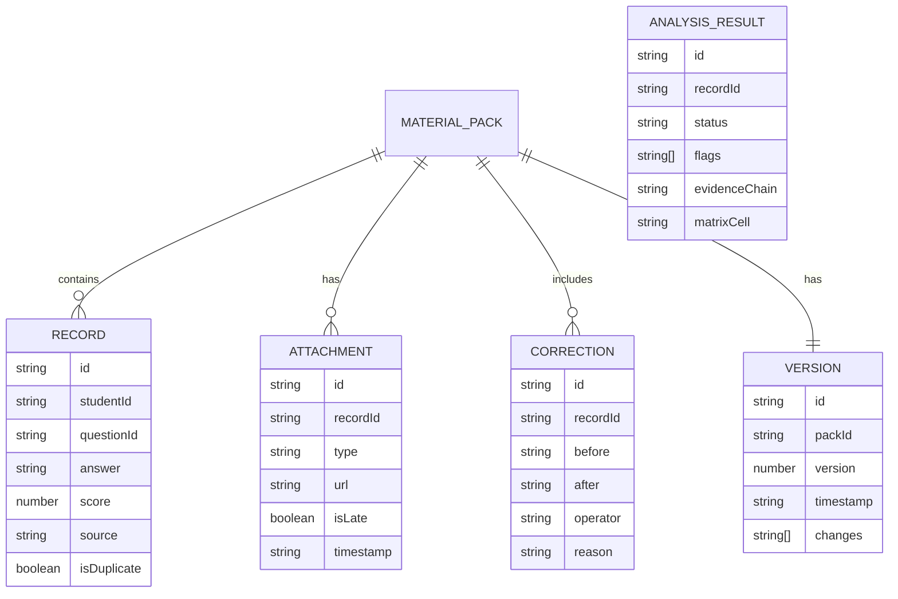

## 1. 架构设计

```mermaid
graph TB
    subgraph "前端层"
        A["React UI 组件"] --> B["状态管理 (Zustand)
        B --> C["业务逻辑 Hooks"]
    end
    
    subgraph "核心引擎"
        D["材料导入引擎"] --> E["预处理模块"]
        E --> F["重复项检测"]
        E --> G["晚到附件识别"]
        E --> H["人工更正标记"]
        F --> I["矩阵变换分析引擎"]
        G --> I
        H --> I
        I --> J["待确认标记模块"]
        I --> K["溯源追踪模块"]
    end
    
    subgraph "数据层"
        L["本地存储 (IndexedDB)
        M["版本管理系统"]
        N["Mock 数据包"]
    end
    
    subgraph "工具层"
        O["差异对比工具"]
        P["热力图渲染"]
        Q["证据链生成"]
    end
```

## 2. 技术选型

- **前端框架**: React@18 + TypeScript
- **构建工具**: Vite@5
- **样式方案**: TailwindCSS@3
- **状态管理**: Zustand
- **图标库**: Lucide React
- **本地存储**: IndexedDB (Dexie.js)
- **数据可视化**: Recharts

## 3. 路由定义

| 路由 | 页面 |
|-------|------|
| / | 材料导入页面 |
| /matrix | 矩阵分析页面 |
| /trace/:id | 溯源详情页面 |
| /versions | 版本对比页面 |

## 4. 数据模型

### 4.1 数据模型定义



### 4.2 核心类型定义

```typescript
// 材料记录类型
interface Record {
  id: string;
  studentId: string;
  questionId: string;
  knowledgePoint: string;
  studentAnswer: string;
  standardAnswer: string;
  score: number;
  fullScore: number;
  source: 'normal' | 'late' | 'correction';
  isDuplicate: boolean;
  duplicateOf?: string;
  attachments: Attachment[];
  createdAt: string;
}

// 附件类型
interface Attachment {
  id: string;
  type: 'image' | 'pdf' | 'screenshot';
  name: string;
  url: string;
  isLate: boolean;
  timestamp: string;
}

// 人工更正类型
interface Correction {
  id: string;
  recordId: string;
  field: 'answer' | 'score' | 'status';
  before: any;
  after: any;
  operator: string;
  reason: string;
  timestamp: string;
}

// 分析结果类型
interface AnalysisResult {
  id: string;
  recordId: string;
  status: 'normal' | 'pending' | 'warning';
  flags: Flag[];
  matrixPosition: {
    knowledgePoint: string;
    errorType: string;
  };
  evidenceChain: EvidenceItem[];
}

// 待确认标记类型
type FlagType = 
  | 'equivalent_answer_mismatch'
  | 'empty_set_boundary'
  | 'step_scoring_bias';

interface Flag {
  type: FlagType;
  description: string;
  confidence: number;
}

// 证据项类型
interface EvidenceItem {
  id: string;
  type: 'student_answer' | 'standard_answer' | 'screenshot' | 'correction_note';
  content: string;
  url?: string;
  timestamp: string;
}
```

## 5. 核心算法模块

### 5.1 矩阵变换分析引擎

```typescript
// 知识维度 × 错误类型维度 矩阵变换
class MatrixTransformer {
  transform(records: Record[]): MatrixCell[][];
  detectPatterns(cells: MatrixCell[][]): Pattern[];
}
```

### 5.2 待确认检测算法

```typescript
// 等价答案误判检测
function detectEquivalentAnswerMismatch(
  studentAnswer: string, 
  standardAnswer: string
): Flag | null;

// 空集边界检测
function detectEmptySetBoundary(record: Record): Flag | null;

// 分步得分偏差检测
function detectStepScoringBias(record: Record): Flag | null;
```

### 5.3 版本变更检测

```typescript
class VersionComparator {
  compare(oldVersion: MaterialPack, newVersion: MaterialPack): Change[];
  highlightChanges(changes: Change[]): Highlight[];
}
```

